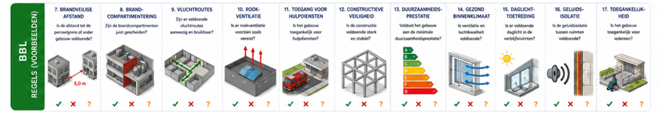

# Rule interpretation per check {#regelinterpretatie}

**Project:** VNG Policy Measure 13 — Permitting with BIM
**Version:** 0.3 (3 July 2026) — *being edited*
**Status:** Result of physical sessions with participating municipalities, 7 April 2026 and 8 June 2026, Zoetermeer

> This inventory describes, for each rule: the check, the working method, the regulatory source, the current assessment time and remarks. Rules #1–#6 concern the environment plan (environment plan activity, OPA; also called the environment plan check), rules #7–#17 the Buildings (Living Environment) Decree (Bbl; also called the technical check).

> 

> 

*Image to be updated: numbering and description of the checks as below.*

This chapter is translated from the Dutch original. Quoted rules and legal provisions are unofficial translations; the Dutch legal text prevails. Dutch terms from the ILS Spaces dictionary (bSDD) and the key registers are kept as names, with an English explanation where helpful. *Regels op de kaart* ("Rules on the Map") is the national viewer for environment plan rules.

## Rule #1: Use function matches the zoning designation {#regel-1}

### Check

Is the requested use function permitted at the location concerned?

### Working method

- Review the DSO application form.
- Determine the requested use function(s).
- Using the location of the plot or parcel, find the applicable rules on permitted use functions / zoning designations via <a href="https://omgevingswet.overheid.nl/regels-op-de-kaart/zoeken/locatie?session=aa1f4c6e-30e6-47c3-8301-03c60978f374" target="new">Regels op de kaart</a>.
- Using the building drawing (floor plans), determine the outlines of the use function and spaces per storey.
- Compare these with the area of application (zoning) of the rule and determine whether this is correct (permitted).
- For a rule / standard on an x% of m² for a home-based occupation, see Rule #5.

NB: to determine the rules, not only the zoning plan (with final and binding status) applies, but possibly also an umbrella zoning plan with general rules (a separate document).

Some checks cannot be automated and require a manual check. This is due to differences in interpretation between the legal rule and the (technical) information in the building application.

*#Control question: does this have to do with exceptions?*

### Information requirements

#### Building data

- Building application / floor plan / building drawing
- Use function per space per storey

#### In relation to ILS Spaces ([data dictionary](https://search.bsdd.buildingsmart.org/uri/bsnl/Omgevingswet-Ruimten/0.3.0))

- Bouwwerkperceel (building parcel): IfcZone (or IfcSpatialZone, IfcSpace)
- Kadastraalperceel (cadastral parcel): IfcZone (or IfcSpatialZone, IfcSpace). NB: also environment data
- Bouwlaag (storey): IfcBuildingStorey (in line with the BIM Basis ILS)
- Gebruiksfunctie (use function): IfcZone (or IfcSpatialZone, IfcSpace)
- VerblijfsRuimte (habitable room) or Functieruimte (functional room): IfcSpace (or IfcZone, IfcSpatialZone)

#### Environment data / geodata

- Parcel boundaries

#### In relation to geo-standard concepts and imagery

- Parcel boundary: BRK – Digital Cadastral Map
  - <https://www.stelselcatalogus.nl/detail/objecttype?id=https:%2F%2Fpurl.stelselcatalogus.nl%2Fid%2Fmkg%2FBRKregistratie_entiteit_KadastraleGrens>

### Regulations and standards

Regels op de kaart: current (final and binding) environment plan with zoning designations for use function / zoning designation (possibly limited to a number of storeys).

Possibly an umbrella zoning plan with generic rules.

NEN 2580: determination of areas.

### Time (current situation)

About 1 hour

### Remarks

None

## Rule #2: Maximum building height {#regel-2}

### Check

Does the height of the building exceed the maximum permitted building height for the parcel?

### Working method

- Review the DSO application form.
- Determine the height (ridge or eaves height) from the building drawing (floor plans, sections and details).
- Using the location of the plot or parcel, find the applicable rules on the maximum permitted building height via Regels op de kaart.
- If no maximum is set = approved and completed.
- Check the outcome against the rule.

NB:
The height is measured from reference level = 0 (usually the top of the ground-floor slab), or from a reference level set by the municipality. For the final height, it is also important to consider any installations on the roof.

### Information requirements

#### Building data

- Building application / floor plan / building drawing
- Roof shape

#### In relation to ILS Spaces ([data dictionary](https://search.bsdd.buildingsmart.org/uri/bsnl/Omgevingswet-Ruimten/0.3.0))

- Bouwwerkperceel (building parcel): IfcZone (or IfcSpatialZone, IfcSpace)
- Kadastraalperceel (cadastral parcel): IfcZone (or IfcSpatialZone, IfcSpace). NB: also environment data
- Bouwlaag (storey): IfcBuildingStorey (in line with the BIM Basis ILS)
- *Building height is not a concept in ILS Spaces*

#### Environment data / geodata

- Parcel boundaries
- Reference level (set by the municipality)

#### In relation to geo-standard concepts and imagery

- Parcel boundary: BRK – Digital Cadastral Map
  - <https://www.stelselcatalogus.nl/detail/objecttype?id=https:%2F%2Fpurl.stelselcatalogus.nl%2Fid%2Fmkg%2FBRKregistratie_entiteit_KadastraleGrens>
- Reference level: AHN / surveyed terrain model
  - <https://www.ahn.nl/producten>

NB: this refers to the annual nationwide aerial photographs and the nationwide elevation dataset of Beeldmateriaal Nederland and the Actueel Hoogtebestand Nederland (AHN) respectively. Some municipalities also have their own aerial photographs and sometimes their own elevation datasets.

### Regulations

Regels op de kaart: current (final and binding) environment plan with zoning (or building envelope) and standards for maximum building height.

### Time (current situation)

15 minutes – 2 hours

### Remarks

The reference level to be used can vary. For example, a different level is used for dyke houses than for ordinary houses. The zoning plans (environment plans) should contain the different definitions of the reference level.

## Rule #3: Maximum building coverage percentage {#regel-3}

### Check

Does the requested built-up area, added to the area of existing buildings, exceed the maximum permitted building coverage percentage for a given area?

Example: a new ground-level house on a self-build plot.

### Working method

- Review the DSO application form.
- Collect the building drawings of the existing buildings on the plot (building archive or aerial photograph).
- Determine the outlines (at ground level) of all new and existing buildings from the existing and new floor plans.
- Determine the outline of the plot / parcel (and possibly additional outlines of the building envelope or yard layout).
- Determine which buildings and parts of buildings count towards the built-up area, based on building type and use.
- Calculate the built-up area and the parcel area and determine the building coverage percentage (built-up area / parcel area × 100).
- Using the location of the plot or parcel, find the applicable rules on the maximum permitted coverage percentage via Regels op de kaart.
- Check the outcome against the rule.

NB: the built-up area is calculated from the requested and existing buildings. Not all buildings or building parts have to be counted.

When plots and parcels are split, the calculation is more complicated.

Some checks cannot be automated and require a manual check. This is due to differences in interpretation between the legal rule and the (technical) information in the building application.

### Information requirements

#### Building data

- Building application / floor plan / building drawing / site plan
- Building type
- Use function
- Floor plan at ground level / ground floor
- Gross floor area per ground-floor level

#### In relation to ILS Spaces ([data dictionary](https://search.bsdd.buildingsmart.org/uri/bsnl/Omgevingswet-Ruimten/0.3.0))

- Bouwwerkperceel (building parcel): IfcZone (or IfcSpatialZone, IfcSpace)
- Kadastraalperceel (cadastral parcel): IfcZone (or IfcSpatialZone, IfcSpace). NB: also environment data
- Gebouwtype (building type): IfcBuilding (MarketCategory and MarketSubCategory)
- Bouwlaag (storey): IfcBuildingStorey (in line with the BIM Basis ILS)
- Gebruiksfunctie (use function): IfcZone (or IfcSpatialZone, IfcSpace)
- VerblijfsRuimte (habitable room) or Functieruimte (functional room): IfcSpace (or IfcZone, IfcSpatialZone)

#### Environment data / geodata

- Existing buildings
- Aerial photograph
- Parcel boundaries
- Reference level (set by the municipality)

#### In relation to geo-standard concepts and imagery

- BGT Pand (building)
  - <https://www.stelselcatalogus.nl/detail/objecttype?id=https:%2F%2Fpurl.stelselcatalogus.nl%2Fid%2Fmkg%2FBAGregistratie_entiteit_Pand>
- BGT Overig bouwwerk (other structure)
  - <https://www.stelselcatalogus.nl/detail/objecttype?id=https:%2F%2Fpurl.stelselcatalogus.nl%2Fid%2Fmkg%2FBGTregistratie_entiteit_Overig%2520bouwwerk>
- Aerial photograph
  - <https://www.beeldmateriaal.nl/producten>
- Parcel boundary: BRK – Digital Cadastral Map
  - <https://www.stelselcatalogus.nl/detail/objecttype?id=https:%2F%2Fpurl.stelselcatalogus.nl%2Fid%2Fmkg%2FBRKregistratie_entiteit_KadastraleGrens>
- Reference level: AHN / surveyed terrain model
  - <https://www.ahn.nl/producten>

NB: this refers to the annual nationwide aerial photographs and the nationwide elevation dataset of Beeldmateriaal Nederland and the Actueel Hoogtebestand Nederland (AHN) respectively. Some municipalities also have their own aerial photographs and sometimes their own elevation datasets.

### Regulations

Regels op de kaart: current (final and binding) environment plan with zoning designations for the maximum building coverage percentage.

Possibly an umbrella zoning plan with generic rules.

NEN 2580: determination of areas.

### Time (current situation)

30 – 60 minutes per case

### Remarks

Pay close attention to the area for which the coverage percentage is calculated: the parcel, the building envelope or the built-up zone.

Differs per municipality:

The calculation can be based on m² (area), but also on m³ (volume). Residential buildings often use volume, businesses often use area.

## Rule #4: Use function / zoning designation limited to a given number of storeys {#regel-4}

### Check

Is the requested use function permitted at the location concerned?

Example: the permitted use function is limited to a given number of storeys.

### Working method

Partly the same as rule #1.

- Review the DSO application form.
- Determine the requested use function(s).
- Using the location of the plot or parcel, find the applicable rules on permitted use functions / zoning designations via Regels op de kaart.
- Using the building drawing (floor plans), determine the outlines of the use function and spaces per storey.
- Compare these with the area of application (zoning) of the rule and the accompanying explanation of the rules (number of storeys, etc.) and determine whether this is correct (permitted).
- For a rule / standard on an x% of m² for a home-based occupation, see rule X.

NB: to determine the rules, not only the zoning plan (with final and binding status) applies, but possibly also an umbrella zoning plan with general rules (a separate document).

Some checks cannot be automated and require a manual check. This is due to differences in interpretation between the legal rule and the (technical) information in the building application.

### Information requirements

#### Building data

- Building application / floor plan / building drawing
- Building type
- Use function per space per storey

#### In relation to ILS Spaces ([data dictionary](https://search.bsdd.buildingsmart.org/uri/bsnl/Omgevingswet-Ruimten/0.3.0))

- Gebouwtype (building type): IfcBuilding (MarketCategory and MarketSubCategory)
- Bouwlaag (storey): IfcBuildingStorey (in line with the BIM Basis ILS)
- Gebruiksfunctie (use function): IfcZone (or IfcSpatialZone, IfcSpace)
- VerblijfsRuimte (habitable room) or Functieruimte (functional room): IfcSpace (or IfcZone, IfcSpatialZone)

#### Environment data / geodata

None.

### Regulations

Regels op de kaart: current (final and binding) environment plan with zoning designations for use function / zoning designation (possibly limited to a number of storeys).

Possibly an umbrella zoning plan with generic rules.

NEN 2580: determination of areas.

### Time (current situation)

About 30 minutes

### Remarks

None

## Rule #5: Home-based occupation: at most 50% of the usable floor area as a business-related office {#regel-5}

Check: does the usable floor area of an (ancillary) business use function exceed the maximum permitted usable floor area within a residential use function?

### Working method

- Review the DSO application form.
- Determine or derive the SBI code (Dutch standard industrial classification) of the intended business.
- Determine whether the requested (ancillary) use function counts as a "home-based occupation".
- Check whether the applicant is an interested party (via the Kadaster).
- Collect the building drawings of the existing buildings on the plot (building archive).
- Determine the surrounding buildings.
- Calculate the gross floor area of the different use functions from the existing and new floor plans.
- Determine which spaces are not used for the residential use function.
- Using the location of the plot or parcel, find the applicable rules on the maximum permitted percentage for home-based occupations via Regels op de kaart.
- Optionally: check municipal policy rules that are not yet on the map.
- Record the internal considerations and remarks, calculations and measurements of the VTH officer (regarding the review / check) in a Word document.

NB:
Sometimes a table of spaces and areas, or an Excel file, is supplied. Pay particular attention to "unnamed spaces", as these could later be used for something that is not yet permitted.
Some SBI codes are exempt from the permit requirement.

### Information requirements

#### Building data

- Building application / floor plan / building drawing
- Use function
- Gross floor area of spaces per use function
- Site plan (building parcel + cadastral parcel + adjacent parcels and structures)
- SBI code of the home-based office

#### In relation to ILS Spaces ([data dictionary](https://search.bsdd.buildingsmart.org/uri/bsnl/Omgevingswet-Ruimten/0.3.0))

- Bouwwerkperceel (building parcel): IfcZone (or IfcSpatialZone, IfcSpace)
- Kadastraalperceel (cadastral parcel): IfcZone (or IfcSpatialZone, IfcSpace). NB: also environment data
- Gebruiksfunctie (use function): IfcZone (or IfcSpatialZone, IfcSpace)
- VerblijfsRuimte (habitable room) or Functieruimte (functional room): IfcSpace (or IfcZone, IfcSpatialZone)
- GFA per space: GFA determination method (= net + tare area)

#### Environment data / geodata

NB: environment data is probably only needed within a certain zone / buffer around the building plan.

- Parcel boundaries
- Existing buildings

#### In relation to geo-standard concepts and imagery

- Parcel boundary: BRK – Digital Cadastral Map
  - <https://www.stelselcatalogus.nl/detail/objecttype?id=https:%2F%2Fpurl.stelselcatalogus.nl%2Fid%2Fmkg%2FBRKregistratie_entiteit_KadastraleGrens>
- Existing buildings + status: BAG Pand (building)
  - <https://www.stelselcatalogus.nl/detail/objecttype?id=https:%2F%2Fpurl.stelselcatalogus.nl%2Fid%2Fmkg%2FBAGregistratie_entiteit_Pand>
  - <https://www.stelselcatalogus.nl/detail/attribuutsoort?id=https:%2F%2Fpurl.stelselcatalogus.nl%2Fid%2Fmkg%2FBAGkenmerk_status-pand>
- Existing buildings: BAG VBO (dwelling / accommodation object) + status + intended use + usable floor area
  - <https://www.stelselcatalogus.nl/detail/objecttype?id=https:%2F%2Fpurl.stelselcatalogus.nl%2Fid%2Fmkg%2FBAGregistratie_entiteit_Verblijfsobject>
  - <https://www.stelselcatalogus.nl/detail/attribuutsoort?id=https:%2F%2Fpurl.stelselcatalogus.nl%2Fid%2Fmkg%2FBAGkenmerk_status-verblijfsobject>
  - <https://www.stelselcatalogus.nl/detail/attribuutsoort?id=https:%2F%2Fpurl.stelselcatalogus.nl%2Fid%2Fmkg%2FBAGkenmerk_gebruiksdoel-verblijfsobject>
  - <https://www.stelselcatalogus.nl/detail/attribuutsoort?id=https:%2F%2Fpurl.stelselcatalogus.nl%2Fid%2Fmkg%2FBAGkenmerk_oppervlakte-verblijfsobject>

### Regulations

Regels op de kaart: current (final and binding) environment plan with standards for the percentage of usable floor area for home-based occupations.

NEN 2580: determination of areas.

### Time (current situation)

About 45 minutes

### Remarks

None

## Rule #6: Maximum number of storeys {#regel-6}

### Check

Does the number of storeys exceed the maximum permitted number of storeys?

### Working method

- Review the DSO application form.
- Determine the number of storeys from the building drawing (floor plans, sections and details).
- Using the location of the plot or parcel, find the applicable rules on the maximum permitted number of storeys via Regels op de kaart or via the municipality's own geo application.
- If no maximum is set = approved and completed.
- Determine (count) the number of storeys from the section and floor plans.
- Check the outcome against the rule.

NB:
Number of storeys from reference level = 0 (usually the top of the ground-floor slab), or from a reference level set by the municipality.
Does a basement (−1) count as a storey? See the definitions in NEN 2580.
Does a roof (top storey) count as a separate storey? In the case of a flat roof and a pitched roof.
There are differences in interpretation between NEN 2580 and the Bbl.

### Information requirements

#### Building data

- Building application / floor plan / building drawing
- Presence of a basement
- Roof shape

#### In relation to ILS Spaces ([data dictionary](https://search.bsdd.buildingsmart.org/uri/bsnl/Omgevingswet-Ruimten/0.3.0))

- Bouwwerkperceel (building parcel): IfcZone (or IfcSpatialZone, IfcSpace)
- Kadastraalperceel (cadastral parcel): IfcZone (or IfcSpatialZone, IfcSpace). NB: also environment data
- Bouwlaag (storey): IfcBuildingStorey (in line with the BIM Basis ILS)
- Gebruiksfunctie (use function): IfcZone (or IfcSpatialZone, IfcSpace)
- VerblijfsRuimte (habitable room) or Functieruimte (functional room): IfcSpace (or IfcZone, IfcSpatialZone)
- GFA per space: GFA determination method (= net + tare area)

#### Environment data / geodata

None

### Regulations

Regels op de kaart: current (final and binding) environment plan with zoning and standards for the maximum building coverage percentage.

NEN 2580: determination of areas.

### Time (current situation)

About 10 minutes

### Remarks

None.

## Rule #7: Fire compartments {#regel-7}

### Check

Presence and maximum size (usable floor area) of fire compartments per use function.

### Working method

- Review the DSO application form.
- Determine the main use function of the new building or the combined use function (no ancillary use functions).
- Go to the Buildings (Living Environment) Decree, section 4.2.8.
- Use control table 4.49, belonging to article 4.49, to determine the relevant paragraphs of articles 4.51 and 4.52.
- Check whether the outlines of the fire compartments are shown.
- Calculate or check the area of the fire compartments (GFA).
  NB: the permit applicant must also calculate these and supply them in a table. Some municipalities check them; others do not.
- Check that specifications of the fire-resistant doors, windows, penetrations, floors, walls, etc. are present.
- Check whether the specifications meet the Bbl (EI = integrity / flame-tightness and insulation classification; WBDBO = resistance to fire penetration and fire spread).
- Assess whether the distance from the façade to the parcel boundary or to the middle of the road meets the Bbl (in line with the mirror principle).
- Assess whether the distance or WBDBO between buildings (on the same parcel) meets the Bbl with regard to fire spread.

NB: this concerns the distance between buildings on the same parcel. For buildings on adjacent parcels, the so-called "mirror symmetry" is used: the new building is mirrored on the parcel boundary, and the necessary fire-spread measures are determined from the distance between the new building and the mirrored building.
For buildings bordering public green space, roads or water, the mirroring takes place on the centre line of that green space, road or water.

Check for equivalence (NEN 6060 / 6079). If the fire compartments are larger (in m² usable floor area) than directly permitted by the Bbl, an equivalence assessment is needed. The consequences for the surroundings are then weighed in that assessment. Building properties, use functions in surrounding buildings, critical infrastructure and fire-brigade deployment help determine whether the equivalence can be approved.

### Information requirements

#### Building data (as part of the submitted permit application)

- Building application / floor plan / sections
- Use function
- Site plan (building parcel + cadastral parcel + adjacent parcels and structures)
- Fire compartments (designation + outlines)
- GFA per fire compartment
- Fire-resistant building elements with specification and certificate (except demonstrably fire-resistant elements such as concrete or brick)
- Façade of the new building with specification and certificate (except demonstrably fire-resistant elements such as concrete or brick)
- Equivalence report

#### In relation to ILS Spaces ([data dictionary](https://search.bsdd.buildingsmart.org/uri/bsnl/Omgevingswet-Ruimten/0.3.0))

- Bouwwerkperceel (building parcel): IfcZone (or IfcSpatialZone, IfcSpace)
- Kadastraalperceel (cadastral parcel): IfcZone (or IfcSpatialZone, IfcSpace). NB: also environment data
- Gebruiksfunctie (use function): IfcZone (or IfcSpatialZone, IfcSpace)
- Brandcompartiment (fire compartment): IfcZone (or IfcSpatialZone, IfcSpace)
- GFA per fire compartment: GFA determination method (= net + tare area)
- WBDBO (fire resistance of construction): IfcWall or IfcSlab (IfcZone, IfcSpatialZone or IfcSpace may also be used)
- Fire-resistant building elements: IfcDoor, IfcWall, IfcColumn, IfcCurtainWall, IfcSlab

#### Environment data / geodata

NB: environment data is probably only needed within a certain zone / buffer around the building plan — in principle only the directly adjacent parcels, where the position of the boundary is essential. An adjacent parcel with the same owner as the parcel to be built on may be treated as the same parcel. A site plan with parcel boundaries that differ from the BRK is leading, on the assumption that the parcel will be subdivided later.

- Parcel boundaries
- Interested party / owner
- Existing buildings
- Type of intended use / use function of existing buildings
- Critical infrastructure
- Publicly accessible space (woodland, water, green strip, etc.)
- Publicly accessible roads (and railways)

#### In relation to geo-standard concepts and imagery

- Parcel boundary: BRK – Digital Cadastral Map
  - <https://www.stelselcatalogus.nl/detail/objecttype?id=https:%2F%2Fpurl.stelselcatalogus.nl%2Fid%2Fmkg%2FBRKregistratie_entiteit_KadastraleGrens>
- Interested party / owner: BRK – Zakelijk recht (right in rem) + Natuurlijk or Niet-natuurlijk persoon (natural or legal person)
  - <https://www.stelselcatalogus.nl/detail/objecttype?id=https:%2F%2Fpurl.stelselcatalogus.nl%2Fid%2Fmkg%2FBRKregistratie_entiteit_ZakelijkRecht>
  - <https://www.stelselcatalogus.nl/detail/objecttype?id=https:%2F%2Fpurl.stelselcatalogus.nl%2Fid%2Fmkg%2FBRKregistratie_entiteit_NatuurlijkPersoon>
  - <https://www.stelselcatalogus.nl/detail/objecttype?id=https:%2F%2Fpurl.stelselcatalogus.nl%2Fid%2Fmkg%2FBRKregistratie_entiteit_NietNatuurlijkPersoon>
- Existing buildings + status: BAG Pand (building)
  - <https://www.stelselcatalogus.nl/detail/objecttype?id=https:%2F%2Fpurl.stelselcatalogus.nl%2Fid%2Fmkg%2FBAGregistratie_entiteit_Pand>
  - <https://www.stelselcatalogus.nl/detail/attribuutsoort?id=https:%2F%2Fpurl.stelselcatalogus.nl%2Fid%2Fmkg%2FBAGkenmerk_status-pand>
- Existing buildings: BAG VBO + status + intended use
  - <https://www.stelselcatalogus.nl/detail/objecttype?id=https:%2F%2Fpurl.stelselcatalogus.nl%2Fid%2Fmkg%2FBAGregistratie_entiteit_Verblijfsobject>
  - <https://www.stelselcatalogus.nl/detail/attribuutsoort?id=https:%2F%2Fpurl.stelselcatalogus.nl%2Fid%2Fmkg%2FBAGkenmerk_status-verblijfsobject>
  - <https://www.stelselcatalogus.nl/detail/attribuutsoort?id=https:%2F%2Fpurl.stelselcatalogus.nl%2Fid%2Fmkg%2FBAGkenmerk_gebruiksdoel-verblijfsobject>
- Critical infrastructure: BGT Kunstwerk (engineering structure: bridge part + tunnel part + structure part)
  - <https://www.stelselcatalogus.nl/detail/objecttype?id=https:%2F%2Fpurl.stelselcatalogus.nl%2Fid%2Fmkg%2FBGTregistratie_entiteit_Overbruggingsdeel>
  - <https://www.stelselcatalogus.nl/detail/objecttype?id=https:%2F%2Fpurl.stelselcatalogus.nl%2Fid%2Fmkg%2FBGTregistratie_entiteit_Tunneldeel>
  - <https://www.stelselcatalogus.nl/detail/objecttype?id=https:%2F%2Fpurl.stelselcatalogus.nl%2Fid%2Fmkg%2FBGTregistratie_entiteit_Kunstwerkdeel>
- Road: BGT Wegdeel and BGT Ondersteunend wegdeel (road part and supporting road part, + classification Function)
  - <https://www.stelselcatalogus.nl/detail/objecttype?id=https:%2F%2Fpurl.stelselcatalogus.nl%2Fid%2Fmkg%2FBGTregistratie_entiteit_Wegdeel>
  - <https://www.stelselcatalogus.nl/detail/attribuutsoort?id=https:%2F%2Fpurl.stelselcatalogus.nl%2Fid%2Fmkg%2FBGTkenmerk_functie-wegdeel>
  - <https://www.stelselcatalogus.nl/detail/objecttype?id=https:%2F%2Fpurl.stelselcatalogus.nl%2Fid%2Fmkg%2FBGTregistratie_entiteit_Ondersteunend%2520wegdeel>
  - <https://www.stelselcatalogus.nl/detail/attribuutsoort?id=https:%2F%2Fpurl.stelselcatalogus.nl%2Fid%2Fmkg%2FBGTkenmerk_functie-ondersteunend-wegdeel>
- Railway: BGT Spoor (+ classification Function)
  - <https://www.stelselcatalogus.nl/detail/objecttype?id=https:%2F%2Fpurl.stelselcatalogus.nl%2Fid%2Fmkg%2FBGTregistratie_entiteit_Spoor>
  - <https://www.stelselcatalogus.nl/detail/attribuutsoort?id=https:%2F%2Fpurl.stelselcatalogus.nl%2Fid%2Fmkg%2FBGTkenmerk_functie-spoor>
- Public green space: BGT Begroeid terreindeel and BGT Onbegroeid terreindeel (vegetated and unvegetated terrain part, + classification Physical appearance)
  - <https://www.stelselcatalogus.nl/detail/objecttype?id=https:%2F%2Fpurl.stelselcatalogus.nl%2Fid%2Fmkg%2FBGTregistratie_entiteit_Begroeid%2520terreindeel>
  - <https://www.stelselcatalogus.nl/detail/attribuutsoort?id=https:%2F%2Fpurl.stelselcatalogus.nl%2Fid%2Fmkg%2FBGTkenmerk_plus-fysiek-voorkomen-begroeid-terreindeel>
  - <https://www.stelselcatalogus.nl/detail/objecttype?id=https:%2F%2Fpurl.stelselcatalogus.nl%2Fid%2Fmkg%2FBGTregistratie_entiteit_Onbegroeid%2520terreindeel>
  - <https://www.stelselcatalogus.nl/detail/attribuutsoort?id=https:%2F%2Fpurl.stelselcatalogus.nl%2Fid%2Fmkg%2FBGTkenmerk_fysiek-voorkomen-onbegroeid-terreindeel>
- Water: BGT Waterdeel and BGT Ondersteunend waterdeel (water part and supporting water part, + classification Type)
  - <https://www.stelselcatalogus.nl/detail/objecttype?id=https:%2F%2Fpurl.stelselcatalogus.nl%2Fid%2Fmkg%2FBGTregistratie_entiteit_Waterdeel>
  - <https://www.stelselcatalogus.nl/detail/attribuutsoort?id=https:%2F%2Fpurl.stelselcatalogus.nl%2Fid%2Fmkg%2FBGTkenmerk_type-waterdeel>
  - <https://www.stelselcatalogus.nl/detail/objecttype?id=https:%2F%2Fpurl.stelselcatalogus.nl%2Fid%2Fmkg%2FBGTregistratie_entiteit_Ondersteunend%2520waterdeel>
  - <https://www.stelselcatalogus.nl/detail/attribuutsoort?id=https:%2F%2Fpurl.stelselcatalogus.nl%2Fid%2Fmkg%2FBGTkenmerk_type-ondersteunend-waterdeel>

### Regulations

<https://wetten.overheid.nl/BWBR0041297/2026-05-29/0#Hoofdstuk4_Afdeling4.2_Paragraaf4.2.8_Artikel4.50>

<https://wetten.overheid.nl/BWBR0041297/2026-05-29/0#Hoofdstuk4_Afdeling4.2_Paragraaf4.2.8_Artikel4.51>

<https://wetten.overheid.nl/BWBR0041297/2026-05-29/0#Hoofdstuk4_Afdeling4.2_Paragraaf4.2.8_Artikel4.53>

<https://wetten.overheid.nl/BWBR0041297/2026-05-29/0#Hoofdstuk4_Afdeling4.2_Paragraaf4.2.8_Artikel4.54>

NEN 6060: fire safety of fire compartments.

NEN 6079: method for fire control and limiting fire spread, based on a risk approach and physical fire modelling.

NEN 2580: determination of areas.

### Time (current situation)

Time spent differs per object category:

- Easy (CC1): 0.5 hour
- Medium (CC2): 3 hours
- Difficult (CC3): 4 – 16 hours
- Frequency: in principle for every building application (?)

### Remarks

Differs per municipality:

- The level of checking according to the assessment protocol.
- Who performs the check (the municipality itself or the safety region), for example small plans versus larger ones.

## Rule #8: Fire resistance {#regel-8}

### Check

Sufficient fire resistance of the building elements enclosing a fire compartment.

### Working method

Everything under the fire compartments check.

- Determine the fire resistance of the construction.

### Information requirements

#### Building data (as part of the submitted permit application)

Everything listed under the fire compartments rule.

- Building elements

#### In relation to ILS Spaces ([data dictionary](https://search.bsdd.buildingsmart.org/uri/bsnl/Omgevingswet-Ruimten/0.3.0))

- Building elements: IfcWall, IfcColumn, IfcCurtainWall, IfcSlab
- Brandcompartiment (fire compartment)

#### Environment data

Everything under the fire compartments rule.

### Regulations

Everything under the fire compartments rule.

### Time (current situation)

Time spent differs per object category:

- Easy (CC1): 0.5 hour
- Medium (CC2): 3 hours
- Difficult (CC3): 4 – 16 hours
- Frequency: in principle for every building application, except applications without enclosed spaces, or adjacent structures with an industrial or other use function < 50 m² (existing buildings < 100 m²).

### Remarks

Differs per municipality:

- The level of checking according to the assessment protocol.
- Who performs the check (the municipality itself or the safety region), for example small plans versus larger ones.

## Rule #9: Clear width {#regel-9}

*[image: see source document]*

### Check

Check on the accessibility of spaces.

### Working method

- Review the DSO application form.
- Determine the main use function of the new building or the combined use function (no ancillary use functions).
- Go to the Buildings (Living Environment) Decree, section 4.6.1.
- Use control table 4.176, belonging to article 4.176, to determine the relevant paragraphs of articles 4.180 and 4.181.
- Determine the use areas, habitable rooms, toilet room, bathroom, storage room, outdoor space and shared circulation space.
- Determine whether there is a lift.
- Determine the circulation route(s).
- Calculate the clear width and clear height of all passages and circulation routes.
- Calculate the clear width and the area of the space in front of the lift.
- Check these against table 4.176.

NB: for calculating clear width, clear height and area, the relevant Bbl article does not refer to a specific standard or guideline.

### Information requirements

#### Building data (as part of the submitted permit application)

- Use function
- Type of space, namely habitable area, functional area, bathroom, toilet room, storage room, outdoor space, shared circulation space
- Circulation route
- Clear width, clear height, area

#### In relation to ILS Spaces ([data dictionary](https://search.bsdd.buildingsmart.org/uri/bsnl/Omgevingswet-Ruimten/0.3.0))

- Bouwlaag (storey): IfcBuildingStorey (in line with the BIM Basis ILS)
- Gebruiksfunctie (use function): IfcZone (or IfcSpatialZone, IfcSpace)
  - <https://search.bsdd.buildingsmart.org/uri/bsnl/Omgevingswet-Ruimten/0.3.0/class/Gebruiksfunctie>
- VerblijfsRuimte (habitable room) or Functieruimte (functional room), toilet room, bathroom, storage room, outdoor space, shared circulation space: IfcSpace (or IfcZone, IfcSpatialZone)
- Circulation route: IfcZone
- Walls, floors, roof (to calculate width, height and area): IfcWall, IfcFloor, IfcRoof

#### Environment data

No environment data needed.

### Regulations

- <https://wetten.overheid.nl/BWBR0041297/2026-07-01/0#Hoofdstuk4_Afdeling4.6_Paragraaf4.6.1_Artikel4.180>
- <https://wetten.overheid.nl/BWBR0041297/2026-07-01/0#Hoofdstuk4_Afdeling4.6_Paragraaf4.6.1_Artikel4.181>

### Time (current situation)

Not described

### Remarks

None

## Rule #10: Height difference {#regel-10}

*[image: see source document]*

### Check

1. Safely bridging height differences (from a safety perspective)
2. Bridging height differences (from a general accessibility perspective)

### Working method

**1. Safely bridging height differences (from a safety perspective):**

- Review the DSO application form.
- Determine the main use function of the new building or the combined use function (no ancillary use functions).
- Go to the Buildings (Living Environment) Decree, section 4.2.4.
- Use control table 4.24, belonging to article 4.24, to determine the relevant paragraphs of articles 4.25 to 4.33.
- Determine the use areas, habitable rooms, toilet room, bathroom and shared circulation space.
- Determine the circulation route(s).
- Calculate the height differences between these spaces on a circulation route.
- Calculate the height difference between adjoining terrain and these spaces (as part of a circulation route).
- Determine whether there is a stair or ramp for height differences > 0.21 m.
- Determine whether there is a stair landing for height differences > 4 m.
- Determine whether there is a ramp landing for height differences > 0.03 m.
- Determine the dimensions, design and rain protection of the stair and ramp and check these against articles 4.26 to 4.33.

**2. Bridging height differences (from a general accessibility perspective):**

- Review the DSO application form.
- Determine the main use function of the new building or the combined use function (no ancillary use functions).
- Go to the Buildings (Living Environment) Decree, section 4.6.1.
- Use control table 4.179, belonging to article 4.179, to determine the relevant paragraphs of article 4.182.
- Determine the main entrance, shared circulation space, habitable areas, residential function, (shared) outdoor space and outdoor storage.
- Determine the circulation route(s).
- Calculate the height differences between the floors of the various (outdoor) spaces and the outdoor storage.
- Determine whether the maximum height difference of > 1 m is exceeded.
- Determine whether there is a ramp for height differences > 0.20 m.
- Determine whether there is a lift for height differences > 3 m.

NB: for calculating the height difference and dimensions, the relevant Bbl article does not refer to a specific standard or guideline.

For determining rain protection, reference is made to NEN 2778.

### Information requirements

#### Building data (as part of the submitted permit application)

- Use function, residential function
- Type of space, namely habitable area, functional area, bathroom, toilet room, storage room, outdoor space, shared circulation space
- Circulation route
- Stair, ramp, stair landing, ramp landing
- Floors for calculating height differences
- Access to the outdoor area

#### In relation to ILS Spaces ([data dictionary](https://search.bsdd.buildingsmart.org/uri/bsnl/Omgevingswet-Ruimten/0.3.0))

**1. Safely bridging height differences (from a safety perspective):**

- Bouwlaag (storey): IfcBuildingStorey (in line with the BIM Basis ILS)
- Gebruiksfunctie (use function): IfcZone (or IfcSpatialZone, IfcSpace)
  - <https://search.bsdd.buildingsmart.org/uri/bsnl/Omgevingswet-Ruimten/0.3.0/class/Gebruiksfunctie>
- VerblijfsRuimte (habitable room) or Functieruimte (functional room), toilet room, bathroom, storage room, outdoor space, shared circulation space: IfcSpace (or IfcZone, IfcSpatialZone)
- Outdoor storage:
- Circulation route: IfcZone
- Floors: IfcFloor
- Unbuilt space: IfcSite

**2. Bridging height differences (from a general accessibility perspective):**

- Bouwlaag (storey): IfcBuildingStorey (in line with the BIM Basis ILS)
- Gebruiksfunctie (use function): IfcZone (or IfcSpatialZone, IfcSpace)
  - <https://search.bsdd.buildingsmart.org/uri/bsnl/Omgevingswet-Ruimten/0.3.0/class/Gebruiksfunctie>
- Woonfunctie (residential function): IfcZone (or IfcSpatialZone, IfcSpace)
- VerblijfsRuimte (habitable room) or Functieruimte (functional room), toilet room, bathroom, storage room, outdoor space, shared circulation space: IfcSpace (or IfcZone, IfcSpatialZone)
- Outdoor storage:
- Circulation route: IfcZone
- Floors: IfcFloor
- Unbuilt space: IfcSite

#### Environment data

In principle none — unless the building directly borders public outdoor space. In that case, the access to the public road / public space and the reference level / ground level matter:

- Public road
- Public green space

#### In relation to geo-standard concepts and imagery

- Reference level: AHN / surveyed terrain model
  - <https://www.ahn.nl/producten>
- Road: BGT Wegdeel and BGT Ondersteunend wegdeel (road part and supporting road part, + classification Function)
  - <https://www.stelselcatalogus.nl/detail/objecttype?id=https:%2F%2Fpurl.stelselcatalogus.nl%2Fid%2Fmkg%2FBGTregistratie_entiteit_Wegdeel>
  - <https://www.stelselcatalogus.nl/detail/attribuutsoort?id=https:%2F%2Fpurl.stelselcatalogus.nl%2Fid%2Fmkg%2FBGTkenmerk_functie-wegdeel>
  - <https://www.stelselcatalogus.nl/detail/objecttype?id=https:%2F%2Fpurl.stelselcatalogus.nl%2Fid%2Fmkg%2FBGTregistratie_entiteit_Ondersteunend%2520wegdeel>
  - [https://www.stelselcatalogus.nl/detail/attribuutsoort?id=https:%2F%2Fpurl.stelselcatalogus.nl%2Fid%2Fmkg%2FBGTkenmerk_functie-ondersteunend-wegdeel](https://opendata.stelselcatalogus.nl/bgt/doc/gegevenselement/functie-ondersteunend_wegdeel)
- Public green space: BGT Begroeid terreindeel and BGT Onbegroeid terreindeel (vegetated and unvegetated terrain part, + classification Physical appearance)
  - <https://www.stelselcatalogus.nl/detail/objecttype?id=https:%2F%2Fpurl.stelselcatalogus.nl%2Fid%2Fmkg%2FBGTregistratie_entiteit_Begroeid%2520terreindeel>
  - <https://www.stelselcatalogus.nl/detail/attribuutsoort?id=https:%2F%2Fpurl.stelselcatalogus.nl%2Fid%2Fmkg%2FBGTkenmerk_plus-fysiek-voorkomen-begroeid-terreindeel>
  - <https://www.stelselcatalogus.nl/detail/objecttype?id=https:%2F%2Fpurl.stelselcatalogus.nl%2Fid%2Fmkg%2FBGTregistratie_entiteit_Onbegroeid%2520terreindeel>
  - <https://www.stelselcatalogus.nl/detail/attribuutsoort?id=https:%2F%2Fpurl.stelselcatalogus.nl%2Fid%2Fmkg%2FBGTkenmerk_fysiek-voorkomen-onbegroeid-terreindeel>

### Regulations

<https://wetten.overheid.nl/BWBR0041297/2026-07-01/0#Hoofdstuk4_Afdeling4.2_Paragraaf4.2.4>

<https://wetten.overheid.nl/BWBR0041297/2026-07-01/0#Hoofdstuk4_Afdeling4.6_Paragraaf4.6.1_Artikel4.182>

NEN 2778

### Time (current situation)

Not described.

### Remarks

Dimensions and values are measured with a PDF measuring tool, or the applicant states the dimensions on the building drawing.

## Rule #11: Rc value {#regel-11}

*[image: see source document]*

*[image: see source document]*

### Check

Check of the Rc value (thermal resistance) of walls, roofs and floors.

### Working method

- Review the DSO application form.
- Determine the main use function of the new building or the combined use function (no ancillary use functions).
- Go to the Buildings (Living Environment) Decree, section 4.4.1.
- Use control table 4.148B, belonging to article 4.148, to determine the relevant paragraphs of article 4.152.
- Determine the habitable areas, functional areas, toilet rooms and bathrooms.
- Determine the area of all external walls, roofs and floors of these areas and spaces (net area / which measuring method?).
- Determine which walls, roofs or floors form a separation with a crawl space, ground, water or unheated spaces.
- Determine the Rc values of the walls, roofs and floors concerned according to NTA 8800.
- Check whether the calculated Rc value is sufficient for the situation, in accordance with article 4.152.

### Information requirements

#### Building data (as part of the submitted permit application)

- Type of space, namely habitable area, functional area, bathroom, toilet room
- Vertical separating constructions: walls, floors and roofs
- Area of vertical separating constructions
- Usable floor area
- Determination method according to NTA 8800 (BENG)

#### In relation to ILS Spaces ([data dictionary](https://search.bsdd.buildingsmart.org/uri/bsnl/Omgevingswet-Ruimten/0.3.0))

- Kadastraalperceel (cadastral parcel): IfcZone (or IfcSpatialZone, IfcSpace). NB: also environment data
  - <https://search.bsdd.buildingsmart.org/uri/bsnl/Omgevingswet-Ruimten/0.3.0/class/Kadastraal-Perceel>
- Gebruiksfunctie (use function): IfcZone (or IfcSpatialZone, IfcSpace)
  - <https://search.bsdd.buildingsmart.org/uri/bsnl/Omgevingswet-Ruimten/0.3.0/class/Gebruiksfunctie>
- Wand (wall): ThermalTransmittance, IfcWall
  - <https://search.bsdd.buildingsmart.org/uri/bsnl/Omgevingswet-Ruimten/0.3.0/class/Wand>
- Vloer (floor): ThermalTransmittance, IfcSlab
  - <https://search.bsdd.buildingsmart.org/uri/bsnl/Omgevingswet-Ruimten/0.3.0/class/Vloer>
- Dak (roof): IfcRoof, ThermalTransmittance
- bSDD: to be determined
- Vliesgevel (curtain wall): ThermalTransmittance, IfcCurtainWall
  - <https://search.bsdd.buildingsmart.org/uri/bsnl/Omgevingswet-Ruimten/0.3.0/class/Vliesgevel>

#### Environment data

- Adjacent buildings (terraced houses, for example, have no thermal insulation in the party wall)

#### In relation to geo-standard concepts and imagery

- Existing buildings + status: BAG Pand (building)
  - <https://opendata.stelselcatalogus.nl/bag/doc/begrip/pand>
  - <https://opendata.stelselcatalogus.nl/bag/doc/gegevenselement/status-pand>

### Regulations

- <https://wetten.overheid.nl/BWBR0041297/2026-01-01#Hoofdstuk4_Afdeling4.4_Paragraaf4.4.1_Artikel4.152>

### Time (current situation)

Not described

### Remarks

Overlaps considerably with Rule #12: U value.
It would be good if the legislation changed the value to a U value.
A provisional BENG calculation is needed for the permit application. After completion of the project, a final certified calculation is needed.

## Rule #12: U value {#regel-12}

*[image: see source document]*

### Check

Check of the U value (thermal transmittance) of windows, doors and frames.

### Working method

- Review the DSO application form.
- Determine the main use function of the new building or the combined use function (no ancillary use functions).
- Go to the Buildings (Living Environment) Decree, section 4.4.1.
- Use control table 4.148B, belonging to article 4.148, to determine the relevant paragraphs of article 4.153.
- Determine the windows, doors and frames (or anything equivalent) in the vertical separating constructions.
- Determine the (sum of the) projected area of all windows, doors and frames (according to NTA 8800).
- Calculate the U values of the windows, doors and frames.
- Check whether the calculated U value is sufficient for the situation, in accordance with article 4.153.

### Information requirements

#### Building data (as part of the submitted permit application)

- Type of space, namely habitable area, bathroom, toilet room
- Windows, doors and frames
- Area of windows, doors and frames, individually and summed
- Determination method according to NTA 8800 (BENG)

#### In relation to ILS Spaces ([data dictionary](https://search.bsdd.buildingsmart.org/uri/bsnl/Omgevingswet-Ruimten/0.3.0))

- Kadastraalperceel (cadastral parcel): IfcZone (or IfcSpatialZone, IfcSpace). NB: also environment data
- Gebruiksfunctie (use function): IfcZone (or IfcSpatialZone, IfcSpace)
- Deur (door): ThermalTransmittance, IfcDoor
- Raam (window): ThermalTransmittance, IfcWindow
- Vliesgevel (curtain wall): ThermalTransmittance, IfcCurtainWall
  - <https://search.bsdd.buildingsmart.org/uri/bsnl/Omgevingswet-Ruimten/0.3.0/class/Vliesgevel>

#### Environment data

No environment data needed.

### Regulations

<https://wetten.overheid.nl/BWBR0041297/2026-01-01#Hoofdstuk4_Afdeling4.4_Paragraaf4.4.1_Artikel4.153>

NTA 8800

### Time (current situation)

Not described

### Remarks

Overlaps considerably with Rule #11: Rc value.
It would be good if the legislation changed the value to a U value.
A provisional BENG calculation is needed for the permit application. After completion of the project, a final certified calculation is needed.

## Rule #13: MPG {#regel-13}

*[image: see source document]*

### Check

Bbl § 4.4.2 / Art. 4.158 Environmental performance

- A building is such that the environmental impact of the materials to be used in the building is limited.
- If rules are designated in table 4.158 for a use function, the first paragraph is met for that use function by complying with those rules.

Note: for the purposes of this section, a residential building also means a building or part of a building with only residential functions and their ancillary use functions, containing more than one residential function that does not depend on a shared circulation route.

### Working method

- Review the DSO application form.
- Determine the main use function of the new building or the combined use function (no ancillary use functions).
- Go to the Buildings (Living Environment) Decree, section 4.4.2.
- Use control table 4.158, belonging to article 4.158, to determine the relevant paragraphs of article 4.159.
- Determine the usable floor area according to NEN 2580.
- For a residential function: check it against paragraph 3a.
- For an office function: determine the loss area of the building, divide it by the usable floor area and check the result against paragraph 3b.
- Determine the environmental performance of the building in accordance with the Environmental Performance Assessment Method for Buildings (Bepalingsmethode Milieuprestatie Bouwwerken).
- For combined use functions (on at most one parcel): determine the weighted environmental performance requirement in accordance with paragraph 4.
- Check whether the calculated environmental performance is sufficient for the situation.

Note: loss area = the total area of all external separating constructions of a building. This means the total area of all external walls, roofs and the floor of a building that border the outside air.

### Information requirements

#### Building data (as part of the submitted permit application)

- Spaces
- Use function
- Usable floor area
- External walls, roofs and floors (bordering the outside air)

#### In relation to ILS Spaces ([data dictionary](https://search.bsdd.buildingsmart.org/uri/bsnl/Omgevingswet-Ruimten/0.3.0))

- Gebruiksfunctie (use function): IfcZone (or IfcSpatialZone, IfcSpace)
- VerblijfsRuimte (habitable room) or Functieruimte (functional room): IfcSpace (or IfcZone, IfcSpatialZone)
- Walls, roofs, floors: IfcWall, IfcRoof, IfcFloor
- Usable floor area (GO) per space: GO determination method

#### Environment data

No environment data needed.

### Regulations

- Bbl § 4.4.2 / Art. 4.158 Environmental performance
- Environmental Performance Assessment Method for Buildings: <https://milieudatabase.nl/nl/downloads-plugin/download/bepalingsmethode-milieuprestatie-bouwwerken-versie-12/>
- NEN 2580
- Article 4.158, paragraph 4: calculation of the weighted environmental performance requirement

### Time (current situation)

Not described.

### Remarks

This article of the Bbl changes on 1 July 2026. The text above assumes the amended situation.

## Rule #14: Escape routes {#regel-14}

*[image: see source document]*

### Check

Bbl 4.2.10 / Art. 4.65 Escape route
A building has escape routes such that a safe place can be reached in the event of fire.

### Working method

- Review the DSO application form.
- Determine the main use function of the new building or the combined use function (no ancillary use functions).
- Go to the Buildings (Living Environment) Decree, section 4.2.10.
- Use control table 4.64, belonging to article 4.64, to determine the relevant paragraphs of article 4.65.
- Determine the use areas and habitable rooms.
- Determine the escape route.
- Check it against article 4.65.

Note: by an escape route, the Buildings (Living Environment) Decree (Bbl) means *a route that starts in a space for persons, runs only over floors, stairs or ramps and ends at a safe place*. A lift may not be used, and an escape route cannot run through a window.

### Information requirements

#### Building data (as part of the submitted permit application)

- Spaces
- Use areas
- Grounds belonging to the building
- Use function
- Fire compartments
- Floors
- Doors

#### In relation to ILS Spaces ([data dictionary](https://search.bsdd.buildingsmart.org/uri/bsnl/Omgevingswet-Ruimten/0.3.0))

- Gebruiksfunctie (use function): IfcZone (or IfcSpatialZone, IfcSpace)
- VerblijfsRuimte (habitable room) or Functieruimte (functional room): IfcSpace (or IfcZone, IfcSpatialZone)
- Grounds belonging to the building: IfcSite
- Brandcompartimenten (fire compartments): IfcZone (or IfcSpatialZone, IfcSpace)
- Doors and floors: IfcDoor and IfcFloor

#### Environment data

- Public road

#### In relation to geo-standard concepts and imagery

- Road: BGT Wegdeel and BGT Ondersteunend wegdeel (road part and supporting road part, + classification Function)
  - <https://opendata.stelselcatalogus.nl/bgt/doc/begrip/wegdeel>
  - <https://opendata.stelselcatalogus.nl/bgt/doc/gegevenselement/functie-wegdeel>
  - <https://opendata.stelselcatalogus.nl/bgt/doc/begrip/ondersteunend_wegdeel>
  - <https://opendata.stelselcatalogus.nl/bgt/doc/gegevenselement/functie-ondersteunend_wegdeel>

### Regulations

Bbl 4.2.10 / Art. 4.65 Escape route

### Time (current situation)

Not described.

### Remarks

None.

## Rule #15: Walking distance {#regel-15}

*[image: see source document]*

### Check

Bbl 4.2.10 / Art. 4.66 Escaping to the exit of a fire compartment
The corrected walking distance between a point in a use area and at least one exit of the sub-fire compartment in which that use area lies is no greater than a distance specified in the law.

### Working method

- Review the DSO application form.
- Determine the main use function of the new building or the combined use function (no ancillary use functions).
- Go to the Buildings (Living Environment) Decree, section 4.2.10.
- Use control table 4.64, belonging to article 4.64, to determine the relevant paragraphs of article 4.66.
- Determine the fire compartments, the use areas and the habitable rooms.
- Determine (if relevant) the usable floor area according to NEN 2580.
- Determine (if relevant) the occupancy per usable floor area (in persons / m²).
- Determine (if relevant) the maximum height difference between floors within fire compartments.
- Calculate the (corrected) walking distance.
- Check it against the values in table 4.64.
- Check whether the calculated height difference between floors within a fire compartment is at most 4 metres (art. 4.66, paragraph 6).
- Check whether a fire compartment and a habitable room for more than 150 persons have at least 2 exits at least 5 metres apart.

Note: the corrected walking distance is the distance between the most remote point in a use area and the exit of a fire compartment, multiplied by 1.5.
The walking distance is the distance between the most remote point in a use area that is not further subdivided, or in a habitable room, and the exit of a fire compartment, multiplied by 1.

### Information requirements

#### Building data (as part of the submitted permit application)

- Spaces
- Use areas
- Use function
- Usable floor area
- Fire compartments
- Floors
- Doors
- Occupancy rate (staff)

#### In relation to ILS Spaces ([data dictionary](https://search.bsdd.buildingsmart.org/uri/bsnl/Omgevingswet-Ruimten/0.3.0))

- Gebruiksfunctie (use function): IfcZone (or IfcSpatialZone, IfcSpace)
- VerblijfsRuimte (habitable room) or Functieruimte (functional room): IfcSpace (or IfcZone, IfcSpatialZone)
- Brandcompartimenten (fire compartments): IfcZone (or IfcSpatialZone, IfcSpace)
- Doors and floors: IfcDoor and IfcFloor
- Usable floor area (GO) per space: GO determination method

#### Environment data

No environment data needed.

### Regulations

- <https://wetten.overheid.nl/BWBR0041297/2026-05-29/0#Hoofdstuk4_Afdeling4.2_Paragraaf4.2.10_Artikel4.66>
- NEN 2580

### Time (current situation)

Simple objects: 15 minutes

Complex objects: 60 minutes

### Remarks

Architects / builders also calculate this themselves and add it as a table.
As a municipality, you can choose to recalculate it in full or to check it by sampling.

## Rule #16: Escape width {#regel-16}

*[image: see source document]*

### Check

1. Clear passage of escape routes
2. Flow capacity

### Working method

**1. Clear passage of escape routes**

- Review the DSO application form.
- Determine the main use function of the new building or the combined use function (no ancillary use functions).
- Go to the Buildings (Living Environment) Decree, section 4.2.11.
- Use control table 4.73, belonging to article 4.73, to determine the relevant paragraphs of articles 4.78 and 4.80.
- Determine the escape routes, habitable areas and bed areas.
- Determine whether there are stairs.
- Calculate the clear passage (width) and height of the escape routes.
- Calculate the floor area of habitable areas (if accessible via a stair).
- Check whether all calculated values comply with article 4.78.

**2. Flow capacity**

- Review the DSO application form.
- Determine the main use function of the new building or the combined use function (no ancillary use functions).
- Go to the Buildings (Living Environment) Decree, section 4.2.11.
- Use control table 4.73, belonging to article 4.73, to determine the relevant paragraphs of articles 4.78 and 4.80.
- Calculate the clear passage (width) and height of the escape routes.
- Determine whether there are stairs and (double) doors.
- Determine the opening angle of (double) doors.
- Determine the number of persons that depend on an escape route (per escape route).
- Calculate the flow capacity in accordance with article 4.80.
- Check whether it is sufficient for the number of persons.

### Information requirements

#### Building data (as part of the submitted permit application)

- Use function, habitable areas, bed areas
- Escape routes
- Stairs
- Floor area of habitable areas
- Walls, floors and roofs (to calculate clear width and height)
- Doors
- Occupancy rate per habitable area and escape route

#### In relation to ILS Spaces ([data dictionary](https://search.bsdd.buildingsmart.org/uri/bsnl/Omgevingswet-Ruimten/0.3.0))

**1. Clear passage of escape routes**

- Bouwlaag (storey): IfcBuildingStorey (in line with the BIM Basis ILS)
- Gebruiksfunctie (use function): IfcZone (or IfcSpatialZone, IfcSpace)
  - <https://search.bsdd.buildingsmart.org/uri/bsnl/Omgevingswet-Ruimten/0.3.0/class/Gebruiksfunctie>
- Verblijfsgebied (habitable area), bedruimte (bedroom): IfcSpace (or IfcZone, IfcSpatialZone)
- Outdoor storage:
- Vluchtroute (escape route): IfcZone
- Stair: IfcStairs
- Walls, floors, roofs: IfcWall, IfcFloor, IfcRoof

**2. Flow capacity**

- Bouwlaag (storey): IfcBuildingStorey (in line with the BIM Basis ILS)
- Gebruiksfunctie (use function): IfcZone (or IfcSpatialZone, IfcSpace)
  - <https://search.bsdd.buildingsmart.org/uri/bsnl/Omgevingswet-Ruimten/0.3.0/class/Gebruiksfunctie>
- Verblijfsgebied (habitable area), bedruimte (bedroom): IfcSpace (or IfcZone, IfcSpatialZone)
- Outdoor storage:
- Vluchtroute (escape route): IfcZone
- Stair: IfcStairs
- Walls, floors, roofs: IfcWall, IfcFloor, IfcRoof
- Doors: IfcDoor

#### Environment data

No environment data needed.

### Regulations

<https://wetten.overheid.nl/BWBR0041297/2026-07-01/0#Hoofdstuk4_Afdeling4.2_Paragraaf4.2.11_Artikel4.78>

<https://wetten.overheid.nl/BWBR0041297/2026-07-01/0#Hoofdstuk4_Afdeling4.2_Paragraaf4.2.11_Artikel4.80>

### Time (current situation)

Not described.

### Remarks

Some municipalities have working agreements with the fire brigade on who performs the check.

## Rule #17: Daylight {#regel-17}

### Check

A building is such that daylight can enter to a sufficient extent.

### Working method

- Review the DSO application form.
- Determine the main use function of the new building or the combined use function (no ancillary use functions).
- Go to the Buildings (Living Environment) Decree, section 4.3.10.
- Use control table 4.146, belonging to article 4.146, to determine the relevant paragraphs of article 4.147.
- Determine the habitable areas and habitable rooms.
- Determine the external separating constructions (walls / façade).
- Determine the distance from the external separating constructions to the parcel boundary or (if bordering public green space, roads or water) to the centre line of the road, green space or water.
- Determine the daylight openings (windows, doors and frames).
- Calculate the obstruction angle per daylight opening (according to NEN 2057).
- Calculate the floor area (according to NEN 2057).
- Determine the equivalent daylight area of all relevant spaces (according to NEN 2057).
- Check whether the calculated daylight area is sufficient for the situation, in accordance with article 4.147.

### Information requirements

#### Building data (as part of the submitted permit application)

- Building type
- Type of space, namely habitable area, habitable rooms
- Usable floor area
- Equivalent daylight area according to NEN 2057
- Obstruction angle
- New parcel boundaries (building parcel)

#### In relation to ILS Spaces ([data dictionary](https://search.bsdd.buildingsmart.org/uri/bsnl/Omgevingswet-Ruimten/0.3.0))

Verblijfsruimten (habitable rooms)

Verblijfsgebieden (habitable areas)

<https://search.bsdd.buildingsmart.org/uri/bsnl/Omgevingswet-Ruimten/0.3.0/class/Gebouw>

Window, Door, Curtain Wall – net glass area

#### Environment data

- Distance from the building façade to the parcel boundary
- Distance from the building façade to green space, roads and water, and to their centre line
- Current and future changes to the surroundings
- Ownership of adjacent parcels

#### In relation to geo-standard concepts and imagery

- Parcel boundary: BRK – Digital Cadastral Map
  - <https://opendata.stelselcatalogus.nl/brk/doc/begrip/kadastralegrens>
- Interested party / owner: BRK – Zakelijk recht (right in rem) + Natuurlijk or Niet-natuurlijk persoon (natural or legal person)
  - <https://opendata.stelselcatalogus.nl/brk/doc/begrip/zakelijkrecht>
  - <https://opendata.stelselcatalogus.nl/brk/doc/begrip/natuurlijkpersoon>
  - <https://opendata.stelselcatalogus.nl/brk/doc/begrip/nietnatuurlijkpersoon>
- Existing buildings + status: BAG Pand (building)
  - <https://opendata.stelselcatalogus.nl/bag/doc/begrip/pand>
  - <https://opendata.stelselcatalogus.nl/bag/doc/gegevenselement/status-pand>
- Road: BGT Wegdeel and BGT Ondersteunend wegdeel (road part and supporting road part, + classification Function)
  - <https://opendata.stelselcatalogus.nl/bgt/doc/begrip/wegdeel>
  - <https://opendata.stelselcatalogus.nl/bgt/doc/gegevenselement/functie-wegdeel>
  - <https://opendata.stelselcatalogus.nl/bgt/doc/begrip/ondersteunend_wegdeel>
  - <https://opendata.stelselcatalogus.nl/bgt/doc/gegevenselement/functie-ondersteunend_wegdeel>
- Railway: BGT Spoor (+ classification Function)
  - <https://opendata.stelselcatalogus.nl/bgt/doc/begrip/spoor>
  - <https://opendata.stelselcatalogus.nl/bgt/doc/gegevenselement/functie-spoor>
- Public green space: BGT Begroeid terreindeel and BGT Onbegroeid terreindeel (vegetated and unvegetated terrain part, + classification Physical appearance)
  - <https://opendata.stelselcatalogus.nl/bgt/doc/begrip/begroeid_terreindeel>
  - <https://opendata.stelselcatalogus.nl/bgt/doc/gegevenselement/fysiek_voorkomen-begroeid_terreindeel>
  - <https://opendata.stelselcatalogus.nl/bgt/doc/begrip/onbegroeid_terreindeel>
  - <https://opendata.stelselcatalogus.nl/bgt/doc/gegevenselement/fysiek_voorkomen-onbegroeid_terreindeel>
- Water: BGT Waterdeel and BGT Ondersteunend waterdeel (water part and supporting water part, + classification Type)
  - <https://opendata.stelselcatalogus.nl/bgt/doc/begrip/waterdeel>
  - <https://opendata.stelselcatalogus.nl/bgt/doc/gegevenselement/type-waterdeel>
  - <https://opendata.stelselcatalogus.nl/bgt/doc/begrip/ondersteunend_waterdeel>
  - <https://opendata.stelselcatalogus.nl/bgt/doc/gegevenselement/type-ondersteunend_waterdeel>

### Regulations

NEN 2057

<https://wetten.overheid.nl/BWBR0041297/2026-01-1#Hoofdstuk4_Afdeling4.3_Paragraaf4.3.10>

### Time (current situation)

Not described.

### Remarks

None.
