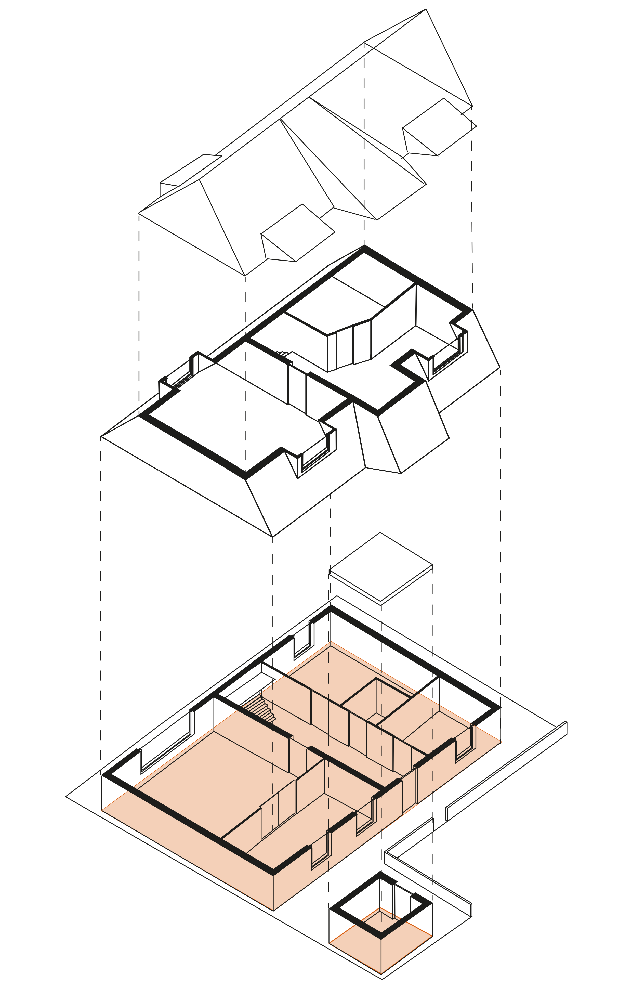
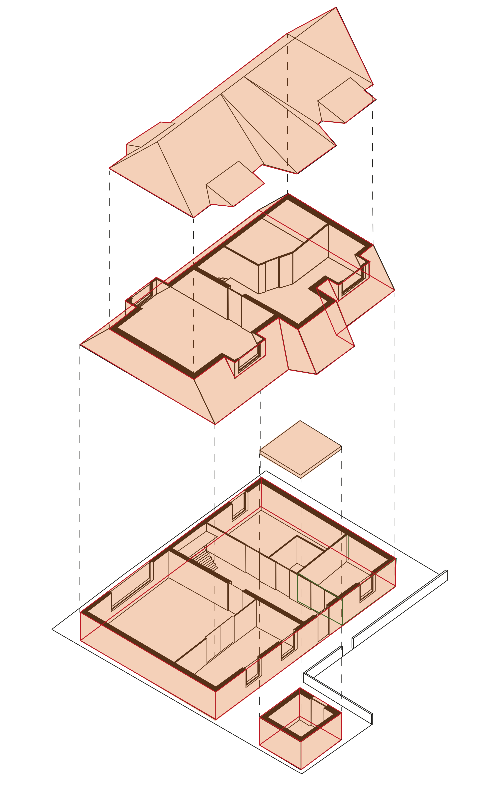
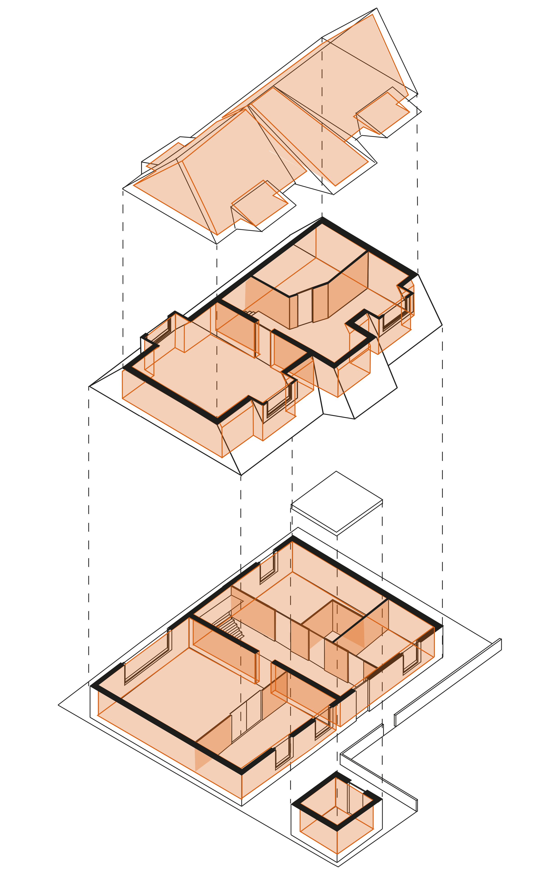
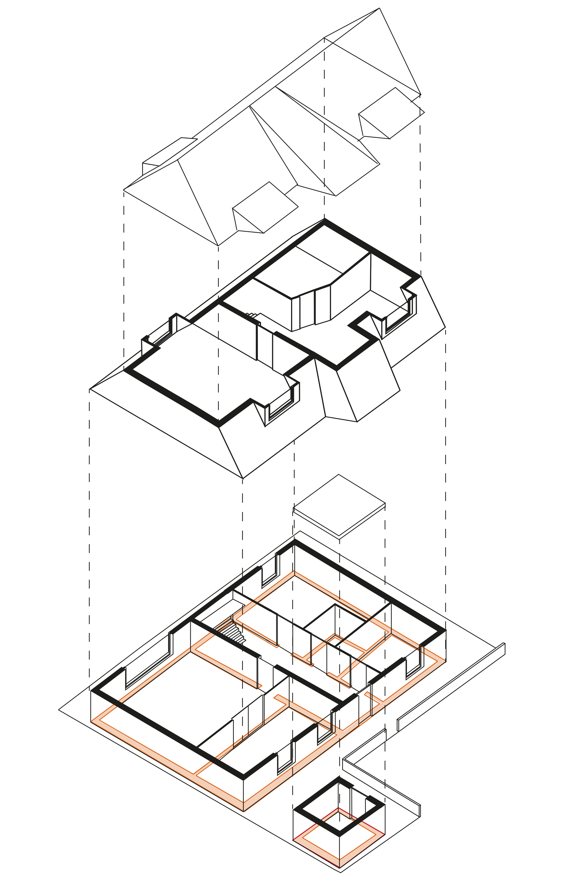
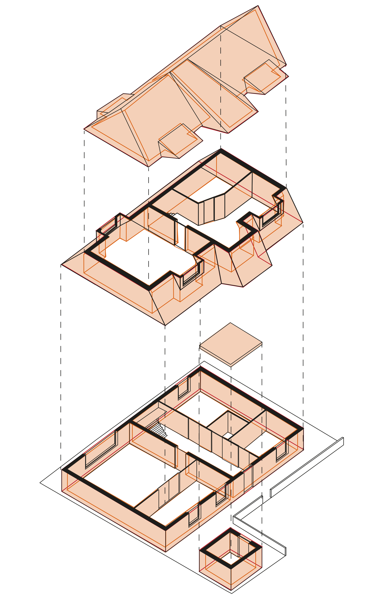

# Ruimtelijke begrippen bij vergunningcontrole gebouwen

Bouwwerk Informatie Modellen (BIM) vormen een waardevolle bron voor digitaal ondersteunde vergunningscontroles. Voorwaarde is dat het BIM-model voorziet in informatie die nodig is voor de controle. Deze informatie moet voor mens én machine te begrijpen en gebruiken zijn. Een cruciaal aspect hierbij is de informatie over de ruimtelijke indeling. In Nederland gelden specifieke eisen voor specifieke ruimtes. Zo gelden er eisen over verwarming, lichtinval, toegankelijkheid, ventilatie en afmeting voor ruimtes die bedoeld zijn voor menselijk verblijf, die niet gelden voor ruimtes die ingedeeld zijn als technische of toiletruimte.  Bovendien leggen omgevingsplannen beperkingen op aan het gebruik van ruimte op specifieke locaties. Om een digitale controle op deze voorbeelden en op andere vergunningseisen uit te kunnen voeren is het van groot belang dat zowel mens als machine begrijpt welke beoogde functie of verblijf voor de ruimtes in en om een bouwwerk is bedacht voorgesteld en gemodelleerd. Dit vraagt om eenduidig begrip van ruimte. Dit begrippenkader 

## Bepalingsmethoden

Valt een gemeenschappelijk trappenhuis nu wel of niet onder de oppervlakte van een gebruiksgebied? En dat tussenmuurtje en de ruimte onder de trap? De ene rekent het wel mee en de ander niet. Dit levert problemen. De NEN2580 is een richtlijn om de oppervlakten en inhoud van onroerende zaken eenduidig en objectief te meten en bepalen. De norm is omarmd door de vastgoedsector. De norm stelt niet wat een ruimte is, maar wel hoe men deze bepaalt. Concepten als “BVO” “NVO” zijn bepalingsmethodes, geen oppervlaktes.  

  

|                       |                                       |
|-----------------------|---------------------------------------|
| **voorkeursterm**   | <dfn>Bruto Vloer Oppervlak</dfn> |
| **alternatieve term**   | BVO |
| **alternatieve term**   | Gross Floor Area |
| **alternatieve term**   | GFA |
| **definitie**        | Het bruto vloer oppervlak van een ruimte of van een groep van ruimten is de oppervlakte, gemeten op vloerniveau langs de buitenomtrek van de opgaande scheidingsconstructies, die de desbetreffende ruimte of groep van ruimten omhullen. |
| **heeft bron** | https://example.org/source/nen2580 |
| **toelichting** | — indien een binnenruimte aan een andere binnenruimte grenst, moet worden gemeten tot het hart van de desbetreffende scheidingsconstructie; — indien een gebouwgebonden buitenruimte aan een binnenruimte grenst, moet het grondvlak van de scheidingsconstructie volledig worden toegerekend aan de BVO van de binnenruimte. |

  

<figure id="fig-bvo">
  
  <figcaption>Voorbeeld van een conform Bruto Vloer Oppervlak bepaalde eigendoms- en gebruikseenheid</figcaption>
</figure>

  

|                       |                                       |
|-----------------------|---------------------------------------|
| **voorkeursterm**   | <dfn>Bruto Inhoud</dfn> |
| **alternatieve term**   | BI |
| **alternatieve term**   | Gross Volume |
| **alternatieve term**   | GV |
| **definitie**        | De bruto inhoud van een ruimte of van een groep van ruimten is de inhoud, gemeten in 3D langs de buitenomtrek van de horizontale en verticale  scheidingsconstructies, die de desbetreffende ruimte of groep van ruimten omhullen. |
| **heeft bron** | https://example.org/source/nen2580 |
| **toelichting** | — indien een binnenruimte aan een andere binnenruimte grenst, moet worden gemeten tot het hart van de desbetreffende scheidingsconstructie; — indien een gebouwgebonden buitenruimte aan een binnenruimte grenst, moet de inhoud van de scheidingsconstructie volledig worden toegerekend aan de inhoud van de binnenruimte. |

  

<figure id="fig-bi">
  
  <figcaption>Voorbeeld van een conform Bruto Inhoud bepaalde eigendoms- en gebruikseenheid</figcaption>
</figure>

  

|                       |                                       |
|-----------------------|---------------------------------------|
| **voorkeursterm**   | <dfn>Netto Vloer Oppervlak</dfn> |
| **alternatieve term**   | NVO |
| **alternatieve term**   | Net Floor Area |
| **alternatieve term**   | NFA |
| **definitie**        | Het netto vloer oppervlak van een ruimte of een groep van ruimten is het oppervlak tussen de begrenzende horizontale en verticale scheidingsconstructies van de afzonderlijke ruimten.  |
| **heeft bron** | https://example.org/source/nen2580 |
| **toelichting** | Het volgende oppervlak is geen onderdeel van het Netto oppervlak: Het oppervlak boven delen van vloeren, waarboven de netto-hoogte kleiner is dan 1,5 m; een schalmgat of een vide, indien de oppervlakte daarvan groter is dan of gelijk is aan 4 m; een vrijstaande kolom of een vrijstaande dragende wandschijf, indien het grondvlak daarvan groter is dan of gelijk is aan 0,5 m; het volume van een vrijstaande niet-toegankelijke leidingschacht, indien het grondvlak daarvan groter is dan of gelijk is aan 0,5 m.  |

  

<figure id="fig-nvo">
  
  <figcaption>Voorbeeld van een conform Netto Vloer Oppervlak bepaalde eigendoms- en gebruikseenheid</figcaption>
</figure>

  

|                       |                                       |
|-----------------------|---------------------------------------|
| **voorkeursterm**   | <dfn>Netto Inhoud</dfn> |
| **alternatieve term**   | NI |
| **alternatieve term**   | Net Volume |
| **alternatieve term**   | NV |
| **definitie**        | De netto inhoud van een ruimte of een groep van ruimten is de inhoud tussen de begrenzende horizontale en verticale scheidingsconstructies van de afzonderlijke ruimten.  |
| **heeft bron** | https://example.org/source/nen2580 |
| **toelichting** | Het volgende volume is geen onderdeel van het Netto volume: Het volume boven delen van vloeren, waarboven de netto-hoogte kleiner is dan 1,5 m; een schalmgat of een vide, indien het grondvlakoppervlakte daarvan groter is dan of gelijk is aan 4 m2; een vrijstaande kolom of een vrijstaande dragende wandschijf, indien het grondvlak daarvan groter is dan of gelijk is aan 0,5 m; het volume van een vrijstaande niet-toegankelijke leidingschacht, indien het grondvlak daarvan groter is dan of gelijk is aan 0,5 m.  |

  

<figure id="fig-ni">
  
  <figcaption>Voorbeeld van een conform Netto Inhoud bepaalde eigendoms- en gebruikseenheid</figcaption>
</figure>

  

|                       |                                       |
|-----------------------|---------------------------------------|
| **voorkeursterm**   | <dfn>Tarra Oppervlak</dfn> |
| **alternatieve term**   | TO |
| **alternatieve term**   | Tare Area |
| **alternatieve term**   | TA |
| **definitie**        | Het Tarra Oppervlak van een ruimte of een groep van ruimten is het oppervlak dat ingenomen wordt door constructies, lage gedeeltes en nissen en schachten.  |
| **heeft bron** | https://example.org/source/nen2580 |
| **toelichting** | Het volgende oppervlak is onderdeel van het Tara Oppervlak: Het vloeroppervlak van vloeren, waarboven de netto-hoogte kleiner is dan 1,5 m; het vloeroppervlak van een schalmgat of een vide, indien het grondvlakoppervlakte daarvan groter is dan of gelijk is aan 4 m2; een vrijstaande kolom of een vrijstaande dragende wandschijf, indien het grondvlak daarvan groter is dan of gelijk is aan 0,5 m; het volume van een vrijstaande niet-toegankelijke leidingschacht, indien het grondvlak daarvan groter is dan of gelijk is aan 0,5 m. Het vloeroppervlak van verticale scheidingsconstructies |

  

<figure id="fig-to">
  
  <figcaption>Voorbeeld van een conform Tarra Oppervlak bepaalde eigendoms- en gebruikseenheid</figcaption>
</figure>

  

|                       |                                       |
|-----------------------|---------------------------------------|
| **voorkeursterm**   | <dfn>Tarra Inhoud</dfn> |
| **alternatieve term**   | TI |
| **alternatieve term**   | Tare Volume |
| **alternatieve term**   | TV |
| **definitie**        | De Tarra Inhoud van een ruimte of een groep van ruimten is de inhoud die ingenomen wordt door constructies, lage gedeeltes en nissen en schachten.  |
| **heeft bron** | https://example.org/source/nen2580 |
| **toelichting** | De volgende inhoud is onderdeel van het Tara Oppervlak: De inhoud van ruimte boven vloeren, waarboven de netto-hoogte kleiner is dan 1,5 m; de inhoud van ruimte van een schalmgat of een vide, indien het grondvlakoppervlakte daarvan groter is dan of gelijk is aan 4 m2; de inhoud van ruimte van een vrijstaande kolom of een vrijstaande dragende wandschijf, indien het grondvlak daarvan groter is dan of gelijk is aan 0,5 m; de inhoud van ruimte van een vrijstaande niet-toegankelijke leidingschacht, indien het grondvlak daarvan groter is dan of gelijk is aan 0,5 m. De inhoud van ruimte van verticale en horizontale scheidingsconstructies |

  

<figure id="fig-to">
  
  <figcaption>Voorbeeld van een conform Tarra Inhoud bepaalde eigendoms- en gebruikseenheid</figcaption>
</figure>

  

|                       |                                       |
|-----------------------|---------------------------------------|
| **voorkeursterm**   | <dfn>Gebruiks Oppervlak</dfn> |
| **alternatieve term**   | GO |
| **definitie**        | Het gebruiksoppervlak van een ruimte of een groep van ruimten is de inhoud tussen de begrenzende verticale scheidingsconstructies van de afzonderlijke ruimten, inclusief het oppervlak van niet dragende scheidingsmuren.   |
| **heeft bron** | https://example.org/source/nen2580 |
| **toelichting** | Het volgende oppervlak is geen onderdeel van het Gebruiks Oppervlak: Het opervlak van vloeren, waarboven de netto-hoogte kleiner is dan 1,5 m; een schalmgat of een vide, indien het grondvlakoppervlakte daarvan groter is dan of gelijk is aan 4 m2; een vrijstaande kolom of een vrijstaande dragende wandschijf, indien het grondvlak daarvan groter is dan of gelijk is aan 0,5 m; het oppervlak van een vrijstaande niet-toegankelijke leidingschacht, indien het grondvlak daarvan groter is dan of gelijk is aan 0,5 m. |

  

|                       |                                       |
|-----------------------|---------------------------------------|
| **voorkeursterm**   | <dfn>Gebruiks Inhoud</dfn> |
| **alternatieve term**   | GI |
| **definitie**        | De Gebruiks Inhoud van een ruimte of een groep van ruimten is de inhoud tussen de begrenzende horizontale en verticale scheidingsconstructies van de afzonderlijke ruimten, inclusief de ruimte van niet dragende scheidingsmuren.   |
| **heeft bron** | https://example.org/source/nen2580 |
| **toelichting** | Het volgende volume is geen onderdeel van het Gebruiks Inhoud: Het volume boven delen van vloeren, waarboven de netto-hoogte kleiner is dan 1,5 m; een schalmgat of een vide, indien het grondvlakoppervlakte daarvan groter is dan of gelijk is aan 4 m2; een vrijstaande kolom of een vrijstaande dragende wandschijf, indien het grondvlak daarvan groter is dan of gelijk is aan 0,5 m; het volume van een vrijstaande niet-toegankelijke leidingschacht, indien het grondvlak daarvan groter is dan of gelijk is aan 0,5 m. |

  

## Bronnen (dct:source)

|                       |                                       |
|-----------------------|---------------------------------------|
| **URI**   | https://example.org/source/nen2580 |
| **rdf.type**        | foaf:Document |
| **dcterms.title** | "NEN 2580 - Oppervlakten en inhouden van gebouwen"@nl |
| **rdfs.comment** | "NEN 2580 is een Nederlandse norm die termen, definities en bepalingsmethoden vastlegt voor het bepalen van oppervlakten en inhouden van gebouwen."@nl |
| **dcterms:publisher** | <https://www.nen.nl/> |
| **foaf:page** | <https://www.nen.nl/nen-2580-2007-nl-113982> |
| **dcterms:identifier** | "NEN 2580" |
