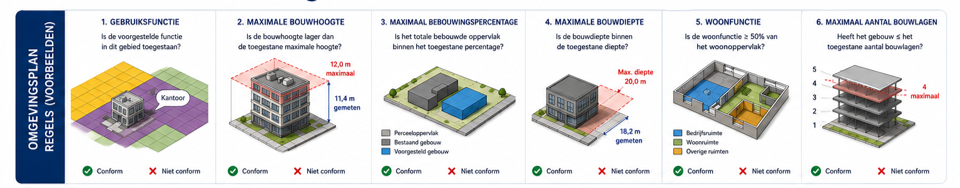
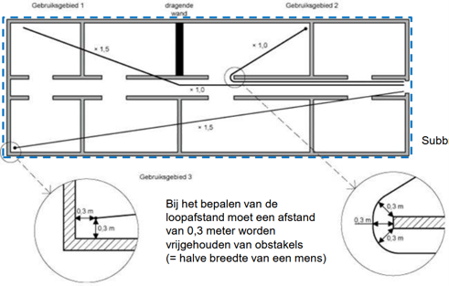

# Regelinterpretatie per check {#regelinterpretatie}

**Project:** VNG Beleidsmaatregel 13 — Vergunningverlening met BIM
**Versie:** 0.3 (3 juli 2026) — *onder bewerking*
**Status:** Resultaat van fysieke sessies met deelnemende gemeenten, 7 april 2026 en 8 juni 2026, Zoetermeer

> Deze inventarisatie beschrijft per regel: de toets, de werkwijze, de regelgevingsbron, de huidige toetstijd en opmerkingen. Regels #1–#6 betreffen het omgevingsplan (OPA) (ook: de Omgevingsplantoets, regels #7–#17 het Besluit bouwwerken leefomgeving (Bbl) (ook: de Technische toets)

> 

> 

*Afbeelding aanpassen: nummering en omschrijving checks als hieronder.*

## Regel #1: Gebruiksfunctie komt overeen met bestemming {#regel-1}
### Toets

Is de aangevraagde gebruiksfunctie toegestaan op de betreffende locatie?

### Werkwijze

- Bekijk het aanvraagformulier DSO

- Bepaal de aangevraagde gebruiksfunctie(‘s)

- Bepaal aan de hand van de locatie van de kavel of perceel de betreffende Regels over toegestane gebruiksfuncties / bestemmingen via  <a href="https://omgevingswet.overheid.nl/regels-op-de-kaart/zoeken/locatie?session=aa1f4c6e-30e6-47c3-8301-03c60978f374" target="new"> Regels op de kaart</a>

- Bepaal op basis van de bouwtekening (plattegronden) per bouwlaag de contouren van de gebruiksfunctie en ruimten

- Vergelijk deze met het werkingsgebied (zonering) van de regel en bepaal of dit klopt (toegestaan is).

- In het geval van een regel / norm voor een x% m2 voor beroep aan huis zie Regel #5.

Nb. voor het bepalen van de regels geldt niet alleen het bestemmingplan (met de status onherroepelijk), maar mogelijk ook een Paraplu bestemmingsplan met algemene regelgeving (afzonderlijk document).

Sommige checks zijn niet te automatiseren en vragen om een handmatige toets. Dat heeft te maken met verschil van interpretatie tussen de juridische regel en de (technische) informatie uit de bouwaanvraag.

*#Controlevraag: heeft dit te maken met uitzonderingen?*

### Informatiebehoefte

#### Gebouwdata

- Bouwaanvraag /Plattegrond/ bouwtekening

- Gebruiksfunctie per ruimten per bouwlaag

#### In relatie tot ILS Ruimte ([data dictionary](https://search.bsdd.buildingsmart.org/uri/bsnl/Omgevingswet-Ruimten/0.3.0) )

- Bouwwerkperceel: IfcZone (of IfcSpatialzone, IfcSpace)

- Kadastraalperceel: IfcZone (of IfcSpatialzone, IfcSpace) Nb.tevens Omgevingsdata

- Bouwlaag: IfcBuildingStorey (conform BIM Basis ILS)

- Gebruiksfunctie: IfcZone (of IfcSpatialzone, IfcSpace)

- VerblijfsRuimte of Functieruimte: IfcSpace (of IfcZone, IfcSpatialzone)

#### Omgevingsdata / geodata

- Perceelgrenzen

#### In relatie tot begrippen Geo-standaarden en beeldmateriaal

- (Kadastraal) Perceel: BRK – Digitale Kadastrale Kaart

  - https://stelselcatalogus.nl/detail/objecttype?id=https:%2F%2Fpurl.stelselcatalogus.nl%2Fmkg%2Fbrk%2Fb9fd1c65-1d17-4129-a237-3d00a1667312
  
### Regelgeving en normen

Regels op de Kaart: Vigerend (onherroepelijk) omgevingsplan met aanwijzing zonering voor gebruiksfunctie / bestemming (eventueel beperkt tot aantal bouwlagen).

Eventueel Paraplubestemmingsplan met generieke regelgeving

NEN2580: oppervlaktebepaling

### Tijd (huidige situatie)

Ca. 1 uur

### Opmerkingen

Geen

## Regel #2: Maximale bouwhoogte {#regel-2}
### Toets

Overschrijdt de hoogte van het gebouw de toegestane maximale gebouwhoogte van het perceel?

### Werkwijze

- Bekijk het aanvraagformulier DSO

- Bepaal het de hoogte (nok- of goothoogte) op basis van de bouwtekening (plattegronden, doorsneden en details)

- Bepaal aan de hand van de locatie van de kavel of perceel de betreffende Regels over de maximaal toegestane bouwhoogte via Regels op de Kaart

- Als er geen maximum wordt gesteld = akkoord en afgerond

- Toets de uitkomst aan de regel

Nb.  
De hoogte wordt gemeten vanaf referentiepeil = 0 (meestal bovenkant begane grond vloer). Of een referentiepeil (door gemeente bepaald). Voor de uiteindelijke hoogte is het ook belangrijk dat er gekeken wordt naar de installaties die (eventueel) op het dak staan.

### Informatiebehoefte

#### Gebouwdata

- Bouwaanvraag /Plattegrond / bouwtekening

- Dakvorm

#### In relatie tot ILS Ruimte ([data dictionary](https://search.bsdd.buildingsmart.org/uri/bsnl/Omgevingswet-Ruimten/0.3.0) )

- Bouwwerkperceel: IfcZone (of IfcSpatialzone, IfcSpace)

- Kadastraalperceel: IfcZone (of IfcSpatialzone, IfcSpace) Nb.tevens Omgevingsdata

- Bouwlaag: IfcBuildingStorey (conform BIM Basis ILS)

- *Hoogte van het gebouw is geen begrip in ILS ruimte*

#### Omgevingsdata / geodata

- Perceelgrenzen

- Referentiepeil (door gemeente bepaald)

#### In relatie tot begrippen Geo-standaarden en beeldmateriaal

- (Kadastraal) Perceel: BRK – Digitale Kadastrale Kaart

  - https://stelselcatalogus.nl/detail/objecttype?id=https:%2F%2Fpurl.stelselcatalogus.nl%2Fmkg%2Fbrk%2Fb9fd1c65-1d17-4129-a237-3d00a1667312
  >

- Referentiepeil: AHN / ingemeten terreinmodel

  - <https://www.ahn.nl/producten>

Nb. We verwijzen hier naar de jaarlijkse landsdekkende luchtfoto's en het landsdekkende hoogtebestand van respectievelijk Beeldmateriaal Nederland en Algemeen Hoogtebestand Nederland. Sommige gemeenten hebben daarnaast nog eigen luchtfoto's en soms ook nog eigen hoogtebestanden.
### Regelgeving

Regels op de Kaart: Vigerend (onherroepelijk) omgevingsplan met zonering (of bouwvlak) en normen voor maximale bouwhoogte.

### Tijd (huidige situatie)

15 minuten – 2 uur

### Opmerkingen

Het te hanteren referentiepeil kan variëren. Bijv. bij dijkwoningen wordt een ander peil gehanteerd dan bij gewone woningen. In de bestemmingsplannen (omgevingsplannen) zijn als het goed is de verschillende definities van referentiepeil opgenomen.

## Regel #3: Maximaal bebouwingspercentage {#regel-3}
### Toets

Overschrijdt het aangevraagde bebouwde oppervlakte opgeteld bij de oppervlakte van aanwezige bebouwing het toegestane maximale bebouwingspercentage voor een bepaald gebied?

Als voorbeeld: een grondgebonden nieuwbouwwoning op een vrije kavel.

### Werkwijze

- Bekijk het aanvraagformulier DSO

- Verzamel de bouwtekeningen van de bestaande bebouwing op de kavel (bouwarchief of luchtfoto)

- Bepaal de contouren (op maaiveld) van alle nieuwe en bestaande gebouwen op basis van de bestaande en nieuwe plattegronden

- Bepaal de contour van de kavel / perceel (en eventueel aanvullende contouren bouwvlak of indeling erf)

- Bepaal welke gebouwen en delen van gebouwen meedoen bij het bepalen van de oppervlakte gebouwd op basis van soort gebouw en gebruik

- Bereken de gebouwde oppervlakte en de oppervlakte van het perceel en bepaal het bebouwingspercentage (gebouwde oppervlakte / perceel oppervlakte X 100)

- Bepaal aan de hand van de locatie van de kavel of perceel de betreffende Regels over maximaal toegestaan bebouwings% via Regels op de Kaart

- Toets de uitkomst aan de regel

Nb De gebouwde oppervlakte wordt berekend op basis van de aangevraagde en bestaande gebouwen. Niet alle gebouwen of gebouwdelen hoeven te worden meegerekend.

Bij het splitsen van kavels en percelen is de berekening ingewikkelder.

Sommige checks zijn niet te automatiseren en vragen om een handmatige toets. Dat heeft te maken met verschil van interpretatie tussen de juridische regel en de (technische) informatie uit de bouwaanvraag.

### Informatiebehoefte

#### Gebouwdata

- Bouwaanvraag /Plattegrond / bouwtekening/situatietekening

- Gebouwtype

- Gebruiksfunctie

- Plattegrond op maaiveld / begane grond

- Bruto oppervlakte per begane grond laag

#### In relatie tot ILS Ruimte ([data dictionary](https://search.bsdd.buildingsmart.org/uri/bsnl/Omgevingswet-Ruimten/0.3.0) )

- Bouwwerkperceel: IfcZone (of IfcSpatialzone, IfcSpace)

- Kadastraalperceel: IfcZone (of IfcSpatialzone, IfcSpace) Nb.tevens Omgevingsdata

- Gebouwtype: IfcBuilding (MarketCategory en MarketSubCategory)

- Bouwlaag: IfcBuildingStorey (conform BIM Basis ILS)

- Gebruiksfunctie: IfcZone (of IfcSpatialzone, IfcSpace)

- VerblijfsRuimte of Functieruimte: IfcSpace (of IfcZone, IfcSpatialzone)

#### Omgevingsdata / geodata

- Bestaande bebouwing

- Luchtfoto

- Perceelgrenzen

- Referentiepeil (door gemeente bepaald)

#### In relatie tot begrippen Geo-standaarden en beeldmateriaal

- BAG Pand

  - https://stelselcatalogus.nl/detail/objecttype?id=https:%2F%2Fpurl.stelselcatalogus.nl%2Fmkg%2Fbag%2Ff31b46a2-b6b3-48d1-bfd3-a624bb2757c6
  

<!-- -->

- BGT Overig bouwwerk

  - https://stelselcatalogus.nl/detail/objecttype?id=https:%2F%2Fpurl.stelselcatalogus.nl%2Fmkg%2Fbgt%2F333255c2-7038-434f-a137-7467ef8f5af4
  

<!-- -->

- Luchtfoto

  - <https://www.beeldmateriaal.nl/producten>

- (Kadastraal) Perceel: BRK – Digitale Kadastrale Kaart

  - https://stelselcatalogus.nl/detail/objecttype?id=https:%2F%2Fpurl.stelselcatalogus.nl%2Fmkg%2Fbrk%2Fb9fd1c65-1d17-4129-a237-3d00a1667312
  

- Referentiepeil: AHN / ingemeten terreinmodel

  - https://www.ahn.nl/producten

Nb. We verwijzen hier naar de jaarlijkse landsdekkende luchtfoto's en het landsdekkende hoogtebestand van respectievelijk Beeldmateriaal Nederland en Algemeen Hoogtebestand Nederland. Sommige gemeenten hebben daarnaast nog eigen luchtfoto's en soms ook nog eigen hoogtebestanden.

### Regelgeving

Regels op de Kaart: Vigerend (onherroepelijk) omgevingsplan met aanwijzing zonering voor maximaal bebouwingspercentage.

Eventueel Paraplubestemmingsplan met generieke regelgeving

NEN2580: oppervlaktebepaling

### Tijd (huidige situatie)

30 – 60 minuten per casus

### Opmerkingen

Er moet goed worden gekeken naar het gebied waarvan het bebouwingspercentage wordt berekend: gaat het om het perceel, het bouwvlak of het bebouwingsgebied.

Verschilt per gemeente:

Berekening kan op basis van m2 (oppervlakte), maar ook op basis van m3 (volume). Bij woongebouwen vaak volume en bij bedrijven vaak oppervlakte.

## Regel #4: Gebruiksfunctie / Bestemming beperkt tot x aantal bouwlagen {#regel-4}
### Toets

is de aangevraagde gebruiksfunctie toegestaan op de betreffende locatie?

Als voorbeeld: Toegestane gebruiksfunctie is beperkt tot x aantal bouwlagen

### Werkwijze

Deels gelijk aan regel \#1.

- Bekijk het aanvraagformulier DSO

- Bepaal de aangevraagde gebruiksfunctie(‘s)

- Bepaal aan de hand van de locatie van de kavel of perceel de betreffende Regels over toegestane gebruiksfuncties / bestemmingen via Regels op de Kaart

- Bepaal op basis van de bouwtekening (plattegronden) per bouwlaag de contouren van de gebruiksfunctie en ruimten

- Vergelijk deze met het werkingsgebied (zonering) van de regel en bijbehorende uitleg van de regels (aantal bouwlagen etc.) en bepaal of dit klopt (toegestaan is).

- In het geval van een regel / norm voor een x% m2 voor beroep aan huis zie Regel X.

Nb voor het bepalen van de regels geldt niet alleen het bestemmingplan (met de status onherroepelijk), maar mogelijk ook een Paraplu bestemmingsplan met algemene regelgeving (afzonderlijk document).

Sommige checks zijn niet te automatiseren en vragen om een handmatige toets. Dat heeft te maken met verschil van interpretatie tussen de juridische regel en de (technische) informatie uit de bouwaanvraag.

### Informatiebehoefte

#### Gebouwdata

- Bouwaanvraag /Plattegrond / bouwtekening

- Gebouwtype

- Gebruiksfunctie per ruimten per bouwlaag

#### In relatie tot ILS Ruimte ([data dictionary](https://search.bsdd.buildingsmart.org/uri/bsnl/Omgevingswet-Ruimten/0.3.0) )

- Gebouwtype: IfcBuilding (MarketCategory en MarketSubCategory)

- Bouwlaag: IfcBuildingStorey (conform BIM Basis ILS)

- Gebruiksfunctie: IfcZone (of IfcSpatialzone, IfcSpace)

- VerblijfsRuimte of Functieruimte: IfcSpace (of IfcZone, IfcSpatialzone)

#### Omgevingsdata / geodata

Geen.

### Regelgeving

Regels op de Kaart: Vigerend (onherroepelijk) omgevingsplan met aanwijzing zonering voor gebruiksfunctie / bestemming (eventueel beperkt tot aantal bouwlagen).

Eventueel Paraplubestemmingsplan met generieke regelgeving

NEN2580: oppervlaktebepaling

### Tijd (huidige situatie)

Ca. 30 minuten

### Opmerkingen

Geen

## Regel #5: Beroep aan huis: maximaal 50% gebruiksoppervlakte bedrijfsgebonden kantoor {#regel-5}
Toets: Overschrijdt de gebruiksoppervlakte van een (neven-) gebruiksfunctie bedrijf de toegestane maximale gebruiksoppervlakte binnen een Gebruiksfunctie Wonen?

### Werkwijze

- Bekijk het aanvraagformulier DSO

- Bepaal of leid de SBI-code van het beoogde bedrijf af

- Bepaal of de aangevraagde (neven-)gebruiksfunctie valt onder “Beroep aan huis”

- Check of de aanvrager een belanghebbende is (via het Kadaster)

- Verzamel de bouwtekeningen van de bestaande bebouwing op de kavel (bouwarchief)

- Bepaal de omliggende gebouwen

- Bereken de bruto oppervlakte van de verschillende gebruiksfuncties op basis van de bestaande en nieuwe plattegronden

- Bepaal welke ruimten niet worden gebruikt voor gebruiksfunctie Wonen

- Bepaal aan de hand van de locatie van de kavel of perceel de betreffende Regels over maximaal toegestaan % beroep aan huis via Regels op de Kaart

- Eventueel: check op gemeentelijke beleidsregels, die nog niet op de kaart staan

- Noteer in een word-document de interne overwegingen en opmerkingen, berekeningen en metingen van de VTH medewerk (m.b.t. de beoordeling / toets)

Nb.  
Soms wordt een tabel met ruimten en oppervlaktes of een Excel meegeleverd. Let daarbij speciaal op “onbenoemde ruimtes”, deze kunnen namelijk later worden gebruikt voor iets dat nu nog niet is toegestaan.  
Sommige SBI-coderingen zijn vergunningsvrij.

### Informatiebehoefte

#### Gebouwdata

- Bouwaanvraag /Plattegrond / bouwtekening

- Gebruiksfunctie

- Bruto oppervlakte ruimten per gebruiksfunctie

- Situatietekening (bouwwerkperceel + kadastraal perceel + belendende percelen en bouwwerken)

- SBI-codering kantoor Beroep aan huis

#### In relatie tot ILS Ruimte ([data dictionary](https://search.bsdd.buildingsmart.org/uri/bsnl/Omgevingswet-Ruimten/0.3.0) )

- Bouwwerkperceel: IfcZone (of IfcSpatialzone, IfcSpace)

- Kadastraalperceel: IfcZone (of IfcSpatialzone, IfcSpace) Nb.tevens Omgevingsdata

- Gebruiksfunctie: IfcZone (of IfcSpatialzone, IfcSpace)

- VerblijfsRuimte of Functieruimte: IfcSpace (of IfcZone, IfcSpatialzone)

- BVO per Ruimte: Bepalingsmethode BVO (= Netto + Tarra oppervlakte)

#### Omgevingsdata / geodata

Nb. Omgevingsdata is waarschijnlijk alleen in een bepaalde zone / buffer rond het bouwplan gewenst.

- Perceelgrenzen

- Bestaande bebouwing

#### In relatie tot begrippen Geo-standaarden en beeldmateriaal

- Perceelgrens: BRK – Digitale Kadastrale Kaart

  - https://stelselcatalogus.nl/detail/objecttype?id=https:%2F%2Fpurl.stelselcatalogus.nl%2Fmkg%2Fbrk%2Fb9fd1c65-1d17-4129-a237-3d00a1667312
  

- Bestaande bebouwing + status: BAG Pand

  - https://stelselcatalogus.nl/detail/objecttype?id=https:%2F%2Fpurl.stelselcatalogus.nl%2Fmkg%2Fbag%2Ff31b46a2-b6b3-48d1-bfd3-a624bb2757c6
  

  - https://stelselcatalogus.nl/detail/attribuutsoort?id=https:%2F%2Fpurl.stelselcatalogus.nl%2Fmkg%2Fbag%2F9ba0e95d-5be3-4c08-9c46-4e98286392bd
  

- Bestaande bebouwing: BAG VBO + status + Gebruiksdoel + Gebruiksoppervlakte

  - https://stelselcatalogus.nl/detail/objecttype?id=https:%2F%2Fpurl.stelselcatalogus.nl%2Fmkg%2Fbrk%2Fdb6aad7d-d1e2-441a-a6fc-16b99b12cb28
  

  - https://stelselcatalogus.nl/detail/attribuutsoort?id=https:%2F%2Fpurl.stelselcatalogus.nl%2Fmkg%2Fbag%2F6ad4108e-b958-47ca-a0a0-abb836f2722e
  

  - https://stelselcatalogus.nl/detail/attribuutsoort?id=https:%2F%2Fpurl.stelselcatalogus.nl%2Fmkg%2Fbag%2F3b4f790f-1bf3-47f5-9160-d181e2a155d8
  

  - https://stelselcatalogus.nl/detail/attribuutsoort?id=https:%2F%2Fpurl.stelselcatalogus.nl%2Fmkg%2Fbag%2F55c06ea8-feb7-4392-89ba-a251a4606c5a
   

### Regelgeving

Regels op de Kaart: Vigerend (onherroepelijk) omgevingsplan met normen voor % gebruiksoppervlakte beroep aan huis.

NEN2580: oppervlaktebepaling

### Tijd (huidige situatie)

Ca. 45 minuten

### Opmerkingen

Geen

## Regel #6: Maximum aantal bouwlagen {#regel-6}
### Toets

Overschrijdt het aantal bouwlagen het maximaal toegestane aantal bouwlagen?

### Werkwijze

- Bekijk het aanvraagformulier DSO

- Bepaal het aantal bouwlagen op basis van de bouwtekening (plattegronden, doorsneden en details)

- Bepaal aan de hand van de locatie van de kavel of perceel de betreffende Regels over maximaal toegestaan aantal bouwlagen via Regels op de Kaart of via eigen Geo-applicatie

- Als er geen maximum wordt gesteld = akkoord en afgerond

- Bepaal (tellen) het aantal bouwlagen op basis van de doorsnede en plattegronden

- Toets de uitkomst aan de regel

Nb.  
Aantal bouwlagen vanaf referentiepeil = 0 (meestal bovenkant begane grond vloer). Of een referentiepeil (door gemeente bepaald).  
Telt een kelder (-1) ook mee als bouwlaag? Begripsbepaling NEN2580.   
Telt een dak (hoogste bouwlaag) ook mee als aparte bouwlaag? In het geval van een plat dak en een schuin dak.  
Tussen NEN2580 en Bbl zitten interpretatieverschillen.

### Informatiebehoefte

#### Gebouwdata

- Bouwaanvraag /Plattegrond / bouwtekening

- Aanwezigheid kelder

- Dakvorm

#### In relatie tot ILS Ruimte ([data dictionary](https://search.bsdd.buildingsmart.org/uri/bsnl/Omgevingswet-Ruimten/0.3.0) )

- Bouwwerkperceel: IfcZone (of IfcSpatialzone, IfcSpace)

- Kadastraalperceel: IfcZone (of IfcSpatialzone, IfcSpace) Nb.tevens Omgevingsdata

- Bouwlaag: IfcBuildingStorey (conform BIM Basis ILS)

- Gebruiksfunctie: IfcZone (of IfcSpatialzone, IfcSpace)

- VerblijfsRuimte of Functieruimte: IfcSpace (of IfcZone, IfcSpatialzone)

- BVO per Ruimte: Bepalingsmethode BVO (= Netto + Tarra oppervlakte)

#### Omgevingsdata / geodata

Geen

### Regelgeving

Regels op de Kaart: Vigerend (onherroepelijk) omgevingsplan met zonering en normen voor maximaal bebouwingspercentage.

NEN2580: oppervlaktebepaling

### Tijd (huidige situatie)

Ca. 10 minuten

### Opmerkingen

Geen.

## Regel #7: Brandcompartimenten {#regel-7}
### Toets

aanwezigheid en maximale omvang (gebruiksoppervlakte) van brandcompartimenten per gebruiksfunctie.

### Werkwijze

- Bekijk het aanvraagformulier DSO

- Bepaal de hoofd gebruiksfunctie van het nieuw te bouwen bouwwerk of de gecombineerde gebruiksfunctie (geen nevengebruiksfuncties)

- Ga naar Besluit Bouwwerken Leefomgeving paragraaf 4.2.8

- Gebruik aansturingstabel 4.49 behorende bij artikel 4.49 voor het bepalen van de relevante leden uit artikel 4.51 en 4.52

- Check of de contouren van de brandcompartimenten zijn weergegeven

- Bereken of toets de oppervlakte van de brandcompartimenten (BVO)  
  Nb. vergunningaanvrager moet deze zelf ook berekenen in een tabel mee leveren. Sommige gemeenten controleren deze dan nog wel, sommige gemeenten niet.

- Controleer op aanwezigheid specificaties van de brandwerende deuren, ramen, doorvoeren, vloeren, wanden, etc)

- Toets of de specificaties voldoen aan het Bbl (EI = Integriteit / vlamdichtheid en Isolatie classificatie), WBDBO = Weerstand tegen BrandDoorslag en BrandOverslag)

- Beoordeel of de afstand van de gevel tot de grens perceel of midden weg voldoet aan het Bbl (conform spiegelprincipe)

- Beoordeel of de afstand of WBDO tussen de gebouwen onderling (op hetzelfde perceel) voldoet aan het Bbl met betrekking tot brandoverslag

Nb. Het gaat hier om de onderlinge afstand tussen de gebouwen op hetzelfde perceel. Voor gebouwen op aangrenzende percelen wordt gewerkt volgens het zogenaamde “spiegelsymmetrie”. Het nieuw te bouwen gebouw wordt gespiegeld op de perceelsgrens en de noodzakelijke brandoverslag maatregelen worden bepaald op basis van de afstand tussen nieuwbouw en gespiegeld gebouw.  
Voor gebouwen die grenzen aan openbaar groen, wegen of water vindt de spiegeling plaats op de hartlijn van dat openbaar groen, wegen of water.

Toets op gelijkwaardigheden (NEN 6060 / 6079). In het geval de brandcompartimenten groter zijn (in m2 GO) dan rechtstreeks toegestaan volgens het Bbl is een gelijkwaardigheidsbeoordeling nodig. De gevolgen voor de omgeving worden dan meegewogen in de gelijkwaardigheidsbeoordeling. Gebouweigenschappen, gebruiksfuncties in omliggende panden, vitale infrastructuur en inzet van de brandweer bepalen mede of de gelijkwaardigheid kan worden goedgekeurd.

### Informatiebehoefte

#### Gebouwdata (als onderdeel van de ingediende vergunningaanvraag):

- Bouwaanvraag /Plattegrond / doorsneden

- Gebruiksfunctie

- Situatietekening (bouwwerkperceel + kadastraal perceel + belendende percelen en bouwwerken)

- Brandcompartimenten (aanduiding + contouren)

- BVO per brandcompartiment

- Brandwerende constructieonderdelen met specificatie en certificaat (behalve aantoonbare brandwerende constructieonderdelen zoals beton of steen)

- Gevel nieuw te bouwen gebouw met specificatie en certificaat (behalve aantoonbare brandwerende constructieonderdelen zoals beton of steen)

- Rapportage gelijkwaardigheden

#### In relatie tot ILS Ruimte ([data dictionary](https://search.bsdd.buildingsmart.org/uri/bsnl/Omgevingswet-Ruimten/0.3.0) )

- Bouwwerkperceel: IfcZone (of IfcSpatialzone, IfcSpace)

- Kadastraalperceel: IfcZone (of IfcSpatialzone, IfcSpace) Nb.tevens Omgevingsdata

- Gebruiksfunctie: IfcZone (of IfcSpatialzone, IfcSpace)

- Brandcompartiment: IfcZone (of IfcSpatialzone, IfcSpace)

- BVO per Brandcompartiment: Bepalingsmethode BVO (= Netto + Tarra oppervlakte)

- WBDO (Brandwerendheid constructie): IfcWall of IfcSlab (maar IfcZone of IfcSpatialzone, IfcSpace mag ook worden gebruikt).

- Brandwerende constructieonderdelen: IfcDoor, IfcWall, IfcColumn, IfcCurtainWall, IfcSlab

#### Omgevingsdata / geodata

Nb. Omgevingsdata is waarschijnlijk alleen in een bepaalde zone / buffer rond het bouwplan gewenst. In principe alleen direct aangrenzende percelen. Waarbij de ligging van de grens essentieel is. Waarbij een aangrenzend perceel met dezelfde eigenaar als het te bebouwen perceel als hetzelfde perceel beschouw kan worden. En de situatietekening met perceelsgrenzen die afwijken van de BRK, leidend is, uitgaande van een later te verkavelen perceel.

- Perceelgrenzen

- Belanghebbende / eigenaar

- Bestaande bebouwing

- Typering gebruiksdoel / gebruiksfunctie bestaande bebouwing

- Vitale infrastructuur

- Openbare toegankelijke ruimte (bosgebied, water, groenstrook etc.)

- Openbare toegankelijke wegen (en spoor)

#### In relatie tot begrippen Geo-standaarden en beeldmateriaal

- (Kadastraal) Perceel: BRK – Digitale Kadastrale Kaart

  - https://stelselcatalogus.nl/detail/objecttype?id=https:%2F%2Fpurl.stelselcatalogus.nl%2Fmkg%2Fbrk%2Fb9fd1c65-1d17-4129-a237-3d00a1667312
  

- Belanghebbende / eigenaar: BRK – Tenaamstelling + Naam eigenaar

  - https://stelselcatalogus.nl/detail/objecttype?id=https:%2F%2Fpurl.stelselcatalogus.nl%2Fmkg%2Fbrk%2F8a8cbe3b-00a1-486d-a5c5-0a4888374985
  

  - https://stelselcatalogus.nl/detail/objecttype?id=https:%2F%2Fpurl.stelselcatalogus.nl%2Fmkg%2Fbrk%2Fbf2d680a-fd4f-4b37-bd71-1dea25f3eddd

  
- Bestaande bebouwing + status: BAG Pand

  - https://stelselcatalogus.nl/detail/objecttype?id=https:%2F%2Fpurl.stelselcatalogus.nl%2Fmkg%2Fbag%2Ff31b46a2-b6b3-48d1-bfd3-a624bb2757c6

  - https://stelselcatalogus.nl/detail/attribuutsoort?id=https:%2F%2Fpurl.stelselcatalogus.nl%2Fmkg%2Fbag%2F9ba0e95d-5be3-4c08-9c46-4e98286392bd

- Bestaande bebouwing: BAG VBO + status + Gebruiksdoel

  - https://stelselcatalogus.nl/detail/objecttype?id=https:%2F%2Fpurl.stelselcatalogus.nl%2Fmkg%2Fbrk%2Fdb6aad7d-d1e2-441a-a6fc-16b99b12cb28

  - https://stelselcatalogus.nl/detail/attribuutsoort?id=https:%2F%2Fpurl.stelselcatalogus.nl%2Fmkg%2Fbag%2F6ad4108e-b958-47ca-a0a0-abb836f2722e

  - https://stelselcatalogus.nl/detail/attribuutsoort?id=https:%2F%2Fpurl.stelselcatalogus.nl%2Fmkg%2Fbag%2F3b4f790f-1bf3-47f5-9160-d181e2a155d8

- BGT Overig bouwwerk

  - https://stelselcatalogus.nl/detail/objecttype?id=https:%2F%2Fpurl.stelselcatalogus.nl%2Fmkg%2Fbgt%2F333255c2-7038-434f-a137-7467ef8f5af4

- Vitale infrastructuur: BGT Kunstwerk (Overbruggingsdeel + Tunnel deel + Kunstwerk deel)

  - https://stelselcatalogus.nl/detail/objecttype?id=https:%2F%2Fpurl.stelselcatalogus.nl%2Fmkg%2Fbgt%2F961e56ec-619d-46d0-a864-ef02e1d15761

  - https://stelselcatalogus.nl/detail/objecttype?id=https:%2F%2Fpurl.stelselcatalogus.nl%2Fmkg%2Fbgt%2Ff69a331d-d799-4804-a379-1d1b2df429fd

  - https://stelselcatalogus.nl/detail/objecttype?id=https:%2F%2Fpurl.stelselcatalogus.nl%2Fmkg%2Fbgt%2Feab060de-e74b-4530-895e-a0fcaeabe2fe
  

- Openbaar toegankelijk wegen (Weg): BGT Wegdeel en BGT Ondersteunen Wegdeel (+ classificatie Functie)

  - https://stelselcatalogus.nl/detail/objecttype?id=https:%2F%2Fpurl.stelselcatalogus.nl%2Fmkg%2Fbgt%2Fa1cd188f-1eac-43e3-bfcc-067fb38ebc44

  - https://stelselcatalogus.nl/detail/attribuutsoort?id=https:%2F%2Fpurl.stelselcatalogus.nl%2Fmkg%2Fbgt%2Fa6f9e868-e0bc-4c1e-85da-014db2f05062

  - https://stelselcatalogus.nl/detail/objecttype?id=https:%2F%2Fpurl.stelselcatalogus.nl%2Fmkg%2Fbgt%2Fd1f6d762-5df4-4fa6-82b7-f60dc7347ea9

  - https://stelselcatalogus.nl/detail/attribuutsoort?id=https:%2F%2Fpurl.stelselcatalogus.nl%2Fmkg%2Fbgt%2F3908183e-1608-434e-8135-9984b3dbf9d1

- Spoor: BGT Spoor (+ classificatie Functie)

  - https://stelselcatalogus.nl/detail/objecttype?id=https:%2F%2Fpurl.stelselcatalogus.nl%2Fmkg%2Fbgt%2F3fdd1dc1-c2be-4ac3-abff-7feed7118fb2

  - https://stelselcatalogus.nl/detail/attribuutsoort?id=https:%2F%2Fpurl.stelselcatalogus.nl%2Fmkg%2Fbgt%2F79d479b5-e5fc-4387-97db-391006fca169

- Openbaar toegankelijke ruimte: BGT Begroeid Terreindeel en BGT Onbegroeid Terreindeel (+ classificatie Fysiek voorkomen)

  - https://stelselcatalogus.nl/detail/objecttype?id=https:%2F%2Fpurl.stelselcatalogus.nl%2Fmkg%2Fbgt%2Fe6726ca4-d166-4331-96f5-a6b6c823b145

  - https://stelselcatalogus.nl/detail/attribuutsoort?id=https:%2F%2Fpurl.stelselcatalogus.nl%2Fmkg%2Fbgt%2F1b6baa04-8873-4687-a1c8-421763ab8084

  - https://stelselcatalogus.nl/detail/objecttype?id=https:%2F%2Fpurl.stelselcatalogus.nl%2Fmkg%2Fbgt%2F373bea25-2ca2-42b6-92c6-fc0867ec8182

  - https://stelselcatalogus.nl/detail/attribuutsoort?id=https:%2F%2Fpurl.stelselcatalogus.nl%2Fmkg%2Fbgt%2F1b6baa04-8873-4687-a1c8-421763ab8084

- Water: BGT Waterdeel en BGT Ondersteunend Waterdeel (+ classificatie Type)

  - https://stelselcatalogus.nl/detail/objecttype?id=https:%2F%2Fpurl.stelselcatalogus.nl%2Fmkg%2Fbgt%2Fd27277eb-91cf-48f9-b4dd-17d5bea401fb

  - https://stelselcatalogus.nl/detail/attribuutsoort?id=https:%2F%2Fpurl.stelselcatalogus.nl%2Fmkg%2Fbgt%2F2d729345-0f93-4f2b-8126-481f160d0fc6
  

  - https://stelselcatalogus.nl/detail/objecttype?id=https:%2F%2Fpurl.stelselcatalogus.nl%2Fmkg%2Fbgt%2F9515c15e-bb4e-4359-9059-cca1d527fe8c

  - https://stelselcatalogus.nl/detail/attribuutsoort?id=https:%2F%2Fpurl.stelselcatalogus.nl%2Fmkg%2Fbgt%2F0d98b138-1321-4f3c-8236-aab9e7316625

### Regelgeving

<https://wetten.overheid.nl/BWBR0041297/2026-05-29/0#Hoofdstuk4_Afdeling4.2_Paragraaf4.2.8_Artikel4.50>

<https://wetten.overheid.nl/BWBR0041297/2026-05-29/0#Hoofdstuk4_Afdeling4.2_Paragraaf4.2.8_Artikel4.51>

<https://wetten.overheid.nl/BWBR0041297/2026-05-29/0#Hoofdstuk4_Afdeling4.2_Paragraaf4.2.8_Artikel4.53>

<https://wetten.overheid.nl/BWBR0041297/2026-05-29/0#Hoofdstuk4_Afdeling4.2_Paragraaf4.2.8_Artikel4.54>

NEN 6060: brandveiligheid brandcompartimenten

NEN 6079: methode voor brandbeheersing en de beperking van branduitbreiding op basis van risicobenadering en fysische brandmodellering.

NEN2580: oppervlaktebepaling

### Tijd (huidige situatie)

*Tijd*sbesteding verschilt per categorie object:

- Makkelijk (CC1): 0,5 uur

- Medium (CC2): 3 uur

- Moeilijk (CC3): 4 – 16 uur

- Frequentie: in principe bij elke bouwaanvraag (?)

### Opmerkingen

Verschillen per gemeente:

- Het niveau van toetsing volgens het toetsingsprotocol.

- Wie de toetsing doet (gemeente zelf of Veiligheidsregio), bijvoorbeeld kleine plannen versus grotere.

## Regel #8: Brandwerendheid {#regel-8}
### Toets

Voldoende brandwerendheid van constructieonderdelen die een brandcompartiment omhullen

### Werkwijze

Alles onder de Check op Brandcompartimenten.

- Bepaal de brandwerendheid van de constructie

### Informatiebehoefte

#### Gebouwdata (als onderdeel van de ingediende vergunningaanvraag):

Alles wat genoemd is onder de Regel Brandcompartimenten

- Constructie onderdelen

#### In relatie tot ILS Ruimte ([data dictionary](https://search.bsdd.buildingsmart.org/uri/bsnl/Omgevingswet-Ruimten/0.3.0) )

- Constructie onderdelen: IfcWall, IfcColumn, IfcCurtainWall, IfcSlab

- Brandcompartiment

#### Omgevingsdata

Alles onder de Regel Brandcompartimenten.

### Regelgeving

Alles onder de Regel Brandcompartimenten.

### Tijd (huidige situatie)

*Tijd*sbesteding verschilt per categorie object:

- Makkelijk (CC1): 0,5 uur

- Medium (CC2): 3 uur

- Moeilijk (CC3): 4 – 16 uur

- Frequentie: in principe bij elke bouwaanvraag. Behalve aanvragen zonder besloten ruimten of aangrenzende bouwwerken met een industriefunctie of overige gebruiksfunctie \<50m2 (bestaande bouw \<100m2).

### Opmerkingen

Verschillen per gemeente:

- Het niveau van toetsing volgens het toetsingsprotocol.

- Wie de toetsing doet (gemeente zelf of Veiligheidsregio), bijvoorbeeld kleine plannen versus grotere.

## Regel #9: Vrije breedte {#regel-9}
*[afbeelding: zie brondocument]*

### Toets

Contrôle op de bereikbaarheid van ruimten.

### Werkwijze

- Bekijk het aanvraagformulier DSO

- Bepaal de hoofd gebruiksfunctie van het nieuw te bouwen bouwwerk of de gecombineerde gebruiksfunctie (geen nevengebruiksfuncties)

- Ga naar Besluit Bouwwerken Leefomgeving paragraaf 4.6.1

- Gebruik aansturingstabel 4.176 behorende bij artikel 4.176 voor het bepalen van de relevante leden uit artikel 4.180 en 4.181

- Bepaal de gebruiksgebieden, verblijfsruimten, toiletruimte, badruimte, bergruimte, buitenruimte en gemeenschappelijke verkeersruimte

- Bepaal de aanwezigheid van een lift

- Bepaal de verkeersroute(s)

- Bereken de vrije breedte en vrije hoogte van alle doorgangen en verkeersroute(s)

- Bereken de vrije breedte en de oppervlakte van de ruimte voor de lift

- Toets deze aan tabel 4.176

Nb. Voor het berekenen van vrije breedte, vrije hoogte en oppervlakte wordt in het betreffende artikel in Bbl niet verwezen naar een specifiek norm of richtlijn.

### Informatiebehoefte

#### Gebouwdata (als onderdeel van de ingediende vergunningaanvraag):

- Gebruiksfunctie

- Type ruimte namelijk verblijfsgebied, functiegebied, badruimte, toiletruimte, bergruimte, buitenruimte, gemeenschappelijke verkeersruimte

- Verkeersroute

- Vrije breedte, vrije hoogte, oppervlakte

#### In relatie tot ILS Ruimte ([data dictionary](https://search.bsdd.buildingsmart.org/uri/bsnl/Omgevingswet-Ruimten/0.3.0) )

- Bouwlaag: IfcBuildingStorey (conform BIM Basis ILS)

- Gebruiksfunctie: IfcZone (of IfcSpatialzone, IfcSpace)

  - <https://search.bsdd.buildingsmart.org/uri/bsnl/Omgevingswet-Ruimten/0.3.0/class/Gebruiksfunctie>

- VerblijfsRuimte of Functieruimte, toiletruimte, badruimte, bergruimte, buitenruimte, gemeenschappelijke verkeersruimte: IfcSpace (of IfcZone, IfcSpatialzone)

- Verkeersroute: IfcZone

- Wanden, vloeren, dak (voor berekening breedte, hoogte en oppervlakte): IfcWall, IfcFloor, IfcRoof

#### Omgevingsdata

Geen omgevingsdata nodig

### Regelgeving

- <https://wetten.overheid.nl/BWBR0041297/2026-07-01/0#Hoofdstuk4_Afdeling4.6_Paragraaf4.6.1_Artikel4.180>
- <https://wetten.overheid.nl/BWBR0041297/2026-07-01/0#Hoofdstuk4_Afdeling4.6_Paragraaf4.6.1_Artikel4.181>

### Tijd (huidige situatie)

Niet beschreven

### Opmerkingen

Geen

## Regel #10: Hoogteverschil {#regel-10}
*[afbeelding: zie brondocument]*

### Toets

1.  Het veilig kunnen overbruggen van hoogteverschillen (in het kader van veiligheid)

2.  Het overbruggen van hoogteverschillen (in het kader van bereikbaarheid algemeen)

### Werkwijze

1.  Het veilig kunnen overbruggen van hoogteverschillen (in het kader van veiligheid):

- Bekijk het aanvraagformulier DSO

- Bepaal de hoofd gebruiksfunctie van het nieuw te bouwen bouwwerk of de gecombineerde gebruiksfunctie (geen nevengebruiksfuncties)

- Ga naar Besluit Bouwwerken Leefomgeving paragraaf 4.2.4

- Gebruik aansturingstabel 4.24 behorende bij artikel 4.24 voor het bepalen van de relevante leden uit artikel 4.25 t/m 4.33

- Bepaal de gebruiksgebieden, verblijfsruimten, toiletruimte, badruimte en gemeenschappelijke verkeersruimte

- Bepaal de verkeersroute(s)

- Bereken het hoogteverschillen tussen deze ruimten op een verkeersroute.

- Bereken het hoogteverschil tussen een aansluitend terrein en deze ruimten (als onderdeel van een verkeersroute)

- Bepaal de aanwezigheid van een trap of hellingbaan bij hoogteverschillen \> 0,21 m1

- Bepaal de aanwezigheid van een trapbordes bij hoogteverschillen \> 4 m1

- Bepaal de aanwezigheid van een hellingbaanbordes bij hoogteverschillen \>0,03 m1

- Bepaal de afmetingen, uitvoering en regenwering van de trap en hellingbaan en toets deze aan de artikel 4.26 t/m 4.33

2.  Het overbruggen van hoogteverschillen (in het kader van bereikbaarheid algemeen)

- Bekijk het aanvraagformulier DSO

- Bepaal de hoofd gebruiksfunctie van het nieuw te bouwen bouwwerk of de gecombineerde gebruiksfunctie (geen nevengebruiksfuncties)

- Ga naar Besluit Bouwwerken Leefomgeving paragraaf 4.6.1

- Gebruik aansturingstabel 4.179 behorende bij artikel 4.179 voor het bepalen van de relevante leden uit artikel 4.182

- Bepaal de hoofdtoegang, gemeenschappelijke verkeersruimte, verblijfsgebieden, woonfunctie, (gemeenschappelijke) buitenruimte en buitenberging

- Bepaal de verkeersroute(s)

- Bereken de hoogteverschillen tussen de vloeren van de verschillende (buiten-)ruimten en buitenberging

- Bepaal of het maximale hoogteverschil van \>1 m1 wordt overschreden

- Bepaal de aanwezigheid van een hellingbaan bij hoogteverschillen \> 0,20 m1

- Bepaal de aanwezigheid van een lift bij hoogteverschillen \> 3 m1

Nb. Voor het berekenen van het hoogteverschil en afmeting wordt in het betreffende artikel in Bbl niet verwezen naar een specifiek norm of richtlijn.

Voor het bepalen van de regenwering wordt verwezen naar NEN 2778.

### Informatiebehoefte

#### Gebouwdata (als onderdeel van de ingediende vergunningaanvraag):

- Gebruiksfunctie, woonfunctie

- Type ruimte namelijk verblijfsgebied, functiegebied, badruimte, toiletruimte, bergruimte, buitenruimte, gemeenschappelijke verkeersruimte

- Verkeersroute

- Trap, hellingbaan, trapbordes, hellingbaanbordes

- Vloeren voor berekening hoogteverschillen

- Toegang tot buitengebied

#### In relatie tot ILS Ruimte ([data dictionary](https://search.bsdd.buildingsmart.org/uri/bsnl/Omgevingswet-Ruimten/0.3.0) )

1.  Het veilig kunnen overbruggen van hoogteverschillen (in het kader van veiligheid):

- Bouwlaag: IfcBuildingStorey (conform BIM Basis ILS)

- Gebruiksfunctie: IfcZone (of IfcSpatialzone, IfcSpace)

  - <https://search.bsdd.buildingsmart.org/uri/bsnl/Omgevingswet-Ruimten/0.3.0/class/Gebruiksfunctie>

- VerblijfsRuimte of Functieruimte, toiletruimte, badruimte, bergruimte, buitenruimte, gemeenschappelijke verkeersruimte: IfcSpace (of IfcZone, IfcSpatialzone)

- Buitenberging:

- Verkeersroute: IfcZone

- Vloeren: IfcFloor

- Onbebouwde ruimte: IfcSite

3.  Het overbruggen van hoogteverschillen (in het kader van bereikbaarheid algemeen)

- Bouwlaag: IfcBuildingStorey (conform BIM Basis ILS)

- Gebruiksfunctie: IfcZone (of IfcSpatialzone, IfcSpace)

  - <https://search.bsdd.buildingsmart.org/uri/bsnl/Omgevingswet-Ruimten/0.3.0/class/Gebruiksfunctie>

- Woonfunctie: IfcZone (of IfcSpatialzone, IfcSpace)

- VerblijfsRuimte of Functieruimte, toiletruimte, badruimte, bergruimte, buitenruimte, gemeenschappelijke verkeersruimte: IfcSpace (of IfcZone, IfcSpatialzone)

- Buitenberging:

- Verkeersroute: IfcZone

- Vloeren: IfcFloor

- Onbebouwde ruimte: IfcSite

#### Omgevingsdata

In principe geen. Tenzij het gebouw direct grenst aan de openbare buitenruimte. In dat geval is de toegang tot de openbare weg / openbare ruimte en het referentiepeil / maaiveld van belang:

- Openbare weg

- Openbaar groen

#### In relatie tot begrippen Geo-standaarden en beeldmateriaal

- Referentiepeil: AHN / ingemeten terreinmodel

  - https://www.ahn.nl/producten

- Openbaar toegankelijk wegen (Weg): BGT Wegdeel en BGT Ondersteunen Wegdeel (+ classificatie Functie)

  - https://stelselcatalogus.nl/detail/objecttype?id=https:%2F%2Fpurl.stelselcatalogus.nl%2Fmkg%2Fbgt%2Fa1cd188f-1eac-43e3-bfcc-067fb38ebc44

  - https://stelselcatalogus.nl/detail/attribuutsoort?id=https:%2F%2Fpurl.stelselcatalogus.nl%2Fmkg%2Fbgt%2Fa6f9e868-e0bc-4c1e-85da-014db2f05062

  - https://stelselcatalogus.nl/detail/objecttype?id=https:%2F%2Fpurl.stelselcatalogus.nl%2Fmkg%2Fbgt%2Fd1f6d762-5df4-4fa6-82b7-f60dc7347ea9

  - https://stelselcatalogus.nl/detail/attribuutsoort?id=https:%2F%2Fpurl.stelselcatalogus.nl%2Fmkg%2Fbgt%2F3908183e-1608-434e-8135-9984b3dbf9d1

- Openbaar toegankelijke ruimte: BGT Begroeid Terreindeel en BGT Onbegroeid Terreindeel (+ classificatie Fysiek voorkomen)

  - https://stelselcatalogus.nl/detail/objecttype?id=https:%2F%2Fpurl.stelselcatalogus.nl%2Fmkg%2Fbgt%2Fe6726ca4-d166-4331-96f5-a6b6c823b145

  - https://stelselcatalogus.nl/detail/attribuutsoort?id=https:%2F%2Fpurl.stelselcatalogus.nl%2Fmkg%2Fbgt%2F1b6baa04-8873-4687-a1c8-421763ab8084

  - https://stelselcatalogus.nl/detail/objecttype?id=https:%2F%2Fpurl.stelselcatalogus.nl%2Fmkg%2Fbgt%2F373bea25-2ca2-42b6-92c6-fc0867ec8182

  - https://stelselcatalogus.nl/detail/attribuutsoort?id=https:%2F%2Fpurl.stelselcatalogus.nl%2Fmkg%2Fbgt%2F1b6baa04-8873-4687-a1c8-421763ab8084

### Regelgeving

<https://wetten.overheid.nl/BWBR0041297/2026-07-01/0#Hoofdstuk4_Afdeling4.2_Paragraaf4.2.4>

<https://wetten.overheid.nl/BWBR0041297/2026-07-01/0#Hoofdstuk4_Afdeling4.6_Paragraaf4.6.1_Artikel4.182>

NEN 2778

### Tijd (huidige situatie)

Niet beschreven.

### Opmerkingen

Afmetingen en waarden worden nagemeten met een PDF meetfunctie of de maatvoering wordt door de aanvrager vermeld op de bouwtekening.

## Regel #11: Rc-waarde {#regel-11}
*[afbeelding: zie brondocument]*

*[afbeelding: zie brondocument]*

### Toets

Controle op RC waarde van wanden, daken en vloeren.

### Werkwijze

- Bekijk het aanvraagformulier DSO

- Bepaal de hoofd gebruiksfunctie van het nieuw te bouwen bouwwerk of de gecombineerde gebruiksfunctie (geen nevengebruiksfuncties)

- Ga naar Besluit Bouwwerken Leefomgeving paragraaf 4.4.1.

- Gebruik aansturingstabel 4.148B behorende bij artikel 4.148 voor het bepalen van de relevante leden uit artikel 4.152

- Bepaal de verblijfsgebieden, functiegebieden, toiletruimten en badruimten

- Bepaal de oppervlakte van alle uitwendige wanden, daken en vloeren bij deze gebieden en ruimten (netto oppervlakte / welke meetmethode?)

- Bepaal welke muren, daken of vloeren een scheiding vormen met kruipruimte, grond of water of onverwarmde ruimten

- Bepaal de RC waarden van de betreffende wanden, daken en vloeren volgens NTA 8800

- Check of de berekende RC waarde voldoet voor de bepaalde situatie conform art. 4.152

### Informatiebehoefte

#### Gebouwdata (als onderdeel van de ingediende vergunningaanvraag):

- Type ruimte namelijk verblijfsgebied, functiegebied, badruimte, toiletruimte

- Verticale scheidingsconstructies: wanden, vloeren en daken

- Oppervlakte verticale scheidingsconstructies

- Gebruiksoppervlakte

- Bepalingsmethode volgens de NTA8800 (beng)

#### In relatie tot ILS Ruimte ([data dictionary](https://search.bsdd.buildingsmart.org/uri/bsnl/Omgevingswet-Ruimten/0.3.0) )

- Kadastraalperceel: IfcZone (of IfcSpatialzone, IfcSpace) Nb.tevens Omgevingsdata

  - <https://search.bsdd.buildingsmart.org/uri/bsnl/Omgevingswet-Ruimten/0.3.0/class/Kadastraal-Perceel>

- Gebruiksfunctie: IfcZone (of IfcSpatialzone, IfcSpace)

  - <https://search.bsdd.buildingsmart.org/uri/bsnl/Omgevingswet-Ruimten/0.3.0/class/Gebruiksfunctie>

- Wand ThermalTransmittance IfcWall,

  - <https://search.bsdd.buildingsmart.org/uri/bsnl/Omgevingswet-Ruimten/0.3.0/class/Wand>

- Vloer ThermalTransmittance IfcSlab

  - <https://search.bsdd.buildingsmart.org/uri/bsnl/Omgevingswet-Ruimten/0.3.0/class/Vloer>

- Dak IfcRoof ThermalTransmittance

- Bsdd ntb

- Vliesgevel ThermalTransmittance IfcCurtainWall

  - <https://search.bsdd.buildingsmart.org/uri/bsnl/Omgevingswet-Ruimten/0.3.0/class/Vliesgevel>

#### Omgevingsdata

- Aangrenzende gebouwen (rijwoningen hebben bijvoorbeeld in de scheiding geen warmte isolatie)

#### In relatie tot begrippen Geo-standaarden en beeldmateriaal

- Bestaande bebouwing + status: BAG Pand

  - https://stelselcatalogus.nl/detail/objecttype?id=https:%2F%2Fpurl.stelselcatalogus.nl%2Fmkg%2Fbag%2Ff31b46a2-b6b3-48d1-bfd3-a624bb2757c6

  - https://stelselcatalogus.nl/detail/attribuutsoort?id=https:%2F%2Fpurl.stelselcatalogus.nl%2Fmkg%2Fbag%2F9ba0e95d-5be3-4c08-9c46-4e98286392bd

### Regelgeving

- <https://wetten.overheid.nl/BWBR0041297/2026-01-01#Hoofdstuk4_Afdeling4.4_Paragraaf4.4.1_Artikel4.152>

### Tijd (huidige situatie)

Niet beschreven

### Opmerkingen

Heeft veel raakvlakken met Regel#12: U-waarde  
Zou goed zijn als wetgeving de waarde naar U-waarde zou aanpassen.  
Voor de vergunningaanvraag is een voorlopige BENG berekening nodig. Na uitvoering van het project een definitieve gecertificeerde berekening nodig

## Regel #12: U-waarde {#regel-12}
*[afbeelding: zie brondocument]*

### Toets

Controle op U waarde van ramen, deuren en kozijnen

### Werkwijze

- Bekijk het aanvraagformulier DSO

- Bepaal de hoofd gebruiksfunctie van het nieuw te bouwen bouwwerk of de gecombineerde gebruiksfunctie (geen nevengebruiksfuncties)

- Ga naar Besluit Bouwwerken Leefomgeving paragraaf 4.4.1.

- Gebruik aansturingstabel 4.148B behorende bij artikel 4.148 voor het bepalen van de relevante leden uit artikel 4.153

- Bepaal de ramen, deuren en kozijnen (of alles wat daarmee gelijk is te stellen) in de verticale scheidingsconstructies

- Bepaal de (som van) geprojecteerde oppervlakte van alle ramen, deuren en kozijnen (volgens NTA 8800)

- Bereken de U waarden van ramen, deuren en kozijnen

- Check of de berekende U waarde voldoet voor de bepaalde situatie conform art. 4.153

### Informatiebehoefte

#### Gebouwdata (als onderdel van de ingediende vergunningaanvraag):

- Type ruimte namelijk verblijfsgebied, badruimte, toiletruimte

- Ramen, deuren en kozijnen

- Oppervlakte ramen, deuren en kozijnen individueel en gesommeerd

- Bepalingsmethode volgens de NTA8800 (beng)

#### In relatie tot ILS Ruimte ([data dictionary](https://search.bsdd.buildingsmart.org/uri/bsnl/Omgevingswet-Ruimten/0.3.0) )

- Kadastraalperceel: IfcZone (of IfcSpatialzone, IfcSpace) Nb.tevens Omgevingsdata

- Gebruiksfunctie: IfcZone (of IfcSpatialzone, IfcSpace)

- Deur ThermalTransmittance IfcDoor,

- Raam ThermalTransmittance IfcWindow

- Vliesgevel ThermalTransmittance IfcCurtainWall

- <https://search.bsdd.buildingsmart.org/uri/bsnl/Omgevingswet-Ruimten/0.3.0/class/Vliesgevel>

#### Omgevingsdata

Geen omgevingsdata nodig.

### Regelgeving

<https://wetten.overheid.nl/BWBR0041297/2026-01-01#Hoofdstuk4_Afdeling4.4_Paragraaf4.4.1_Artikel4.153>

NTA8800

### Tijd (huidige situatie)

Niet beschreven.

### Opmerkingen

Heeft veel raakvlakken met Regel#11: RC-waarde  
Zou goed zijn als wetgeving de waarde naar U-waarde zou aanpassen.  
Voor de vergunningaanvraag is een voorlopige BENG berekening nodig. Na uitvoering van het project een definitieve gecertificeerde berekening nodig

## Regel #13: MPG {#regel-13}
*[afbeelding: zie brondocument]*

### Toets

Bbl § 4.4.2 / Art. 4.158 Milieuprestatie

- Een bouwwerk is zodanig dat de belasting van het milieu door de in het bouwwerk toe te passen materialen wordt beperkt.

<!-- -->

- Als voor een gebruiksfunctie in tabel 4.158 regels zijn aangewezen, wordt voor die gebruiksfunctie aan het eerste lid voldaan door naleving van die regels.

Noot: voor de toepassing van deze paragraaf wordt onder woongebouw ook verstaan: gebouw of gedeelte daarvan met alleen woonfuncties en nevengebruiksfuncties daarvan, waarin meer dan een woonfunctie ligt die niet is aangewezen op een gemeenschappelijke verkeersroute.

### Werkwijze

- Bekijk het aanvraagformulier DSO

- Bepaal de hoofd gebruiksfunctie van het nieuw te bouwen bouwwerk of de gecombineerde gebruiksfunctie (geen nevengebruiksfuncties)

- Ga naar Besluit Bouwwerken Leefomgeving paragraaf 4.4.2.

- Gebruik aansturingstabel 4.158 behorende bij artikel 4.158 voor het bepalen van de relevante leden uit artikel 4.159

- Bepaal de gebruiksoppervlakte volgens NEN2580

- In het geval van een woonfunctie: toets deze aan lid 3a

- In het geval van een kantoorfunctie: bepaal de verliesoppervlakte van het bouwwerk en deel dit door de gebruiksoppervlakte en toets deze aan lid 3b

- Bepaal de milieuprestatie van het bouwwerk conform de Bepalingsmethode Milieuprestatie Bouwwerken.

- In het geval van gecombineerde gebruiksfuncties (op max 1 perceel): bepaal de gewogen milieuprestatie eis conform lid 4

- Check of de berekende milieuprestatie voldoet voor de bepaalde situatie

Noot: verliesoppervlakte = het totaal van de oppervlakten van alle uitwendige scheidingsconstructies van een bouwwerk. Hiermee wordt bedoeld de totale oppervlakte van alle buitenmuren, daken en de vloer van een gebouw die aan de buitenlucht grenzen.

### Informatiebehoefte

#### Gebouwdata (als onderdeel van de ingediende vergunningaanvraag):

- Ruimten

- Gebruiksfunctie

- Gebruiksoppervlakte

- Buitenmuren, daken en vloeren (die aan de buitenlucht grenzen)

#### In relatie tot ILS Ruimte ([data dictionary](https://search.bsdd.buildingsmart.org/uri/bsnl/Omgevingswet-Ruimten/0.3.0) )

- Gebruiksfunctie: IfcZone (of IfcSpatialzone, IfcSpace)

- VerblijfsRuimte of Functieruimte: IfcSpace (of IfcZone, IfcSpatialzone)

- Muren, daken, vloeren: IfcWall, IfcRoof, IfcFloor

- GO per Ruimte: Bepalingsmethode GO

#### Omgevingsdata

Geen omgevingsdata nodig.

### Regelgeving

- Bbl § 4.4.2 / Art. 4.158 Milieuprestatie

- Bepalingsmethode Milieuprestatie Bouwwerken: <https://milieudatabase.nl/nl/downloads-plugin/download/bepalingsmethode-milieuprestatie-bouwwerken-versie-12/>

- NEN 2580

- Artikel 4.158, lid 4 Berekening gewogen milieuprestatie eis

### Tijd (huidige situatie)

Niet beschreven.

### Opmerkingen

Dit artikel in de Bbl wijzigt per 1 juli 2026. De tekst hierboven gaat uit van de gewijzigde situatie.

## Regel #14: Vluchtwegen {#regel-14}
*[afbeelding: zie brondocument]*

### Toets

Bbl 4.2.10 / Art. 4.65 Vluchtroute  
Een bouwwerk heeft zodanige vluchtroutes dat bij brand een veilige plaats kan worden bereikt.

### Werkwijze

- Bekijk het aanvraagformulier DSO

- Bepaal de hoofd gebruiksfunctie van het nieuw te bouwen bouwwerk of de gecombineerde gebruiksfunctie (geen nevengebruiksfuncties)

- Ga naar Besluit Bouwwerken Leefomgeving paragraaf 4.2.10

- Gebruik aansturingstabel 4.64 behorende bij artikel 4.64 voor het bepalen van de relevante leden uit artikel 4.65

- Bepaal de gebruiksgebieden en verblijfsruimten

- Bepaal de vluchtroute

- Toets deze aan artikel 4.65

Noot: Met een vluchtroute bedoelt het Besluit bouwwerken leefomgeving (Bbl): *een route die begint in een ruimte voor personen, alleen voert over vloeren, trappen of hellingbanen en eindigt op een veilige plaats*. Daarbij mag geen lift gebruikt worden. Een vluchtroute kan ook niet via een raam lopen.

### Informatiebehoefte

#### Gebouwdata (als onderdeel van de ingediende vergunningaanvraag):

- Ruimten

- Gebruiksgebieden

- Terrein behorende bij gebouw

- Gebruiksfunctie

- Brandcompartimenten

- Vloeren

- Deuren

#### In relatie tot ILS Ruimte ([data dictionary](https://search.bsdd.buildingsmart.org/uri/bsnl/Omgevingswet-Ruimten/0.3.0) )

- Gebruiksfunctie: IfcZone (of IfcSpatialzone, IfcSpace)

- VerblijfsRuimte of Functieruimte: IfcSpace (of IfcZone, IfcSpatialzone)

- Terrein behorende bij gebouw: IfcSite

- Brandcompartimenten: IfcZone (of IfcSpatialzone, IfcSpace)

- Deuren en vloeren: IfcDoor en IfcFloor

#### Omgevingsdata

- Openbare weg

#### In relatie tot begrippen Geo-standaarden en beeldmateriaal

- Openbaar toegankelijk wegen (Weg): BGT Wegdeel en BGT Ondersteunen Wegdeel (+ classificatie Functie)

  - https://stelselcatalogus.nl/detail/objecttype?id=https:%2F%2Fpurl.stelselcatalogus.nl%2Fmkg%2Fbgt%2Fa1cd188f-1eac-43e3-bfcc-067fb38ebc44

  - https://stelselcatalogus.nl/detail/attribuutsoort?id=https:%2F%2Fpurl.stelselcatalogus.nl%2Fmkg%2Fbgt%2Fa6f9e868-e0bc-4c1e-85da-014db2f05062

  - https://stelselcatalogus.nl/detail/objecttype?id=https:%2F%2Fpurl.stelselcatalogus.nl%2Fmkg%2Fbgt%2Fd1f6d762-5df4-4fa6-82b7-f60dc7347ea9

  - https://stelselcatalogus.nl/detail/attribuutsoort?id=https:%2F%2Fpurl.stelselcatalogus.nl%2Fmkg%2Fbgt%2F3908183e-1608-434e-8135-9984b3dbf9d1

### Regelgeving

Bbl 4.2.10 / Art. 4.65 Vluchtroute

### Tijd (huidige situatie)

Niet beschreven.

### Opmerkingen

Geen.

## Regel #15: Loopafstand {#regel-15}
*[afbeelding: zie brondocument]*

### Toets

Bbl 4.2.10 / Art. 4.66 Vluchten naar de uitgang van een brandcompartiment  
De gecorrigeerde loopafstand tussen een punt in een gebruiksgebied en ten minste een uitgang van het subbrandcompartiment waarin dat gebruiksgebied ligt, is niet groter dan een in de wet aangegeven afstand.

### Werkwijze

- Bekijk het aanvraagformulier DSO

- Bepaal de hoofd gebruiksfunctie van het nieuw te bouwen bouwwerk of de gecombineerde gebruiksfunctie (geen nevengebruiksfuncties)

- Ga naar Besluit Bouwwerken Leefomgeving paragraaf 4.2.10

- Gebruik aansturingstabel 4.64 behorende bij artikel 4.64 voor het bepalen van de relevante leden uit artikel 4.66

- Bepaal de brandcompartimenten en de gebruiksgebieden en verblijfsruimten

- Bepaal (indien relevant) de gebruiksoppervlakte volgens NEN2580

- Bepaal (indien relevant) de bezetting per gebruiksoppervlakte (in personen / m2)

- Bepaal (indien relevant) het maximale hoogteverschil van vloeren binnen brandcompartimenten

- Bereken de (gecorrigeerde) loopafstand

- Toets deze aan de waarden in tabel 4.64

- Toets of het berekende hoogteverschil van vloeren binnen een brandcompariment maximaal 4 meter is (art. 4.66 lid 6)

- Toets of een brandcompartiment en verblijfsruimte voor meer dan 150 personen minimaal 2 uitgangen heeft op minimaal 5 meter onderlinge afstand

Noot: gecorrigeerde loopafstand is de afstand tussen een meest verwijderde punt in een gebruiksgebied en de uitgang van een brandcompartiment vermenigvuldigd met 1.5.  
De loopafstand is de afstand tussen een meest verwijderd punt in een niet nader in te delen gebruiksgebied en bij een verblijfsruimte en de uitgang van een brandcompartiment vermenigvuldigd met 1.

### Informatiebehoefte

#### Gebouwdata (als onderdeel van de ingediende vergunningaanvraag):

- Ruimten

- Gebruiksgebieden

- Gebruiksfunctie

- Gebruiksoppervlakte

- Brandcompartimenten

- Vloeren

- Deuren

- Bezettingsgraad (personeel)

#### In relatie tot ILS Ruimte ([data dictionary](https://search.bsdd.buildingsmart.org/uri/bsnl/Omgevingswet-Ruimten/0.3.0) )

- Gebruiksfunctie: IfcZone (of IfcSpatialzone, IfcSpace)

- VerblijfsRuimte of Functieruimte: IfcSpace (of IfcZone, IfcSpatialzone)

- Brandcompartimenten: IfcZone (of IfcSpatialzone, IfcSpace)

- Deuren en vloeren: IfcDoor en IfcFloor

- GO per Ruimte: Bepalingsmethode GO

#### Omgevingsdata

Geen omgevingsdata nodig

### Regelgeving

- <https://wetten.overheid.nl/BWBR0041297/2026-05-29/0#Hoofdstuk4_Afdeling4.2_Paragraaf4.2.10_Artikel4.66>

- NEN 2580

### Tijd (huidige situatie)

Eenvoudige objecten: 15 minuten

Ingewikkelde objecten: 60 minuten

### Opmerkingen

Architecten / bouwers berekenen dit zelf ook en voegen dit toe als tabel.  
Als gemeente kun je kiezen om het volledig na te rekenen of steekproefsgewijs te checken.

## Regel #16: Vluchtbreedte {#regel-16}
*[afbeelding: zie brondocument]*

### Toets

1.  Vrije doorgang vluchtroutes

2.  Doorstroomcapaciteit

### Werkwijze

1.  Vrije doorgang vluchtroutes

- Bekijk het aanvraagformulier DSO

- Bepaal de hoofd gebruiksfunctie van het nieuw te bouwen bouwwerk of de gecombineerde gebruiksfunctie (geen nevengebruiksfuncties)

- Ga naar Besluit Bouwwerken Leefomgeving paragraaf 4.2.11

- Gebruik aansturingstabel 4.73 behorende bij artikel 4.73 voor het bepalen van de relevante leden uit artikel 4.78 en 4.80

- Bepaal de vluchtroutes, verblijfsgebieden en bedgebieden

- Bepaal de aanwezigheid van trappen

- Bereken de vrije doorgang (breedte) en hoogte van de vluchtroutes

- Bereken de de vloeroppervlakte van verblijfsgebieden (indien toegankelijk via een trap)

- Check of alle berekende waarden voldoen aan artikel 4.78

2.  Doorstroomcapaciteit

- Bekijk het aanvraagformulier DSO

- Bepaal de hoofd gebruiksfunctie van het nieuw te bouwen bouwwerk of de gecombineerde gebruiksfunctie (geen nevengebruiksfuncties)

- Ga naar Besluit Bouwwerken Leefomgeving paragraaf 4.2.11

- Gebruik aansturingstabel 4.73 behorende bij artikel 4.73 voor het bepalen van de relevante leden uit artikel 4.78 en 4.80

- Bereken de vrije doorgang (breedte) en hoogte van de vluchtroutes

- Bepaal de aanwezigheid van trappen en (dubbele) deuren

- Bepaal de openingshoek van (dubbele) deuren

- Bepaal het aantal personen dat is aangewezen op een vluchtroute (per vluchtroute)

- Bereken de doorstroomcapaciteit volgens artikel 4.80

- Check of deze voldoet voor het aantal personen

### Informatiebehoefte

#### Gebouwdata (als onderdeel van de ingediende vergunningaanvraag):

- Gebruiksfunctie, verblijfsgebieden, bedgebieden

- Vluchtroutes

- Trappen

- Vloeroppervlakte verblijfsgebieden

- Wanden, vloeren en daken (voor berekening vrije breedte en hoogte)

- Deuren

- Bezettingsgraad per verblijfsgebied en vluchtroute

#### In relatie tot ILS Ruimte ([data dictionary](https://search.bsdd.buildingsmart.org/uri/bsnl/Omgevingswet-Ruimten/0.3.0) )

1.  Vrije doorgang vluchtroutes

- Bouwlaag: IfcBuildingStorey (conform BIM Basis ILS)

- Gebruiksfunctie: IfcZone (of IfcSpatialzone, IfcSpace)

  - <https://search.bsdd.buildingsmart.org/uri/bsnl/Omgevingswet-Ruimten/0.3.0/class/Gebruiksfunctie>

- Verblijfsgebied, bedruimte: IfcSpace (of IfcZone, IfcSpatialzone)

- Buitenberging:

- Vluchtroute: IfcZone

- Trap: IfcStairs

- Wanden, Vloeren, daken: IfcWall, IfcFloor, IfcRoof

2.  Doorstroomcapaciteit

- Bouwlaag: IfcBuildingStorey (conform BIM Basis ILS)

- Gebruiksfunctie: IfcZone (of IfcSpatialzone, IfcSpace)

  - <https://search.bsdd.buildingsmart.org/uri/bsnl/Omgevingswet-Ruimten/0.3.0/class/Gebruiksfunctie>

- Verblijfsgebied, bedruimte: IfcSpace (of IfcZone, IfcSpatialzone)

- Buitenberging:

- Vluchtroute: IfcZone

- Trap: IfcStairs

- Wanden, Vloeren, daken: IfcWall, IfcFloor, IfcRoof

- Deuren: IfcDoor

#### Omgevingsdata

Geen omgevingsdata nodig

### Regelgeving

<https://wetten.overheid.nl/BWBR0041297/2026-07-01/0#Hoofdstuk4_Afdeling4.2_Paragraaf4.2.11_Artikel4.78>

<https://wetten.overheid.nl/BWBR0041297/2026-07-01/0#Hoofdstuk4_Afdeling4.2_Paragraaf4.2.11_Artikel4.80>

### Tijd (huidige situatie)

Niet beschreven.

### Opmerkingen

Sommige gemeenten hebben werkafspraken met de brandweer over wie de check uitvoert.

## Regel #17: Daglicht {#regel-17}
### Toets

Een bouwwerk is zodanig dat daglicht in voldoende mate kan toetreden.

### Werkwijze

- Bekijk het aanvraagformulier DSO

- Bepaal de hoofd gebruiksfunctie van het nieuw te bouwen bouwwerk of de gecombineerde gebruiksfunctie (geen nevengebruiksfuncties)

- Ga naar Besluit Bouwwerken Leefomgeving paragraaf 4.3.10

- Gebruik aansturingstabel 4.146 behorende bij artikel 4.146 voor het bepalen van de relevante leden uit artikel 4.147

- Bepaal de verblijfsgebieden en verblijfsruimten

- Bepaal uitwendige scheidingsconstructies (wanden / gevel)

- Bepaal de afstand van de uitwendige scheidingsconstructies tot de perceelsgrens of (indien grenzend aan openbaar groen, wegen of water) het hart van de weg, openbaar groen of water

- Bepaal de daglichtopeningen (ramen, deuren en kozijnen)

- Bereken de belemmeringshoek per daglichtopening (volgens NEN 2057)

- Bereken de vloeroppervlakte (volgens NEN 2057)

- Bepaal de equivalente daglichtoppervlakte van alle relevante ruimten (volgens NEN 2057)

- Check of de berekende daglichtoppervlakte voldoet voor de bepaalde situatie conform art. 4.147

### Informatiebehoefte

#### Gebouwdata (als onderdeel van de ingediende vergunningaanvraag):

- Type gebouw

- Type ruimte namelijk verblijfsgebied, verblijfsruimten

- Gebruiksoppervlakte

- Gebruiksoppervlakte

- Equivalente daglichtoppervlakte volgens de NEN 2057

- Belemmeringshoek

- Nieuwe perceelsgrenzen (Bouwwerkperceel)

#### In relatie tot ILS Ruimte ([data dictionary](https://search.bsdd.buildingsmart.org/uri/bsnl/Omgevingswet-Ruimten/0.3.0) )

Verblijfsruimten

Verblijfsgebieden

<https://search.bsdd.buildingsmart.org/uri/bsnl/Omgevingswet-Ruimten/0.3.0/class/Gebouw>

Window, Door, Curtain Wall – netto glas oppervlakte

#### Omgevingsdata

- Afstand gevel gebouw tot de perceelsgrens

- Afstand gevel gebouw tot groen, wegen en water en het hart daarvan

- Huidige en toekomstige veranderingen van de omgeving

- Eigendom belendende percelen

#### In relatie tot begrippen Geo-standaarden en beeldmateriaal

- (Kadastraal) Perceel: BRK – Digitale Kadastrale Kaart

  - https://stelselcatalogus.nl/detail/objecttype?id=https:%2F%2Fpurl.stelselcatalogus.nl%2Fmkg%2Fbrk%2Fb9fd1c65-1d17-4129-a237-3d00a1667312
  

- Belanghebbende / eigenaar: BRK – Tenaamstelling + Naam eigenaar

  - https://stelselcatalogus.nl/detail/objecttype?id=https:%2F%2Fpurl.stelselcatalogus.nl%2Fmkg%2Fbrk%2F8a8cbe3b-00a1-486d-a5c5-0a4888374985
  

  - https://stelselcatalogus.nl/detail/objecttype?id=https:%2F%2Fpurl.stelselcatalogus.nl%2Fmkg%2Fbrk%2Fbf2d680a-fd4f-4b37-bd71-1dea25f3eddd

- Bestaande bebouwing + status: BAG Pand

  - https://stelselcatalogus.nl/detail/objecttype?id=https:%2F%2Fpurl.stelselcatalogus.nl%2Fmkg%2Fbag%2Ff31b46a2-b6b3-48d1-bfd3-a624bb2757c6

  - https://stelselcatalogus.nl/detail/attribuutsoort?id=https:%2F%2Fpurl.stelselcatalogus.nl%2Fmkg%2Fbag%2F9ba0e95d-5be3-4c08-9c46-4e98286392bd

- Openbaar toegankelijk wegen (Weg): BGT Wegdeel en BGT Ondersteunen Wegdeel (+ classificatie Functie)

  - https://stelselcatalogus.nl/detail/objecttype?id=https:%2F%2Fpurl.stelselcatalogus.nl%2Fmkg%2Fbgt%2Fa1cd188f-1eac-43e3-bfcc-067fb38ebc44

  - https://stelselcatalogus.nl/detail/attribuutsoort?id=https:%2F%2Fpurl.stelselcatalogus.nl%2Fmkg%2Fbgt%2Fa6f9e868-e0bc-4c1e-85da-014db2f05062

  - https://stelselcatalogus.nl/detail/objecttype?id=https:%2F%2Fpurl.stelselcatalogus.nl%2Fmkg%2Fbgt%2Fd1f6d762-5df4-4fa6-82b7-f60dc7347ea9

  - https://stelselcatalogus.nl/detail/attribuutsoort?id=https:%2F%2Fpurl.stelselcatalogus.nl%2Fmkg%2Fbgt%2F3908183e-1608-434e-8135-9984b3dbf9d1

- Spoor: BGT Spoor (+ classificatie Functie)

  - https://stelselcatalogus.nl/detail/objecttype?id=https:%2F%2Fpurl.stelselcatalogus.nl%2Fmkg%2Fbgt%2F3fdd1dc1-c2be-4ac3-abff-7feed7118fb2

  - https://stelselcatalogus.nl/detail/attribuutsoort?id=https:%2F%2Fpurl.stelselcatalogus.nl%2Fmkg%2Fbgt%2F79d479b5-e5fc-4387-97db-391006fca169

- Openbaar toegankelijke ruimte: BGT Begroeid Terreindeel en BGT Onbegroeid Terreindeel (+ classificatie Fysiek voorkomen)

  - https://stelselcatalogus.nl/detail/objecttype?id=https:%2F%2Fpurl.stelselcatalogus.nl%2Fmkg%2Fbgt%2Fe6726ca4-d166-4331-96f5-a6b6c823b145

  - https://stelselcatalogus.nl/detail/attribuutsoort?id=https:%2F%2Fpurl.stelselcatalogus.nl%2Fmkg%2Fbgt%2F1b6baa04-8873-4687-a1c8-421763ab8084

  - https://stelselcatalogus.nl/detail/objecttype?id=https:%2F%2Fpurl.stelselcatalogus.nl%2Fmkg%2Fbgt%2F373bea25-2ca2-42b6-92c6-fc0867ec8182

  - https://stelselcatalogus.nl/detail/attribuutsoort?id=https:%2F%2Fpurl.stelselcatalogus.nl%2Fmkg%2Fbgt%2F1b6baa04-8873-4687-a1c8-421763ab8084

- Water: BGT Waterdeel en BGT Ondersteunend Waterdeel (+ classificatie Type)

  - https://stelselcatalogus.nl/detail/objecttype?id=https:%2F%2Fpurl.stelselcatalogus.nl%2Fmkg%2Fbgt%2Fd27277eb-91cf-48f9-b4dd-17d5bea401fb

  - https://stelselcatalogus.nl/detail/attribuutsoort?id=https:%2F%2Fpurl.stelselcatalogus.nl%2Fmkg%2Fbgt%2F2d729345-0f93-4f2b-8126-481f160d0fc6

### Regelgeving

NEN2057

<https://wetten.overheid.nl/BWBR0041297/2026-01-1#Hoofdstuk4_Afdeling4.3_Paragraaf4.3.10>

### Tijd (huidige situatie)

Niet beschreven.

### Opmerkingen

Geen.

