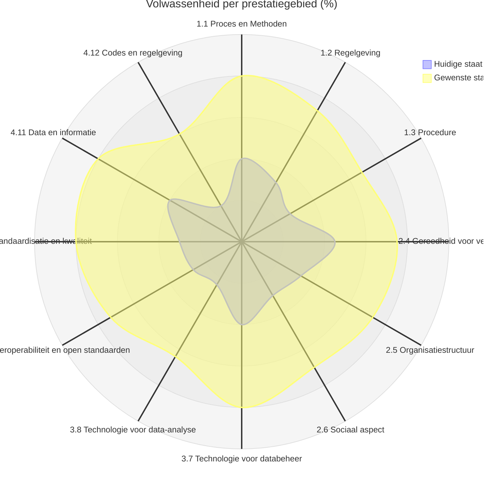

# CHEK DBP — Volwassenheidsmatrix Digitaal Vergunningsproces

**Versie 1.1 (NL, gevalideerd)** · 4 categorieën · 12 prestatiegebieden · 35 kernmeetaspecten (KMA) · 6 volwassenheidsniveaus (Level 0–5)

Deze matrix helpt een organisatie om per onderdeel van het (digitale) vergunningsproces te bepalen waar zij nu staat (**huidige staat**) en waar zij naartoe wil (**gewenste staat**). Het verschil tussen beide is de ontwikkelopgave.

---

## Inhoudsopgave

1. [Zo vul je de matrix in](#1-zo-vul-je-de-matrix-in)
2. [Categorieën en prestatiegebieden](#2-categorieën-en-prestatiegebieden)
3. [De matrix](#3-de-matrix)
   - [1. Proces](#1-proces)
   - [2. Organisatie](#2-organisatie)
   - [3. Technologie](#3-technologie)
   - [4. Informatie](#4-informatie)
4. [Score berekenen](#4-score-berekenen)
5. [Resultaat: spinnenweb](#5-resultaat-spinnenweb)
6. [Digitaal invullen en resultaten verzamelen](#6-digitaal-invullen-en-resultaten-verzamelen)
7. [Verantwoording en bekende correcties](#7-verantwoording-en-bekende-correcties)

---

## 1. Zo vul je de matrix in

Per kernmeetaspect (KMA) staan zes niveaubeschrijvingen, van Level 0 tot en met Level 5. Kies **per KMA** het niveau waarvan de beschrijving jouw situatie het beste dekt.

> **Vuistregel:** kies het hoogste niveau waarvan je de beschrijving *volledig* kunt onderschrijven. Herken je jezelf maar half in Level 3, dan is Level 2 het juiste antwoord.

### Invullen in dit bestand

Maak een kopie van dit bestand en vervang in de tabellen het vakje `☐` door een gekleurd blokje:

| Markering | Betekenis | Kleur in de Excel-versie |
|---|---|---|
| 🟧 | **Huidige staat** — dit niveau beschrijft de situatie zoals die nu is | terracotta `#E8ACA0` |
| 🟦 | **Gewenste staat** — dit niveau is het streefbeeld | lichtblauw `#97CAD7` |
| ☐ | niet van toepassing | — |

Staat huidig en gewenst op hetzelfde niveau, zet dan in beide kolommen van dezelfde regel een markering (🟧 en 🟦).

### Spelregels

- Zet **precies één** markering per kolom per KMA. Alle 35 KMA's invullen, ook als het antwoord Level 0 is.
- Vul in vanuit de **feitelijke** situatie, niet vanuit het beleid dat op papier staat.
- Doe dit bij voorkeur met meerdere rollen samen (proces, IT/data, beleid, uitvoering). Verschil van inzicht is waardevolle informatie, geen probleem.
- De gewenste staat is een keuze, geen automatisme: Level 5 is niet voor elk KMA het juiste doel.

---

## 2. Categorieën en prestatiegebieden

### Categorie 1: Proces

Omvat aspecten die betrekking hebben op het vergunningsproces zelf, inclusief de stappen, procedures, methoden en het algemene begrip van hoe het proces verloopt.

| # | Prestatiegebied | Omschrijving | KMA's | Max. score |
|---|---|---|---:|---:|
| 1.1 | **Proces en Methoden** | Dit omvat de algemene workflow, stappen en methodologie van het vergunningsproces. Het kijkt naar hoe goed het proces is gedefinieerd, in kaart gebracht, begrepen en gevolgd door alle belanghebbenden. | 2 | 100 |
| 1.2 | **Regelgeving** | Dit richt zich op hoe gestandaardiseerd het proces is volgens regelgeving en codes. Het omvat referentiecijfers, indicatoren, kwaliteitscontroles en gestandaardiseerde procedures om naleving te waarborgen. | 3 | 150 |
| 1.3 | **Procedure** | Dit gaat over de toegankelijkheid, transparantie, doorlooptijden en algemene gebruiksvriendelijkheid van het vergunningsproces voor betrokkenen. Het omvat duidelijke communicatie, tracking en een efficiënte informatie uitwisseling. | 3 | 150 |

### Categorie 2: Organisatie

Bevat aspecten die betrekking hebben op de organisatiestructuur, capaciteiten, verandervaardigheid en de betrokken mensen.

| # | Prestatiegebied | Omschrijving | KMA's | Max. score |
|---|---|---|---:|---:|
| 2.4 | **Gereedheid voor verandering** | Dit richt zich op de organisatorische en menselijke gereedheid om nieuwe digitale technologieën en processen te gebruiken. | 4 | 200 |
| 2.5 | **Organisatiestructuur** | Dit gaat over de mate waarin de organisatie structuur heeft aangebracht in de organisatie van afdelingen, teams, training en personeel die zich bezighouden met digitale technologieën zoals BIM. Het gaat over strategische planning, kennis en deskundigheid en management van kennis. | 3 | 150 |
| 2.6 | **Sociaal aspect** | Dit gaat over de algemene kennis en deskundigheid van het personeel en belanghebbenden binnen het vergunningsproces. Het betreft het verwerven van vaardigheden, het delen van kennis en het versterken van competenties. | 2 | 100 |

### Categorie 3: Technologie

Behandelt de verschillende technologieën die worden gebruikt binnen het proces voor gegevensbeheer, verificatie, visualisatie, analyse en uitwisseling.

| # | Prestatiegebied | Omschrijving | KMA's | Max. score |
|---|---|---|---:|---:|
| 3.7 | **Technologie voor databeheer** | Dit richt zich op systemen die worden gebruikt voor opslag, indiening, communicatie en beheer van data gedurende het proces. Het varieert van een volledig analoog systeem tot geintegreerde digitale platforms. | 4 | 200 |
| 3.8 | **Technologie voor data-analyse** | Dit omvat technologieën voor valideren, visualiseren, analyseren en controleren van projectdata op naleving van indieningsvereisten en kwaliteit. | 5 | 250 |
| 3.9 | **Interoperabiliteit en open standaarden** | Dit kijkt naar de mogelijkheid om data te integreren en uit te wisselen tussen verschillende systemen, platforms en formaten binnen het vergunningverleningproces. | 3 | 150 |

### Categorie 4: Informatie

Richt zich op datastandaarden, formaten, regelgeving en de informatie die in het proces wordt gebruikt.

| # | Prestatiegebied | Omschrijving | KMA's | Max. score |
|---|---|---|---:|---:|
| 4.10 | **Datastandaardisatie en kwaliteit** | Dit richt zich op het bestaan van richtlijnen, protocollen en standaarden om hoogwaardige, gestandaardiseerde data te waarborgen. Het heeft te maken met het monitoren van kwaliteit en het aanscherpen van standaarden en richtlijnen. | 2 | 100 |
| 4.11 | **Data en informatie** | Dit richt zich op de soorten data die in het vergunningsproces worden gebruikt, waaronder ontwerpdata en omgevingsdata. | 2 | 100 |
| 4.12 | **Codes en regelgeving** | Dit kijkt naar hoe gedigitaliseerd, toegankelijk en machine-leesbaar de regelgeving is. Het varieert van analoog tot volledig digitaal geparametriseerde en geintegreerde regelregisters. | 2 | 100 |

**Totaal:** 35 KMA's, maximale score 1750 punten.

---

## 3. De matrix

### 1. PROCES

*Omvat aspecten die betrekking hebben op het vergunningsproces zelf, inclusief de stappen, procedures, methoden en het algemene begrip van hoe het proces verloopt.*

#### 1.1 Proces en Methoden

> Dit omvat de algemene workflow, stappen en methodologie van het vergunningsproces. Het kijkt naar hoe goed het proces is gedefinieerd, in kaart gebracht, begrepen en gevolgd door alle belanghebbenden.

##### 1.1.1 — Begrip van het proces en het in kaart brengen van stappen

| Level | Omschrijving | Huidig | Gewenst |
|:---:|---|:---:|:---:|
| **0** | Er is geen duidelijk begrip en het proces is niet formeel in kaart gebracht. | ☐ | ☐ |
| **1** | Het proces is op een algemeen niveau in kaart gebracht en openbaar beschikbaar. | ☐ | ☐ |
| **2** | De processtappen zijn geïdentificeerd en gedocumenteerd, wat een duidelijk begrip van het proces geeft. Er is een begin gemaakt met het digitaliseren van het proces | ☐ | ☐ |
| **3** | Het proces is gedetailleerd in kaart gebracht en geïntegreerd in een digitale omgeving voor het beheer van procesbeschrijvingen. Niet alle stappen zijn echter volledig geïmplementeerd. | ☐ | ☐ |
| **4** | Het volledige proces is in kaart gebracht en gecoördineerd in een centrale digitale omgeving. Alle stappen zijn geïmplementeerd en het administratieve proces kan worden gemonitord met als doel het continu te vereenvoudigen. | ☐ | ☐ |
| **5** | Het hele proces wordt in kaart gebracht en gecoördineerd in een centrale digitale omgeving. Processtappen zijn geautomatiseerd om de efficientie te verhogen, er is sprake van constante monitoring voor feedback en geleerde lessen. | ☐ | ☐ |

##### 1.1.2 — Stakeholders zijn zich bewust van de processtappen en de vereiste informatie die zij moeten aanleveren

| Level | Omschrijving | Huidig | Gewenst |
|:---:|---|:---:|:---:|
| **0** | Er is geen duidelijk begrip en het proces is niet formeel in kaart gebracht. | ☐ | ☐ |
| **1** | Stakeholders hebben beperkt begrip van de processtappen. Er is een gebrek aan bewustzijn over de vereiste informatie en documentatie om het proces te voltooien. Er is beperkte informatie ter ondersteuning van hun rollen en verantwoordelijkheden in het proces. | ☐ | ☐ |
| **2** | Stakeholders hebben een duidelijk begrip van de processtappen. Er zijn richtlijnen en standaarden die hen ondersteunen bij de uitvoering van rollen en verantwoordelijkheden in het proces. | ☐ | ☐ |
| **3** | Uitgebreide procesdocumentatie en checklists stellen stakeholders in staat om taken zelfstandig uit te voeren. Online diensten helpen stakeholders bij het voorbereiden van de vereiste informatie. De digitale oplossing vermindert onduidelijkheid. | ☐ | ☐ |
| **4** | Stakeholders zijn volledig op de hoogte van de stappen, de vereiste informatie en documentatie die nodig zijn om het proces te voltooien. Data kan digitaal worden gevisualiseerd en gedeeld; ieder werkt echt in een eigen digitale omgeving. | ☐ | ☐ |
| **5** | Stakeholders zijn zich volledig bewust van hun rol in het proces. Er is gelijktijdige communicatie en ondersteuning waardoor alle verschillende belanghebbenden de procesontwikkeling kunnen volgen en toegang hebben tot dezelfde gegevensbron. | ☐ | ☐ |

#### 1.2 Regelgeving

> Dit richt zich op hoe gestandaardiseerd het proces is volgens regelgeving en codes. Het omvat referentiecijfers, indicatoren, kwaliteitscontroles en gestandaardiseerde procedures om naleving te waarborgen.

##### 1.2.3 — Benchmarks en key performance indicators

| Level | Omschrijving | Huidig | Gewenst |
|:---:|---|:---:|:---:|
| **0** | Er zijn informele of geen kwaliteitscontroleplannen; niet voor proces, data of documentatie. Er zijn geen prestatienormen voor processen of diensten. | ☐ | ☐ |
| **1** | Proces‑, data‑ en documentatiestandaarden zijn initieel gedefinieerd. Kwaliteitsdoelen en prestatienormen zijn vastgesteld; er vindt echter geen officiële meting plaats. | ☐ | ☐ |
| **2** | Proces‑, data‑ en documentatiestandaarden zijn gedefinieerd en vastgesteld voor kwaliteitsplannen. KPI’s en normen zijn duidelijk gedefinieerd, maar worden niet officieel gemeten. | ☐ | ☐ |
| **3** | Proactieve kwaliteitsmonitoring wordt uitgevoerd via steekproeven en gestructureerde reviews. Sommige KPI’s worden gemeten, maar niet alle zijn geïmplementeerd. Meetwaarden geven inzicht in prestaties versus doelen. | ☐ | ☐ |
| **4** | Prestaties ten opzichte van normen en KPI’s worden gemeten en gemonitord. KPI’s en prestatienormen zijn opgenomen in kwaliteitsmanagement‑ en prestatieverbeteringssystemen. | ☐ | ☐ |
| **5** | Kwaliteitsverbetering en naleving van voorschriften en KPI's worden continu uitgelijnd en verfijnd. Benchmarks en KPI's worden herhaaldelijk herzien om de hoogst mogelijke kwaliteit in processen en diensten te verzekeren. | ☐ | ☐ |

##### 1.2.4 — Gestandaardiseerd proces

| Level | Omschrijving | Huidig | Gewenst |
|:---:|---|:---:|:---:|
| **0** | Er zijn geen richtlijnen of standaarden voor de processen. | ☐ | ☐ |
| **1** | Het proces is voornamelijk vanuit administratief perspectief in kaart gebracht. De technische controles binnen het proces worden uitgevoerd op basis van individuele kennis van technici en normatieve documenten. Er zijn informele interne richtlijnen om technici te helpen bij de te volgen processtappen. | ☐ | ☐ |
| **2** | Naast het procesoverzicht en de normatieve documenten ontvangen technici ondersteuning via een gedetailleerde richtlijn die de specifieke controles voorschrijft die in elke stap van het proces moeten worden uitgevoerd, met uitgebreide instructies en specificatie van de onderdelen die in elke fase moeten worden beoordeeld. | ☐ | ☐ |
| **3** | De ondersteunende richtlijn voor technici biedt een uitgebreide lijst van stedenbouwkundige en bouwkundige aspecten die voor elke fase van het bouwvergunningsproces moeten worden gecontroleerd. De richtlijn fungeert als naslag, zodat technici duidelijke instructies hebben over de specifieke aspecten die zij moeten beoordelen. | ☐ | ☐ |
| **4** | De richtlijn wordt continu verfijnd om geleerde lessen te weerspiegelen. Kwaliteitsverbetering en naleving van regelgeving en codes worden continu op elkaar afgestemd en verfijnd. De richtlijn ter ondersteuning van technici wordt bijgewerkt en gemonitord op basis van KPI‑ en benchmarkmetingen om het proces te vereenvoudigen. | ☐ | ☐ |
| **5** | Er is een gedetailleerde gestandaardiseerde procedure, gedefinieerd op gemeentelijk niveau voor alle belanghebbenden die bij het proces betrokken zijn en waarvan het gebruik voortdurend wordt gecontroleerd en de inhoud wordt bijgewerkt. | ☐ | ☐ |

##### 1.2.5 — Datatemplates, gebruik van gemeenschappelijke dataformaten en documentatie‑eisen

| Level | Omschrijving | Huidig | Gewenst |
|:---:|---|:---:|:---:|
| **0** | Er zijn geen datatemplates, geen gebruik van gemeenschappelijke dataformaten of documentatie‑eisen. | ☐ | ☐ |
| **1** | Beperkte standaardisatie van dataformaten, templates of documentatie‑eisen. Inconsistentie in dataformaten en documentatie tussen verschillende vergunningsprocessen of projecten. | ☐ | ☐ |
| **2** | Sommige stappen van het proces hebben gestandaardiseerde dataformaten, templates en documentatie. De inspanning om tot één enkel gestandaardiseerd gegevensmodel te komen is echter nog gaande. | ☐ | ☐ |
| **3** | Er zijn interne gestandaardiseerde dataformaten en templates. Deze worden niet door externe stakeholders gevolgd en er is slechts een informele kwaliteitscontrole. | ☐ | ☐ |
| **4** | Er zijn gestandaardiseerde dataformaten en templates. Ze zijn gemakkelijk toegankelijk voor alle stakeholders en er is controle om de standaardisatie door het proces heen te borgen. Best practices worden geïdentificeerd en gedeeld met alle stakeholders. | ☐ | ☐ |
| **5** | Er zijn gestandaardiseerde gegevensindelingen en sjablonen volgens open standaarden. Continue verbetering wordt geïmplementeerd om het gebruik van de open dataformaten te verbeteren. Tijdens het proces wordt geautomatiseerde controle uitgevoerd. | ☐ | ☐ |

#### 1.3 Procedure

> Dit gaat over de toegankelijkheid, transparantie, doorlooptijden en algemene gebruiksvriendelijkheid van het vergunningsproces voor betrokkenen. Het omvat duidelijke communicatie, tracking en een efficiënte informatie uitwisseling.

##### 1.3.6 — Doorlooptijden en reactietijd

| Level | Omschrijving | Huidig | Gewenst |
|:---:|---|:---:|:---:|
| **0** | Er is geen duidelijke kennis van doorlooptijden en de reactietijd is niet vooraf gedefinieerd. | ☐ | ☐ |
| **1** | Er is een informeel begrip van de doorlooptijden, maar ze worden niet duidelijk gecommuniceerd en meestal niet gevolgd. | ☐ | ☐ |
| **2** | Er zijn doorlooptijden gedefinieerd voor elke stap van het proces; ze worden intern gedeeld, maar niet duidelijk aan alle stakeholders gecommuniceerd. | ☐ | ☐ |
| **3** | De doorlooptijden zijn duidelijk gedefinieerd en gecommuniceerd. Ze worden in meer dan 80% van de processen gevolgd; er is echter geen officiële meting of inspanning om de doorlooptijden te optimaliseren. | ☐ | ☐ |
| **4** | Doorlooptijden en reactietijden zijn duidelijk gedefinieerd en gecommuniceerd. Ze kunnen door alle stakeholders worden gemonitord. Metingen worden uitgevoerd om optimalisatie van doorlooptijden mogelijk te maken. | ☐ | ☐ |
| **5** | Tijdlijnen worden in alle stappen van het proces bewaakt en gemeten.  Ze zijn continu transparant voor alle stakeholders, ze worden voortdurend beoordeeld en verbeterd op basis van prestatiestatistieken en feedback. | ☐ | ☐ |

##### 1.3.7 — Toegankelijkheid voor stakeholders

| Level | Omschrijving | Huidig | Gewenst |
|:---:|---|:---:|:---:|
| **0** | De informatie is toegankelijk via fysieke documenten. | ☐ | ☐ |
| **1** | Beperkte toegankelijkheid voor de bij het proces betrokken stakeholders. De informatie kent verschillende bronnen en een verschillend wijzigingsproces per stakeholder. | ☐ | ☐ |
| **2** | Stakeholders kunnen toegang hebben tot dezelfde informatiebron en de gedefinieerde workflows zijn gestandaardiseerd. Wijzigingen in de data moeten echter door andere deelnemers aan het proces opnieuw worden geladen. | ☐ | ☐ |
| **3** | Geautomatiseerde workflows versturen meldingen over de vergunningsstatus en relevante informatie naar sommige stakeholders (bijv. aanvragers). | ☐ | ☐ |
| **4** | Er is één unieke databron waar alle stakeholders hun data kunnen ophalen. Alle uitwisselingen vinden plaats binnen hetzelfde digitale ecosysteem; de data wordt gedeeld en voor alle stakeholders bijgewerkt. | ☐ | ☐ |
| **5** | Een digitaal ecosysteem biedt toegang tot informatie, omvat realtime gegevensupdates, interactieve interfaces, gepersonaliseerde meldingen en samenwerkingsfuncties, waardoor belanghebbenden actief kunnen deelnemen en de nodige informatie efficiënt kunnen ophalen uit dezelfde gegevensbron. | ☐ | ☐ |

##### 1.3.8 — Transparantie

| Level | Omschrijving | Huidig | Gewenst |
|:---:|---|:---:|:---:|
| **0** | Er is geen transparantie in de informatiestroom. Verschillende stakeholders kunnen geen informatie inzien of visualiseren die niet door hen wordt beheerd, behalve het eindresultaat. | ☐ | ☐ |
| **1** | Er is beperkte toegang tot informatie en stakeholders hebben moeite om de informatiestroom te volgen en te begrijpen. De documentatie‑ en communicatieprocessen kunnen gefragmenteerd zijn en beperkt toegankelijk voor stakeholders. | ☐ | ☐ |
| **2** | Stakeholders hebben toegang tot de informatie die invloed heeft op hun workflow. Informatie over het proces wordt niet duidelijk gecommuniceerd of gedocumenteerd. Aanvragers kunnen de status online volgen gedurende het proces. Basismetrics over het proces worden af en toe gerapporteerd. | ☐ | ☐ |
| **3** | Realtime vergunningtracking met notificaties aan stakeholders (bijv. aanvragers) en interne medewerkers. Prestatie‑trends worden regelmatig gemonitord. Verbeterde transparantie. | ☐ | ☐ |
| **4** | De informatie is zichtbaar voor alle stakeholders met de juiste rechten. Er is een duidelijke workflow voor documentatie en communicatie die door alle stakeholders kan worden gevolgd. Externe transparantie kan via API’s plaatsvinden. | ☐ | ☐ |
| **5** | Geautomatiseerde workflow-tracking en geavanceerde data-analyse zorgen voor zichtbaarheid. De informatieworkflow is transparant en werkt samen. Rapportagetools worden gebruikt om inzichten te verzamelen en de prestaties te volgen, terwijl initiatieven voor continue verbetering worden geïmplementeerd om de transparantie van het proces te vergroten. | ☐ | ☐ |

### 2. ORGANISATIE

*Bevat aspecten die betrekking hebben op de organisatiestructuur, capaciteiten, verandervaardigheid en de betrokken mensen.*

#### 2.4 Gereedheid voor verandering

> Dit richt zich op de organisatorische en menselijke gereedheid om nieuwe digitale technologieën en processen te gebruiken.

##### 2.4.9 — Intern personeel

| Level | Omschrijving | Huidig | Gewenst |
|:---:|---|:---:|:---:|
| **0** | Het personeel staat niet open voor verandering of digitalisering. | ☐ | ☐ |
| **1** | Minder dan 25% van het personeel erkent de noodzaak van digitale transformatie. Er is ad‑hoc samenwerking tussen enkele individuen op het gebied van digitalisering. | ☐ | ☐ |
| **2** | 25–50% van het personeel neemt deel aan multidisciplinaire teams om digitaliseringsbehoeften en ‑voordelen te identificeren. Er worden reguliere vergaderingen gehouden om kansen met digitale technologie te bespreken. | ☐ | ☐ |
| **3** | 50–75% van het personeel toont een proactieve houding ten aanzien van het adopteren van digitale innovaties. Training omvat aanpassingsvermogen en gereedheid voor nieuwe technologieën. | ☐ | ☐ |
| **4** | Meer dan 75% van het personeel staat open voor digitalisering; sommigen nemen deel aan netwerken om digitale innovatie te bevorderen. Er zijn gedefinieerde processen voor samenwerking rond digitale best practices. | ☐ | ☐ |
| **5** | Medewerkers zoeken voortdurend naar nieuwe digitale innovaties om de bedrijfsvoering te verbeteren. Er bestaan programma’s voor kennisdeling tussen stakeholders om digitale best practices te verspreiden. | ☐ | ☐ |

##### 2.4.10 — Hoger management

| Level | Omschrijving | Huidig | Gewenst |
|:---:|---|:---:|:---:|
| **0** | Het management staat niet open voor organisatorische veranderingen of digitale transformatie. | ☐ | ☐ |
| **1** | Het management ondersteunt de visie; echter is er een strategie nodig om het gebruik van digitale processen, waaronder technologieën zoals BIM en GIS, aan te sturen. | ☐ | ☐ |
| **2** | Er is een beweging om de implementatie van digitale processen, waaronder BIM, GIS of andere technologie, te starten; het initiatief komt echter bottom‑up. Het management heeft geen duidelijke plannen ter ondersteuning van de implementatie. | ☐ | ☐ |
| **3** | Het management erkent digitale innovatie en procesverbeteringen (waaronder BIM, GIS of andere technologie) als een belangrijk strategisch onderdeel van de organisatie. De inspanningen voor implementatie beginnen top‑down. | ☐ | ☐ |
| **4** | Digitale innovaties zoals BIM, GIS en/of andere technologieën maken deel uit van de IT‑strategie. Een implementatieplan voor de strategische doelen is op alle niveaus in de organisatie gepromoot. | ☐ | ☐ |
| **5** | Planning van digitale innovatie is volledig geïntegreerd in de strategische besluitvorming. Een visionair bewustzijn van de mogelijkheden van digitale technologie ondersteunt de ontwikkeling van de geleverde diensten. | ☐ | ☐ |

##### 2.4.11 — Infrastructuur

| Level | Omschrijving | Huidig | Gewenst |
|:---:|---|:---:|:---:|
| **0** | De hardware/software‑infrastructuur is niet in staat de vereiste tools voor het digitale vergunningsproces te ondersteunen. | ☐ | ☐ |
| **1** | Minder dan 20% van de infrastructuur kan de vereiste software ondersteunen. Er zijn beperkte pilot‑vergunningstools en testservers, gebruikt door minder dan 20% van het personeel. | ☐ | ☐ |
| **2** | 20–50% van de infrastructuur is in staat de vereiste software te ondersteunen. 20–50% van het personeel heeft toegang tot softwarelicenties of heeft deze geïnstalleerd. Er is een intern netwerk beschikbaar voor bestandsdeling. | ☐ | ☐ |
| **3** | Tot 80% van de infrastructuur is in staat de vereiste software te ondersteunen. Alle kernsoftware voor vergunningverlening is aangeschaft of geïnstalleerd. Redundante servers voor vergunningen, cloud‑back‑up en een common data environment voor beheer van data en bestanden. | ☐ | ☐ |
| **4** | 100% van de hardware kan de vereiste software en platforms draaien. Alle hardware/software voor het digitale vergunningssysteem is volledig geïmplementeerd. Er is een databasecluster voor vergunningen, software‑integratie en een online netwerk dat delen binnen en buiten de organisatie mogelijk maakt. | ☐ | ☐ |
| **5** | Continue lifecycle‑upgrades van hardware/software. Een vastgesteld programma voor doorlopende infrastructuurupgrades. Regelmatige serververnieuwingen, software‑updates en toevoeging van nieuwe functies. | ☐ | ☐ |

##### 2.4.12 — Wetgevend systeem

| Level | Omschrijving | Huidig | Gewenst |
|:---:|---|:---:|:---:|
| **0** | Niet open voor veranderingen. | ☐ | ☐ |
| **1** | Er is geen flexibiliteit om vanuit de bestaande regelgeving duidelijke en eenvoudig te interpreteren regels te creëren. Mogelijk zijn er lopende inspanningen om het proces te vereenvoudigen. | ☐ | ☐ |
| **2** | Er zijn enkele technische vereisten binnen regelteksten die duidelijk zijn geformuleerd. Meer dan 50% van de vereisten blijft echter onderhevig aan menselijke interpretatie. | ☐ | ☐ |
| **3** | Er is op gemeentelijk niveau een inspanning om ervoor te zorgen dat de technische vereisten in de normatieve teksten duidelijk en direct zijn geformuleerd, waardoor subjectieve interpretatie wordt verminderd. | ☐ | ☐ |
| **4** | Meer dan 50% van de regelgeving binnen de reikwijdte van de gemeente heeft duidelijke en eenvoudig te interpreteren normatieve tekst. Dit faciliteert regelinterpretatie en vereenvoudigt nalevingscontroles. | ☐ | ☐ |
| **5** | Er is op regionaal of nationaal niveau een inspanning om de subjectieve interpreteerbaarheid van de teksten te minimaliseren, wat de interpretatie van regels faciliteert en nalevingscontroles vereenvoudigt. | ☐ | ☐ |

#### 2.5 Organisatiestructuur

> Dit gaat over de mate waarin de organisatie structuur heeft aangebracht in de organisatie van afdelingen, teams, training en personeel die zich bezighouden met digitale technologieën zoals BIM. Het gaat over strategische planning, kennis en deskundigheid en management van kennis.

##### 2.5.13 — Strategische doelstellingen voor implementatie van het data‑ecosysteem

| Level | Omschrijving | Huidig | Gewenst |
|:---:|---|:---:|:---:|
| **0** | Er is geen implementatiestrategie. | ☐ | ☐ |
| **1** | Implementatie wordt uitgevoerd zonder leidende strategie. Er is een gebrek aan bewustzijn en begrip en beperkt gebruik van tools. Processen zijn beperkt geïntegreerd in de workflow en er is een gebrek aan gestandaardiseerde praktijken. | ☐ | ☐ |
| **2** | De implementatiestrategie bevat enkele specifieke uitvoerbare details. Er is een algemeen implementatieplan, maar processen zijn niet volledig geïntegreerd en er zijn geen formele gestandaardiseerde richtlijnen voor implementatie. | ☐ | ☐ |
| **3** | De implementatiestrategie gaat vergezeld van uitgebreide actieplannen en een monitoringsregime. De organisatie erkent dat het data‑ecosysteem technologische vooruitgang, procesverbeteringen en beleidswijzigingen omvat. | ☐ | ☐ |
| **4** | De visie wordt gedeeld door medewerkers in de organisatie en door externe stakeholders. De organisatie streeft naar maximale efficiëntie en effectiviteit bij de implementatie van het data‑ecosysteem. Er is procesintegratie met meerdere technologieën, bijvoorbeeld BIM‑GIS. | ☐ | ☐ |
| **5** | Er is een cultuur van innovatie en continue verbetering in de praktijken rond het data‑ecosysteem. De organisatie streeft ernaar recente innovatieve tools in de processen te integreren (bijv. AI, AR, dataspaces). | ☐ | ☐ |

##### 2.5.14 — Toegewijd personeel

| Level | Omschrijving | Huidig | Gewenst |
|:---:|---|:---:|:---:|
| **0** | Er is geen personeel volledig toegewijd aan BIM, GIS of andere technologieën. | ☐ | ☐ |
| **1** | Tot 20% van het personeel werkt parttime aan BIM, GIS of andere technologieën. | ☐ | ☐ |
| **2** | Klein team van 3–5 medewerkers dat zich toelegt op de implementatie van BIM, GIS of andere technologieën binnen de organisatie en interne processen. | ☐ | ☐ |
| **3** | Meerdere teams werken fulltime met BIM, GIS of andere technologieën. Elk team is toegewijd aan een specifiek deel van het proces of de datatechnologie. Er is hoge individuele en collectieve kennis van digitale processen en tools. | ☐ | ☐ |
| **4** | Er is een afdeling die zich toelegt op digitale data, zoals BIM, GIS of andere. Met interne teams die aan afzonderlijke onderdelen van de processen of technologieën werken. Er is hoge individuele en collectieve kennis en kennisdeling wordt gestimuleerd. | ☐ | ☐ |
| **5** | Er is binnen de afdeling die met digitale processen werkt een team dat is toegewijd aan het borgen van de kwaliteit van processen, data, standaarden en richtlijnen. | ☐ | ☐ |

##### 2.5.15 — Training, voorbereiding en ondersteuning

| Level | Omschrijving | Huidig | Gewenst |
|:---:|---|:---:|:---:|
| **0** | Er is geen enkele vorm van training of ondersteuning. | ☐ | ☐ |
| **1** | Er is een gebrek aan gerichte training of ondersteuning voor technici om vraagstukken rond BIM, GIS of andere technologieën op te lossen. Er is ad‑hoc externe training indien nodig. Er is echter minder dan 8 uur training per medewerker per jaar voorzien. | ☐ | ☐ |
| **2** | Er zijn gedocumenteerde trainingseisen voor rollen die betrekking hebben op digitale en datatechnologie. Jaarlijkse training wordt geboden aan medewerkers die direct met BIM, GIS of andere technologieën werken, indien nodig. Er is 8–16 uur training per medewerker per jaar voorzien. | ☐ | ☐ |
| **3** | Trainingseisen worden beheerd om te voldoen aan competentie‑ en prestatie‑doelen. Regelmatige training wordt geboden aan medewerkers die direct met BIM, GIS of andere technologieën werken. Er is 16–24 uur training per medewerker per jaar voorzien. | ☐ | ☐ |
| **4** | Trainingsplannen zijn gebaseerd op rollen en competenties; het trainingsprogramma gebruikt voorbeelden uit de praktijk en lessons learned. Er is interne ondersteuning en samenwerking met interne en externe partners. 24–40 uur training per medewerker per jaar. | ☐ | ☐ |
| **5** | Training is geïntegreerd in de organisatiestrategie. On‑demand trainingsprogramma’s zijn opgezet, zodat personeel trainingsbronnen kan raadplegen wanneer nodig. Gemiddeld meer dan 40 uur training per medewerker per jaar. | ☐ | ☐ |

#### 2.6 Sociaal aspect

> Dit gaat over de algemene kennis en deskundigheid van het personeel en belanghebbenden binnen het vergunningsproces. Het betreft het verwerven van vaardigheden, het delen van kennis en het versterken van competenties.

##### 2.6.16 — Algehele kennis van technici

| Level | Omschrijving | Huidig | Gewenst |
|:---:|---|:---:|:---:|
| **0** | Er zijn geen technici met kennis of praktische ervaring met datatechnologie (BIM, GIS of andere). | ☐ | ☐ |
| **1** | Minder dan 25% heeft basisbegrip; minimale vaardigheden. Zij hebben mogelijk basiskennis van concepten maar missen praktische vaardigheden en ervaring in het gebruik. | ☐ | ☐ |
| **2** | 25–50% heeft basiskennis, terwijl minder dan 20% praktische vaardigheden heeft met de tools. | ☐ | ☐ |
| **3** | 50–75% van de medewerkers gebruikt regelmatig datatools en ruimtelijke analyses om vergunningsworkflows te verrijken. Er is een tendens om formele certificeringen na te streven om de capaciteiten uit te breiden. | ☐ | ☐ |
| **4** | Meer dan 75% heeft goede werkkennis en vaardigheden in vereiste datatechnologieën met goede praktische vaardigheden. 20% van de individuen is expert in BIM, GIS of andere technologie. | ☐ | ☐ |
| **5** | 50% van de technici is expert in BIM, GIS of andere technologie. Zij beschikken over uitgebreide kennis en ervaring en fungeren als mentoren of trainers voor andere technici. Zij delen voortdurend hun kennis en expertise om een sterke digitale ecosysteemcompetentie voor de organisatie op te bouwen. | ☐ | ☐ |

##### 2.6.17 — Kennis van stakeholders

| Level | Omschrijving | Huidig | Gewenst |
|:---:|---|:---:|:---:|
| **0** | Geen van de stakeholders werkt met datatechnologie (BIM, GIS of andere). | ☐ | ☐ |
| **1** | Tot 50% van de belangrijkste stakeholders gebruikt basis digitale data. Er is echter geen data‑hergebruik gedurende het proces tussen stakeholders. | ☐ | ☐ |
| **2** | 50–80% van de belangrijkste stakeholders gebruikt digitale data zoals BIM of GIS. Voornamelijk geïsoleerd gebruik, minimale interoperabiliteit, samenwerking en weinig communicatie of data‑hergebruik. | ☐ | ☐ |
| **3** | Meer dan 80% van de belangrijkste stakeholders gebruikt gedeelde data in een digitaal ecosysteem. Modeldata is toegankelijk voor meerdere stakeholders. | ☐ | ☐ |
| **4** | 100% van de belangrijkste stakeholders gebruikt een geïntegreerd digitaal ecosysteem. Alle betrokken partijen hebben toegang tot dezelfde bron van informatie via digitale data (bijv. BIM‑GIS) in hun specifieke domein. | ☐ | ☐ |
| **5** | Data is volledig geïntegreerd over alle stakeholders en stappen in het proces met realtime gegevensdeling en samenwerking. Data is consistent in het digitale ecosysteem van meerdere stakeholders. Er zijn statistieken over data‑hergebruik en waardecreatie. | ☐ | ☐ |

### 3. TECHNOLOGIE

*Behandelt de verschillende technologieën die worden gebruikt binnen het proces voor gegevensbeheer, verificatie, visualisatie, analyse en uitwisseling.*

#### 3.7 Technologie voor databeheer

> Dit richt zich op systemen die worden gebruikt voor opslag, indiening, communicatie en beheer van data gedurende het proces. Het varieert van een volledig analoog systeem tot geintegreerde digitale platforms.

##### 3.7.18 — Databeheeromgeving en netwerkplatform

| Level | Omschrijving | Huidig | Gewenst |
|:---:|---|:---:|:---:|
| **0** | Geen platformondersteuning. | ☐ | ☐ |
| **1** | Digitaal platform alleen voor indiening, communicatie en gegevensuitwisseling tussen aanvrager en bevoegd gezag. Er is geen digitaal proces voor databeheer. | ☐ | ☐ |
| **2** | Gesloten of propriëtaire tools ondersteunen de verschillende stappen. Er is een digitale tool voor databeheer; echter is niet 100% van de informatie er digitaal via toegankelijk. Er zijn verschillende databronnen per processtap. | ☐ | ☐ |
| **3** | Modulair platform. De digitale tool slaat data op en beheert deze gedurende het hele proces. Medewerkers van de organisatie hebben toegang tot dezelfde data, maar data van externe stakeholders is niet geïntegreerd. | ☐ | ☐ |
| **4** | Open API‑gebaseerd microservices‑ecosysteem. De databeheertool ondersteunt delen, opslaan en beheren van data. Al het interne personeel kan samenwerken, terwijl externe stakeholders met gedefinieerde rechten met de data kunnen interacteren. | ☐ | ☐ |
| **5** | Gedistibueerd dataspace‑gebaseerd ecosysteem. Er is gelijktijdige samenwerking tussen alle stakeholders in het proces en geautomatiseerde workflows. | ☐ | ☐ |

##### 3.7.19 — Dataopslag / repository

| Level | Omschrijving | Huidig | Gewenst |
|:---:|---|:---:|:---:|
| **0** | Het proces is analoog. Informatie wordt opgeslagen in papieren dossiers en documenten. | ☐ | ☐ |
| **1** | Er is een repository voor dossiers van gearchiveerde processen. Er is digitale documentopslag, maar geen gecentraliseerde repository. Meerdere losse schijven en shares. | ☐ | ☐ |
| **2** | Er is een gecentraliseerde repository voor bestanden die lopende en gearchiveerde processen opslaat, fungeert als database en toegankelijk is voor intern personeel. | ☐ | ☐ |
| **3** | Formele datagovernance voor de repository. Lifecycle‑beheer met archiverings‑ en retentiebeleid. | ☐ | ☐ |
| **4** | Gecentraliseerde digitale repository integreert alle data door het hele proces, met back‑ups, archivering en governance. Geïntegreerd met data‑ecosystemen en toegankelijk voor alle stakeholders volgens toegewezen rechten. Geautomatiseerde back‑ups, archivering en governance. | ☐ | ☐ |
| **5** | Mogelijkheid om taken en workflows in het platform binnen het data‑ecosysteem te automatiseren, waardoor de doeltreffendheid van het proces toeneemt. Geharmoniseerde toegang en structuren binnen de dataspace tussen diverse datahubs. | ☐ | ☐ |

##### 3.7.20 — Indieningssysteem en identificatie (bijv. elektronische handtekening)

| Level | Omschrijving | Huidig | Gewenst |
|:---:|---|:---:|:---:|
| **0** | Er is geen indieningsplatform. Ondertekening gebeurt handmatig. | ☐ | ☐ |
| **1** | Documenten worden digitaal ingediend met niet‑machineleesbare formaten. De handtekening is niet machine‑herkenbaar. | ☐ | ☐ |
| **2** | Vereiste informatie wordt ingediend binnen een digitaal ecosysteem met machine‑leesbare data. Modellen worden elektronisch ondertekend; andere vereiste informatie wordt echter niet automatisch geverifieerd. | ☐ | ☐ |
| **3** | Er is een ondertekeningsapplicatie beschikbaar die alle vereiste informatie combineert, maar er wordt geen automatische validatie uitgevoerd. Interne systemen zijn geïntegreerd met het aanvragersportaal, direct of via API. | ☐ | ☐ |
| **4** | Geïntegreerde validatie van indieningspakketten (vereiste bestanden en data). Er is een applicatie geïntegreerd in het proceseecosysteem die digitaal ondertekenen van ingediende inhoud mogelijk maakt. | ☐ | ☐ |
| **5** | Documenten en modellen worden digitaal ondertekend, geïntegreerd in het indieningsproces en met de ID‑autoriteiten. Automatische controle van de identiteitsvalidatie is ingebed in het proces. | ☐ | ☐ |

##### 3.7.21 — Communicatiesysteem

| Level | Omschrijving | Huidig | Gewenst |
|:---:|---|:---:|:---:|
| **0** | Communicatie gebeurt analoog. | ☐ | ☐ |
| **1** | Communicatie gebeurt digitaal. Er is echter een gebrek aan duidelijke kanalen en procedures voor tijdige en effectieve communicatie tussen stakeholders. | ☐ | ☐ |
| **2** | Er is een tool die interne communicatie in de organisatie mogelijk maakt. Externe communicatie vindt echter plaats in een aparte digitale omgeving. | ☐ | ☐ |
| **3** | Er is een online portaal voor externe stakeholders om vergunningsstatus te volgen, documenten in te dienen en met medewerkers te communiceren. Interne systemen zijn geïntegreerd met het aanvragersportaal, direct of via API. | ☐ | ☐ |
| **4** | Er is een officiële tool die communicatie tussen verschillende stakeholders mogelijk maakt, zowel intern als extern. Standaard API maakt communicatie met externe databases mogelijk. | ☐ | ☐ |
| **5** | Er is een officiële geïntegreerde tool die live communicatie tussen verschillende stakeholders mogelijk maakt, zowel intern als extern. Automatisering en digitale tools worden gebruikt om communicatie te stroomlijnen en reactietijd te verbeteren. | ☐ | ☐ |

#### 3.8 Technologie voor data-analyse

> Dit omvat technologieën voor valideren, visualiseren, analyseren en controleren van projectdata op naleving van indieningsvereisten en kwaliteit.

##### 3.8.22 — Verificatie van procedurele data

| Level | Omschrijving | Huidig | Gewenst |
|:---:|---|:---:|:---:|
| **0** | Handmatige inspectie van fysieke formaten en documenten. Analoog proces. | ☐ | ☐ |
| **1** | Data kan in digitaal formaat worden verkregen om te verifiëren. Elektronische infrastructuur beschikbaar, maar softwaregebruik is ongemonitord en ongereguleerd. | ☐ | ☐ |
| **2** | Digitalisering van data met semi‑digitale verificatie. Softwaregebruik is binnen de organisatie geharmoniseerd. | ☐ | ☐ |
| **3** | Procedurele data wordt in machine‑leesbare formaten aangeleverd. Basis analytische functionaliteiten voor dataverificatie. | ☐ | ☐ |
| **4** | Geavanceerde analytische functionaliteiten voor dataverificatie. Mogelijkheid tot operationele en besluitvormingsacties. Standaard API maakt automatische koppeling met databanken met verschillende systeeminformatie (bijv. ID’s, registraties en certificeringen van professionals, enz.). | ☐ | ☐ |
| **5** | Volledig gedigitaliseerd en geautomatiseerd verificatieproces. Ingediende informatie kan automatisch worden geverifieerd tegen gekoppelde databanken. Procedurele data is in de cloud geïntegreerd en ondersteund door high‑performance computing voor besluitvorming. | ☐ | ☐ |

##### 3.8.23 — Datainspectie en visualisatie

| Level | Omschrijving | Huidig | Gewenst |
|:---:|---|:---:|:---:|
| **0** | Handmatige inspectie van fysieke modellen of tekeningen van geplande objecten. Geen gebruik van softwareapplicaties. | ☐ | ☐ |
| **1** | 2D kaartdata kan worden verkregen om 2D‑producten te maken. Propriëtaire software wordt gebruikt om 2D‑weergaven van geplande objecten te produceren. Gebruik van software is ongemonitord en ongereguleerd. | ☐ | ☐ |
| **2** | 3D‑stadsmodellen kunnen worden verkregen om 3D‑producten te maken. Propriëtaire software wordt gebruikt om 3D‑modellen van geplande objecten te produceren en visualiseren in specifieke propriëtaire formaten. Softwaregebruik is geharmoniseerd binnen een organisatie of team. | ☐ | ☐ |
| **3** | Opleveringen worden geleverd in open bestandsformaten. Webgebaseerde viewers maken dynamische en naadloze visualisatie in 2D en 3D mogelijk voor alle stakeholders, evenals basisanalysefuncties. | ☐ | ☐ |
| **4** | Geavanceerde analysemogelijkheden voor operationele besluitvorming worden geïntroduceerd. Open interfaces maken uitwisseling van data mogelijk tussen gespecialiseerde software en multidisciplinaire applicaties in een system‑of‑systems‑infrastructuur. | ☐ | ☐ |
| **5** | Krachtige numerieke simulatie via cloud en high‑performance computing modelleert de verwachte impact van mogelijke veranderingen om evidence‑based strategische beslissingen te nemen. Integratie met moderne visualisatietechnologieën, zoals AR/VR, ter ondersteuning van besluitvorming voor niet‑kwantificeerbare aspecten (bijv. veiligheidsbeleving door stedelijke dichtheid/verlichting). | ☐ | ☐ |

##### 3.8.24 — Datavalidatie voor ontwerpdata

| Level | Omschrijving | Huidig | Gewenst |
|:---:|---|:---:|:---:|
| **0** | Er is alleen handmatige validatie van data, gebaseerd op menselijke input. | ☐ | ☐ |
| **1** | Handmatige validatie op basis van officiële datavereisten, ondersteund door tools voor visualisatie en handmatige inspectie van data. | ☐ | ☐ |
| **2** | (Semi)automatische validatie op basis van standaard‑gebaseerde formele datavereisten. | ☐ | ☐ |
| **3** | Geavanceerde validatieregels geïmplementeerd met complexe logica en integratie. Geautomatiseerde meldingen van issues die handmatige beoordeling vereisen. | ☐ | ☐ |
| **4** | Automatische validatie tegen machine‑leesbare gestandaardiseerde datavereisten. | ☐ | ☐ |
| **5** | Automatische validatie tegen uitgebreide machine‑leesbare gestandaardiseerde datavereisten. Ondersteuning voor automatische reparatie van data. | ☐ | ☐ |

##### 3.8.25 — Datavalidatie voor ruimtelijke data

| Level | Omschrijving | Huidig | Gewenst |
|:---:|---|:---:|:---:|
| **0** | Er is alleen handmatige validatie van data, gebaseerd op menselijke input. | ☐ | ☐ |
| **1** | Handmatige validatie op basis van officiële datavereisten, ondersteund door tools die visualisatie en handmatige inspectie van data mogelijk maken (inclusief consistentie en clash‑detectie). | ☐ | ☐ |
| **2** | (Semi)automatische validatie op basis van standaard‑gebaseerde formele datavereisten. | ☐ | ☐ |
| **3** | Geavanceerde validatieregels geïmplementeerd met complexe logica en integratie. Geautomatiseerde meldingen van issues die handmatige beoordeling vereisen. | ☐ | ☐ |
| **4** | Automatische validatie tegen machine‑leesbare gestandaardiseerde datavereisten. | ☐ | ☐ |
| **5** | Automatische validatie tegen uitgebreide machine‑leesbare gestandaardiseerde datavereisten. Ondersteuning voor automatische reparatie van data. | ☐ | ☐ |

##### 3.8.26 — Content‑analyse en regelgeving‑checktool

| Level | Omschrijving | Huidig | Gewenst |
|:---:|---|:---:|:---:|
| **0** | Handmatige inspectie van regels en regelgeving. | ☐ | ☐ |
| **1** | Handmatige controle; de inhoudsanalyse en het checken van regels gebeurt in een digitale omgeving, ondersteund door dataviewers of ‑inspectors. | ☐ | ☐ |
| **2** | Semi‑automatische controle van regels en regelgeving, gebaseerd op digitale ontwerpdata. | ☐ | ☐ |
| **3** | Automatische controle op basis van digitale data. Geautomatiseerde regelcontrole wordt voor een beperkt aantal regels op projectbasis uitgevoerd. | ☐ | ☐ |
| **4** | Automatische controle op basis van meerdere digitale datasets, bijv. BIM‑GIS, afhankelijk van de regel. Meestal eenvoudige analyses. | ☐ | ☐ |
| **5** | Automatische controle op basis van meerdere digitale datasets, bijv. BIM‑GIS, afhankelijk van de regel. Inclusief alle mogelijke regelgeving en complexe analyses. | ☐ | ☐ |

#### 3.9 Interoperabiliteit en open standaarden

> Dit kijkt naar de mogelijkheid om data te integreren en uit te wisselen tussen verschillende systemen, platforms en formaten binnen het vergunningverleningproces.

##### 3.9.27 — Interoperabiliteit van dataformaten

| Level | Omschrijving | Huidig | Gewenst |
|:---:|---|:---:|:---:|
| **0** | Geen gebruik van digitale formaten. | ☐ | ☐ |
| **1** | Overwegend gebruik van propriëtaire formaten; beperkte capaciteit om open formaten te beheren en te creëren. Beperkte ondersteuning voor gegevensuitwisseling met externe systemen met standaardformaten. | ☐ | ☐ |
| **2** | Mogelijk gebruik van open formaten; propriëtaire formaten blijven echter de hoofdpraktijk. | ☐ | ☐ |
| **3** | Gebruik van open formaten in interne processen is verplicht; er zijn echter nog steeds interoperabiliteitsproblemen bij uitwisseling met externe stakeholders. | ☐ | ☐ |
| **4** | Ondersteuning uitsluitend van open bestandsformaten volgens standaarden en best practices voor gegevensuitwisseling. Volledige mogelijkheid tot data‑uitwisseling binnen het proces en tussen uiteenlopende stakeholders. | ☐ | ☐ |
| **5** | Er zijn API’s om interoperabiliteit te faciliteren door een gemeenschappelijke taal en protocol te bieden waarmee verschillende systemen intern en extern kunnen communiceren en data uitwisselen. | ☐ | ☐ |

##### 3.9.28 — Ontwerpdata naar geodata (bijv. BIM → GIS)

| Level | Omschrijving | Huidig | Gewenst |
|:---:|---|:---:|:---:|
| **0** | Geen gebruik van ontwerp‑ of geodata. | ☐ | ☐ |
| **1** | Gezamenlijke visualisatie in een GIS omgeving, met handmatige inpassing van ontwerpdata in geodata. | ☐ | ☐ |
| **2** | Gezamenlijke visualisatie in een GIS omgeving, met correcte georeferentie van ontwerpdata. | ☐ | ☐ |
| **3** | Conversie van ontwerpdata naar geodata via semantische mapping en georeferentie van de ontwerpdata. | ☐ | ☐ |
| **4** | Grondige automatische mapping, generalisatie en conversie van ontwerpdata naar geodata (georeferentie, geometrie, semantiek, structuur). | ☐ | ☐ |
| **5** | Automatische communicatie en realtime/on‑the‑fly grondige mapping, generalisatie en conversie van beide modellen in hun specifieke omgevingen. | ☐ | ☐ |

##### 3.9.29 — geodata naar ontwerpdata (bijv. GIS → BIM)

| Level | Omschrijving | Huidig | Gewenst |
|:---:|---|:---:|:---:|
| **0** | Geen gebruik van ontwerp of geodata. | ☐ | ☐ |
| **1** | Gezamenlijke visualisatie in een ontwerpdata omgeving, met handmatige inpassing van geodata data t.o.v. ontwerpdata. | ☐ | ☐ |
| **2** | Gezamenlijke visualisatie van geodata in een ontwerpdata omgeving, met automatische wederzijdse registratie. | ☐ | ☐ |
| **3** | Conversie van geodata naar ontwerpdata via semantische mapping en automatische wederzijdse registratie. | ☐ | ☐ |
| **4** | Grondige conversie van geospatiale naar ontwerpdata (georeferentie, geometrie, semantiek, structuur) via handmatige verrijking, eventueel ondersteund door deels geautomatiseerde routines. | ☐ | ☐ |
| **5** | Automatische grondige mapping, verrijking en conversie met AI/ML‑methoden, met mogelijke koppeling naar extra databronnen om betrouwbare resulterende ontwerpdata te verkrijgen. | ☐ | ☐ |

### 4. INFORMATIE

*Richt zich op datastandaarden, formaten, regelgeving en de informatie die in het proces wordt gebruikt.*

#### 4.10 Datastandaardisatie en kwaliteit

> Dit richt zich op het bestaan van richtlijnen, protocollen en standaarden om hoogwaardige, gestandaardiseerde data te waarborgen. Het heeft te maken met het monitoren van kwaliteit en het aanscherpen van standaarden en richtlijnen.

##### 4.10.30 — Datastandaarden en richtlijnen

| Level | Omschrijving | Huidig | Gewenst |
|:---:|---|:---:|:---:|
| **0** | Er zijn geen richtlijnen of dataspecificaties voor eisen. | ☐ | ☐ |
| **1** | Mens-leesbare dataspecificaties als basisrichtlijnen, documentatieprotocollen of datastandaarden. | ☐ | ☐ |
| **2** | Standaard-gebaseerde data-eisen. Er zijn basisrichtlijnen voor datastandaardisatie, zoals trainingshandleidingen en afleverstandaarden. | ☐ | ☐ |
| **3** | Standaard-gebaseerde en machine-leesbare data-eisen. Organisatiestandaarden zijn in lijn met industrienormen. | ☐ | ☐ |
| **4** | Gedetailleerde en uitgebreide standaard-gebaseerde en formele data-eisen die geometrische, semantische, structurele, syntactische, organisatorische en juridische aspecten dekken en eenvoudige interoperabiliteit en bruikbaarheid mogelijk maken. | ☐ | ☐ |
| **5** | Organisatorische wijzigingen aan Model View Definitions en Information Delivery Manuals worden ter stemming voorgelegd voor opname in industrienormen. Datastandaarden en richtlijnen zijn volledig geïntegreerd in het organisatiebeleid. | ☐ | ☐ |

##### 4.10.31 — Datakwaliteitscontrole

| Level | Omschrijving | Huidig | Gewenst |
|:---:|---|:---:|:---:|
| **0** | Er is geen kwaliteitscontrole op data. | ☐ | ☐ |
| **1** | Er zijn informele kwaliteitscontroleplannen. | ☐ | ☐ |
| **2** | Kwaliteitsdoelen en prestatiebenchmarks zijn vastgesteld om hoge standaarden te handhaven. | ☐ | ☐ |
| **3** | Proactieve processen voor het monitoren van richtlijnen via audits en steekproeven. Metrics volgen kwaliteitstrends. | ☐ | ☐ |
| **4** | Er zijn uitgebreide kwaliteitsplannen om nauwkeurigheid en consistentie te waarborgen. Richtlijnen zijn nauw geïntegreerd met datavalidatieworkflows. Geautomatiseerde rapportage over naleving en afwijkingen. | ☐ | ☐ |
| **5** | Kwaliteitsverbetering en naleving van datastandaarden hebben consistent prioriteit en worden verfijnd. Geautomatiseerde feedbackloop op basis van lessons learned. | ☐ | ☐ |

#### 4.11 Data en informatie

> Dit richt zich op de soorten data die in het vergunningsproces worden gebruikt, waaronder ontwerpdata en omgevingsdata.

##### 4.11.32 — Ontwerpdata (gebouw/ingreep)

| Level | Omschrijving | Huidig | Gewenst |
|:---:|---|:---:|:---:|
| **0** | De data is analoog. Alleen gebruik van 2D‑tekeningen. | ☐ | ☐ |
| **1** | 2D‑tekeningen, met basisinformatie over semantiek. | ☐ | ☐ |
| **2** | Bouwmodel met geometrische en semantische data (bijv. BIM). | ☐ | ☐ |
| **3** | Bouwmodel met gestandaardiseerde data. | ☐ | ☐ |
| **4** | Bouwdata voldoet aan open standaardformaten (bijv. IFC) en aan specifieke standaard‑gebaseerde data‑eisen (bijv. MVD, IDS, enz.), inclusief metadata. | ☐ | ☐ |
| **5** | Geïntegreerd dynamisch bouwmodel. Nagenoeg alle gezaghebbende informatie is voorzien van metadata en gekoppeld aan volledige integratie met data‑ecosystemen. | ☐ | ☐ |

##### 4.11.33 — Omgevingsdata

| Level | Omschrijving | Huidig | Gewenst |
|:---:|---|:---:|:---:|
| **0** | De data is analoog. Gebruik van alleen 2D‑kaarten. | ☐ | ☐ |
| **1** | Er is een 2D omgevingsmodel; echter is niet het gehele model gevuld met overeenkomende semantische data. Gebruik van geodata (bijv. GIS). | ☐ | ☐ |
| **2** | Een 3D omgevingsmodel is voor meer dan 80% gevuld met semantische data; de data is echter niet gestandaardiseerd. | ☐ | ☐ |
| **3** | 3D omgevingsmodel met gestandaardiseerde data. | ☐ | ☐ |
| **4** | Open‑standaard 3D omgevingsmodel. Voldoet aan specifieke data‑eisen.Omgevingsmodel met relevante informatie voorzien van metadata, maar nog niet gekoppeld aan andere datasystemen (bijv. BIM). | ☐ | ☐ |
| **5** | Geïntegreerd dynamisch 3D omgevingsmodel (digitale tweeling / digital twin). Nagenoeg alle gezaghebbende informatie is voorzien van metadata en gekoppeld aan volledige integratie met data‑ecosystemen. | ☐ | ☐ |

#### 4.12 Codes en regelgeving

> Dit kijkt naar hoe gedigitaliseerd, toegankelijk en machine-leesbaar de regelgeving is. Het varieert van analoog tot volledig digitaal geparametriseerde en geintegreerde regelregisters.

##### 4.12.34 — Formaten van regelgeving

| Level | Omschrijving | Huidig | Gewenst |
|:---:|---|:---:|:---:|
| **0** | Natuurlijke taal, die interpretatie vereist en verwijst naar meerdere externe wetten en definities. | ☐ | ☐ |
| **1** | Eenduidige natuurlijke taal met benodigde definities en gerelateerde regels, inclusief uitzonderingen. De prioriteiten van bestuurslagen (gemeentelijk, regionaal, nationaal) zijn duidelijk. | ☐ | ☐ |
| **2** | Regelgeving is ook gedefinieerd als (semi)geformaliseerde taal of pseudocode. | ☐ | ☐ |
| **3** | Regelgeving is machine‑leesbaar. | ☐ | ☐ |
| **4** | Regelgeving is machine‑leesbaar en verwijst naar gestandaardiseerde informatie. Volledig geparametriseerde regels, geïntegreerd over platforms. | ☐ | ☐ |
| **5** | Er is een database als repository van regels, waarmee nieuwe regels kunnen worden aangemaakt volgens updates in de regelgeving. | ☐ | ☐ |

##### 4.12.35 — Toegankelijkheid van regelgeving

| Level | Omschrijving | Huidig | Gewenst |
|:---:|---|:---:|:---:|
| **0** | Normatieve teksten zijn alleen te raadplegen op papier en/of in pdf‑formaat, zowel intern als extern. | ☐ | ☐ |
| **1** | Normatieve teksten zijn online te raadplegen via zoekopdrachten en via een webGIS‑systeem dat regelgeving koppelt aan zoneringsgebieden. | ☐ | ☐ |
| **2** | Normatieve teksten zijn online te raadplegen via specifieke zoekopdrachten in een GIS omgeving. Beperkte integratie; afhankelijkheden worden handmatig beheerd. | ☐ | ☐ |
| **3** | Validatieregelsets geformaliseerd met versiebeheer. Centrale repository met enige real‑time updates. Webportalen voor externe toegang; data kan in controle‑software worden geïmporteerd, direct of via API’s. | ☐ | ☐ |
| **4** | Er is een tool die geautomatiseerde analyse van datacontent en nalevingscontroles mogelijk maakt volgens de gedefinieerde regels. Geautomatiseerde synchronisatie en versiebeheer vanuit centrale repository. | ☐ | ☐ |
| **5** | De codes zijn beschikbaar in machine‑leesbaar formaat en er zijn tools beschikbaar om niet‑vertaalde regels te vertalen of parameters in bestaande regels aan te passen. | ☐ | ☐ |

---

## 4. Score berekenen

De score maakt de matrix vergelijkbaar tussen organisaties en tussen metingen in de tijd.

### Rekenregel

```
score prestatiegebied = som van de gekozen levels binnen dat gebied × 10
maximum prestatiegebied = aantal KMA's × 50          (want 5 × 10 per KMA)
volwassenheid (%)      = score / maximum × 100
```

Bereken dit twee keer: één keer over de huidige staat en één keer over de gewenste staat.

### Invulblad

| # | Prestatiegebied | KMA's | Max. | Huidig | % | Gewenst | % | Gat |
|---|---|---:|---:|---:|---:|---:|---:|---:|
| 1.1 | Proces en Methoden | 2 | 100 | | | | | |
| 1.2 | Regelgeving | 3 | 150 | | | | | |
| 1.3 | Procedure | 3 | 150 | | | | | |
| **1** | **PROCES — totaal** | **8** | **400** | | | | | |
| 2.4 | Gereedheid voor verandering | 4 | 200 | | | | | |
| 2.5 | Organisatiestructuur | 3 | 150 | | | | | |
| 2.6 | Sociaal aspect | 2 | 100 | | | | | |
| **2** | **ORGANISATIE — totaal** | **9** | **450** | | | | | |
| 3.7 | Technologie voor databeheer | 4 | 200 | | | | | |
| 3.8 | Technologie voor data-analyse | 5 | 250 | | | | | |
| 3.9 | Interoperabiliteit en open standaarden | 3 | 150 | | | | | |
| **3** | **TECHNOLOGIE — totaal** | **12** | **600** | | | | | |
| 4.10 | Datastandaardisatie en kwaliteit | 2 | 100 | | | | | |
| 4.11 | Data en informatie | 2 | 100 | | | | | |
| 4.12 | Codes en regelgeving | 2 | 100 | | | | | |
| **4** | **INFORMATIE — totaal** | **6** | **300** | | | | | |
| | **EINDTOTAAL** | **35** | **1750** | | | | | |

### Duiding van het percentage

| Score | Volwassenheid | Wat het typisch betekent |
|---|---|---|
| 0–20 % | **Afwezig / analoog** | Het onderwerp is niet belegd; werkwijzen zijn informeel en persoonsafhankelijk. |
| 21–40 % | **Beginnend** | Er zijn eerste initiatieven, maar zonder samenhang of standaardisatie. |
| 41–60 % | **Gedefinieerd** | Werkwijzen zijn vastgelegd en worden gevolgd; digitalisering is deels doorgevoerd. |
| 61–80 % | **Beheerst** | Processen zijn geïntegreerd, meetbaar en breed geïmplementeerd. |
| 81–100 % | **Optimaliserend** | Geautomatiseerd, gestuurd op data en continu verbeterd. |

> Het **gat** tussen huidig en gewenst is de belangrijkste uitkomst. Een groot gat op een gebied met een hoge ambitie hoort bovenaan de roadmap; een klein gat op een gebied met lage ambitie is geen prioriteit.

---

## 5. Resultaat: spinnenweb

Zet de percentages per prestatiegebied uit in een spinnenweb (radar). Twee lijnen: huidige staat en gewenste staat. Het vlak ertussen is de ontwikkelopgave.

Vervang de getallen hieronder door je eigen percentages. Onderstaande waarden zijn **een voorbeeld**.



> Het `radar-beta`-diagram vereist een recente Mermaid-versie. Ziet u hierboven alleen code, gebruik dan de balkweergave hieronder — die werkt overal — of de grafiek in het resultatenoverzicht (zie §6).

<details>
<summary>Balkweergave (werkt in elke Markdown-viewer)</summary>

Vul per gebied tien blokjes: `█` voor bereikt, `░` voor niet bereikt (1 blokje = 10 %).

| Prestatiegebied | Huidig | Gewenst |
|---|---|---|
| 1.1 Proces en Methoden | `░░░░░░░░░░` | `░░░░░░░░░░` |
| 1.2 Regelgeving | `░░░░░░░░░░` | `░░░░░░░░░░` |
| 1.3 Procedure | `░░░░░░░░░░` | `░░░░░░░░░░` |
| 2.4 Gereedheid voor verandering | `░░░░░░░░░░` | `░░░░░░░░░░` |
| 2.5 Organisatiestructuur | `░░░░░░░░░░` | `░░░░░░░░░░` |
| 2.6 Sociaal aspect | `░░░░░░░░░░` | `░░░░░░░░░░` |
| 3.7 Technologie voor databeheer | `░░░░░░░░░░` | `░░░░░░░░░░` |
| 3.8 Technologie voor data-analyse | `░░░░░░░░░░` | `░░░░░░░░░░` |
| 3.9 Interoperabiliteit en open standaarden | `░░░░░░░░░░` | `░░░░░░░░░░` |
| 4.10 Datastandaardisatie en kwaliteit | `░░░░░░░░░░` | `░░░░░░░░░░` |
| 4.11 Data en informatie | `░░░░░░░░░░` | `░░░░░░░░░░` |
| 4.12 Codes en regelgeving | `░░░░░░░░░░` | `░░░░░░░░░░` |

</details>

---

## 6. Digitaal invullen en resultaten verzamelen

Voor het uitzetten bij meerdere organisaties of collega's is een formulier praktischer dan dit bestand. De volledige vragenlijst staat kant-en-klaar in deze repository:

| Bestand | Waarvoor |
|---|---|
| [`vragenlijst.csv`](vragenlijst.csv) | Alle 35 vragen met de zes antwoordopties — importeerbaar of over te nemen in elke formulierdienst. |
| [`google-forms-setup.gs`](google-forms-setup.gs) | Apps Script dat het Google Formulier én het resultatenoverzicht met scores en spinnenweb automatisch aanmaakt. |

### Optie A — Google Forms (volledig geautomatiseerd)

1. Ga naar [script.google.com](https://script.google.com) → **Nieuw project**.
2. Plak de inhoud van `google-forms-setup.gs` in de editor en sla op.
3. Voer de functie `maakVolwassenheidsmatrixFormulier` uit en geef toestemming.
4. In het uitvoeringslogboek staan twee links: de **invullink** (deel deze) en het **resultatenbestand**.

Het script maakt 35 vragen aan (per KMA één matrixvraag voor huidig en gewenst), plus een spreadsheet waarin elke inzending automatisch wordt omgerekend naar scores per prestatiegebied en in een spinnenweb wordt getekend.

### Optie B — Microsoft Forms

1. Maak een nieuw formulier op [forms.office.com](https://forms.office.com).
2. Neem de vragen over uit `vragenlijst.csv`. Gebruik per KMA een **Likert**-vraag met de regels *Huidige staat* en *Gewenste staat* en de kolommen *Level 0* t/m *Level 5*.
3. Zet bij elke vraag de zes niveaubeschrijvingen in de vraagtoelichting, zodat invullers weten wat elk level inhoudt.
4. Kies **Antwoorden → Openen in Excel**; het bestand komt in SharePoint/OneDrive te staan en blijft synchroniseren met binnenkomende inzendingen.
5. Neem in dat Excel-bestand de rekenregel uit §4 over voor de scores en het spinnenweb.

### Aanbevolen extra vragen

Voeg aan het formulier vooraf toe: organisatie, rol/afdeling, datum van invullen en (bij herhaalmeting) het meetmoment. Zonder die velden zijn de inzendingen achteraf niet te groeperen of te vergelijken.

---

## 7. Verantwoording en bekende correcties

Dit bestand is een directe omzetting van `CHEK DBP Volwassenheids matrix v1.1 NLgevalideerd.xlsx`. Alle 35 KMA's en 210 niveaubeschrijvingen zijn ongewijzigd overgenomen. Bij de omzetting zijn in de bronexcel een aantal fouten gevonden; die zijn hier gecorrigeerd:

| Onderwerp | In de Excel | Hier |
|---|---|---|
| Scoreformules op tabblad `RESULTATEN_NL` | Alle `SUMIF`-formules verwijzen naar `PROCES_NL`, ook die voor Organisatie, Technologie en Informatie. Die gebieden tellen daardoor altijd 0. | Rekenregel per gebied over het eigen tabblad. |
| Maximum Technologie | 450 | **600** (4 + 5 + 3 KMA's × 50). Het eindtotaal komt daarmee op 1750 in plaats van 1600. |
| Gebiedsnamen | Wijken af tussen tabbladen: *Proces en Methoden* / *Proces en methodieken*, *Organisatiestructuur* / *Organisatiestructuur van eenheden*, *Interoperabiliteit en open standaarden* / *Interoperabiliteit en open formaat*. Hierdoor matcht `SUMIF` niet. | Eén consistente naam per gebied, gebaseerd op tabblad `OMSCHRIJVING_NL`. |
| Voorwaardelijke opmaak `PROCES_NL` | Kolom `LEVEL 1` kleurt op de waarde 2 in plaats van 1, en kolom `LEVEL 0` kleurt alleen op huidig, niet op gewenst. | Markering volgt consequent het gekozen level, voor zowel huidig als gewenst. |

De kleuren en de opzet (huidig = terracotta, gewenst = lichtblauw, één markering per level) zijn overgenomen uit de voorwaardelijke opmaak van het origineel.

---

<sub>Bron: CHEK — Digital Building Permit, volwassenheidsmatrix v1.1, Nederlandse gevalideerde versie.</sub>
